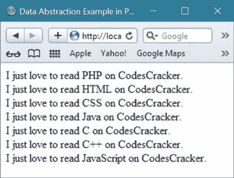
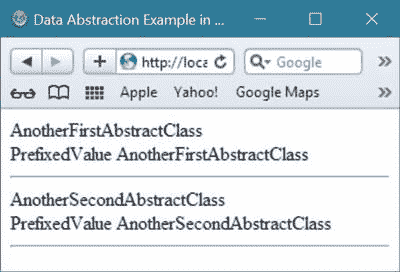

# PHP 数据抽象

> 原文：<https://codescracker.com/php/php-data-abstraction.htm>

PHP 中的[数据抽象是指任何隐藏或抽象了实现 细节的数据表示。](/php/index.htm)

数据抽象用于隐藏一个[对象](/php/php-classes-objects.htm)、 的工作方式，并以某种可理解的形式显示一个对象的信息。

## PHP 数据抽象示例

让我们举一个关于 PHP 中数据抽象的简单例子。

```
<!DOCTYPE html>
<html>
<head>
   <title>Data Abstraction Example in PHP</title>
</head>
<body>
<?php
   abstract class My_abstract_class
   {
      abstract protected function pre_sub_fix_function($parameter_v);
   }
   class My_concrete_class extends My_abstract_class
   {
      public function pre_sub_fix_function($parameter_v)
      {
         return "I just love to read {$parameter_v} on CodesCracker.";
      }
   }
   $obj = new My_concrete_class;
   echo $obj->pre_sub_fix_function("PHP")."<br/>";
   echo $obj->pre_sub_fix_function("HTML")."<br/>";
   echo $obj->pre_sub_fix_function("CSS")."<br/>";
   echo $obj->pre_sub_fix_function("Java")."<br/>";
   echo $obj->pre_sub_fix_function("C")."<br/>";
   echo $obj->pre_sub_fix_function("C++")."<br/>";
   echo $obj->pre_sub_fix_function("JavaScript")."<br/>";
?>
</body>
</html>
```

上面用 PHP 编写的抽象示例代码产生的示例输出如下所示:



这是另一个例子，也展示了 PHP 中的数据抽象。

```
<!DOCTYPE html>
<html>
<head>
   <title>Data Abstraction Example in PHP</title>
</head>
<body>
<?php
   abstract class My_Abstract_Class
   {
      abstract protected function gettingValueFunction();
      abstract protected function prefixValue($prefixParameterValue);
      public function displayingFunction()
      {
         echo $this->gettingValueFunction()."<br/>";
      }
   }
   class AnotherFirstAbstractClass extends My_Abstract_Class
   {
      protected function gettingValueFunction()
      {
         return "AnotherFirstAbstractClass";
      }
      public function prefixValue($prefixParameterValue)
      {
         return "{$prefixParameterValue}AnotherFirstAbstractClass";
      }
   }
   class AnotherSecondAbstractClass extends My_Abstract_Class
   {
      public function gettingValueFunction()
      {
         return "AnotherSecondAbstractClass";
      }
      public function prefixValue($prefixParameterValue)
      {
         return "{$prefixParameterValue}AnotherSecondAbstractClass";
      }
   }
   $objectFirst = new AnotherFirstAbstractClass;
   $objectFirst->displayingFunction();
   echo $objectFirst->prefixValue('PrefixedValue ');
   echo "<hr/>";
   $objectSecond = new AnotherSecondAbstractClass;
   $objectSecond->displayingFunction();
   echo $objectSecond->prefixValue('PrefixedValue ');
   echo "<hr/>";
?>
</body>
</html>
```

上述 PHP 数据抽象示例代码将产生如下输出:



[PHP 在线测试](/exam/showtest.php?subid=8)

* * *

* * *