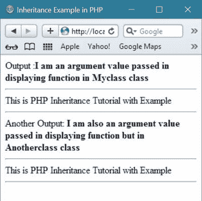
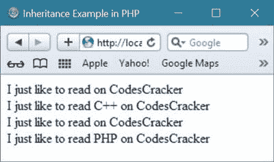

# PHP 继承

> 原文：<https://codescracker.com/php/php-inheritance.htm>

当一个[类](/php/php-classes-objects.htm)通过继承一个父类的现有 [函数](/php/php-functions.htm)来定义时，它被称为继承。

PHP 中的继承允许一个类继承同一个 PHP 程序中另一个类的成员。

## PHP 继承示例

让我们举一个关于 PHP 继承的简单例子。

```
<!DOCTYPE html>
<html>
<head>
   <title>Inheritance Example in PHP</title>
</head>
<body>
<?php
   class Myclass
   {
      public function displaying_function($argument_vl)
      {
         echo "Output :<b>".$argument_vl."</b><hr/>";
      }
      public function displaying_function_alone()
      {
         echo "This is PHP Inheritance Tutorial with Example<hr/>";
      }
   }
   class Anotherclass extends Myclass
   {
      public function displaying_function($argument_vl)
      {
         echo "Another Output: <b>".$argument_vl."</b><hr/>";
      }
   }
   $obj1 = new Myclass();
   $obj2 = new Anotherclass;
   $obj1->displaying_function('I am an argument value passed in displaying function in Myclass class');
   $obj1->displaying_function_alone();
   $obj2->displaying_function("I am also an argument value passed in displaying function but in Anotherclass class");
   $obj2->displaying_function_alone();
?>
</body>
</html>
```

下面是上述继承示例的示例输出



这是另一个例子，演示了 PHP 中的继承。

```
<!DOCTYPE html>
<html>
<head>
   <title>Inheritance Example in PHP</title>
</head>
<body>
<?php
   class Like
   {
      public $whatILike;
      public function tellWhatULike()
      {
         return "I just like to read ".$this->whatILike." on CodesCracker";
      }
   }
   class LikeAnother extends Like
   {
      public function tellWhatULike()
      {
         return "I just like to read ".$this->whatILike." on CodesCracker";
      }
   }
   $objectLikeAnother = new LikeAnother();
   echo $objectLikeAnother->tellWhatULike();
   echo "<br/>";

   $objectLikeAnother = new LikeAnother();
   $objectLikeAnother->whatILike = "C++";
   echo $objectLikeAnother->tellWhatULike();
   echo "<br/>";

   $objectLike = new Like();
   echo $objectLike->tellWhatULike();
   echo "<br/>";

   $objectLike = new LikeAnother();
   $objectLike->whatILike = "PHP";
   echo $objectLike->tellWhatULike();
   echo "<br/>";
?>
</body>
</html>
```

下面是上面 PHP 继承示例代码的输出示例。



[PHP 在线测试](/exam/showtest.php?subid=8)

* * *

* * *