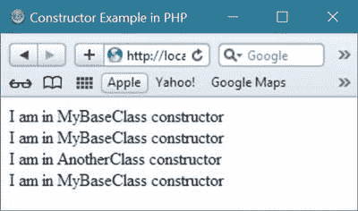
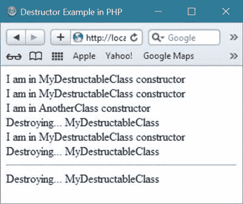
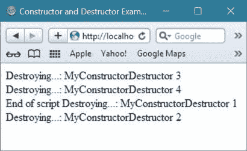
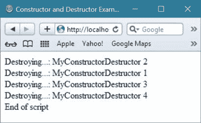
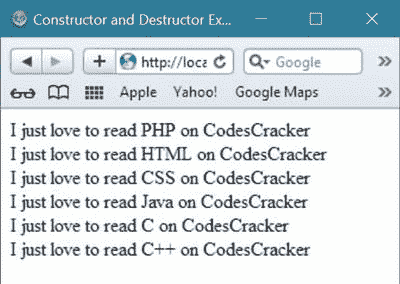

# PHP 构造函数和析构函数

> 原文：<https://codescracker.com/php/php-constructor-destructor.htm>

在这里你将学习构造器和去构造器，一个[面向对象的](/php/php-object-oriented.htm) 概念在 [PHP](/php/index.htm) 中的例子。

## PHP 构造函数

PHP 中的构造函数引用了一种特殊类型的[函数](/php/php-functions.htm)，每当从 [类](/php/php-classes-objects.htm)中产生[对象](/php/php-classes-objects.htm)时，就会自动调用 。

## PHP 构造函数语法

下面是在 PHP 中声明构造函数的一般形式。

```
void __construct()
```

这里的 **__construct** 是在 PHP 中声明构造函数方法时使用的关键字。

## PHP 构造函数示例

让我们举一个例子，以一种实用的方式来理解构造函数。下面的例子演示了 PHP 中的构造函数。

```
<!DOCTYPE html>
<html>
<head>
   <title>Constructor Example in PHP</title>
</head>
<body>
<?php
   // PHP Constructor Example Code - CodesCracker
   class MyBaseClass
   {
      function __construct()
      {
         echo "I am in MyBaseClass constructor<br/>";
      }
   }
   class AnotherClass extends MyBaseClass
   {
      function __construct()
      {
         // this will call the parent constructor, which is in MyBaseClass class
         parent::__construct();
         // after the above, below will be printed
         echo "I am in AnotherClass constructor<br/>";
      }
   }
   class AnotherThirdClass extends MyBaseClass
   {   
      // this will inherit the constructor of MyBaseClass class
   }
   // In MyBaseClass constructor
   $objct = new MyBaseClass();
   // In MyBaseClass and AnotherClass constructor
   $objct = new AnotherClass();
   // In MyBaseClass constructor
   $objct = new AnotherThirdClass();
?>
</body>
</html>
```

从上面的构造函数例子可以看出，当你创建一个包含构造函数的类的对象时，那么这个构造函数或者这个构造函数里面的内容将会被自动执行。

在这里，您可以看到，当您创建一个名为 MyBaseClass 的类的对象(比如$objct)时，该类中的构造函数将被自动调用并执行它们的内容

```
echo "I am in MyBaseClass constructor<br/>";
```

这将打印文本，**I is in my base class constructor**，然后使用 HTML 的 br 标签换行。相同的规则适用于为类创建的所有下一个对象。

下面是上面的 PHP 构造器示例代码产生的示例输出。



## PHP 析构函数

PHP 中的析构函数指的是一种特殊类型的函数，每当对象被删除或超出范围时都会被自动调用

## PHP 析构函数语法

下面是在 PHP 中声明析构函数的一般形式。

```
void __destruct(void)
```

这里的 **__destruct** 是 PHP 中用来声明析构函数方法的关键字。

## PHP 析构函数示例

这里有一个简单的例子来说明 PHP 中的析构函数。

```
<!DOCTYPE html>
<html>
<head>
   <title>Destructor Example in PHP</title>
</head>
<body>
<?php
   // PHP Constructor Example Code - CodesCracker
   class MyDestructableClass
   {
      function __construct()
      {
         echo "I am in MyDestructableClass constructor<br/>";
         $this->name = "MyDestructableClass";
      }
      function __destruct()
      {
         echo "Destroying... ".$this->name."<br/>";
      }
   }
   class AnotherClass extends MyDestructableClass
   {
      function __construct()
      {
         // this will call the parent constructor, which is in MyDestructableClass class
         parent::__construct();
         // after the above, below will be printed
         echo "I am in AnotherClass constructor<br/>";
      }
   }
   class AnotherThirdClass extends MyDestructableClass
   {
      // this will inherit the constructor of MyDestructableClass class
   }
   // In MyDestructableClass constructor
   $objct = new MyDestructableClass();
   // In MyDestructableClass and AnotherClass constructor
   $objct = new AnotherClass();
   // In MyDestructableClass constructor
   $objct = new AnotherThirdClass();
   echo "<hr/>";
?>
</body>
</html>
```

下面是 PHP 中上述析构函数示例代码产生的示例输出。



## PHP 构造函数和析构函数示例

让我们以 PHP 中的构造函数和析构函数为例，这是一个面向对象的概念。

```
<!DOCTYPE html>
<html>
<head>
   <title>Constructor and Destructor Example in PHP</title>
</head>
<body>
<?php
   class MyConstructorDestructor
   {
      private $name;
      private $link;
      public function __construct($name)
      {
         $this->name = $name;
      }
      public function linkSettingFunction(MyConstructorDestructor $link)
      {
         $this->link = $link;
      }
      public function __destruct()
      {
         echo 'Destroying...: ', $this->name."<br/>";
      }
   }
   // now create two object of MyConstructorDestructor class
   $object1 = new MyConstructorDestructor('MyConstructorDestructor 1');
   $object2 = new MyConstructorDestructor('MyConstructorDestructor 2');

   // now make them point to each other with following two line of code
   $object1->linkSettingFunction($object2);
   $object2->linkSettingFunction($object1);

   // then destroy global references to them with following two line of code
   $object1 = null;
   $object2 = null;

   // as the global references to $object1 and $object2 is destroyed
   // therefore there is no any way to access MyConstructorDestructor 1 and MyConstructorDestructor 2
   // but here, then are not destroyed, therefore, they still consume memory space

   // to see the difference when explicitly calling the GC
   // then just uncomment the below function
   // gc_collect_cycles();

   // now again create two objects of the class, MyConstructorDestructor, but this time 
   // don't set their internal MyConstructorDestructor references
   // so nothing point to them except $object1 and $object2 point to them:
   $object1 = new MyConstructorDestructor('MyConstructorDestructor 3');
   $object2 = new MyConstructorDestructor('MyConstructorDestructor 4');
   $object1 = null;
   $object2 = null;
   echo 'End of script';
?>
</body>
</html>
```

下面是 PHP 中上述构造函数和析构函数示例代码产生的示例输出。



现在移除注释或取消注释下面的代码行。

```
// gc_collect_cycles();
```

**重要的** -调用 PHP 函数，名为 gc_collect_cycles()确实有一些速度开销，因此 不要在没有任何理由或没有必要的情况下使用。

下面是取消注释上述函数后将出现的简单程序。

```
<!DOCTYPE html>
<html>
<head>
   <title>Constructor and Destructor Example in PHP</title>
</head>
<body>
<?php
   class MyConstructorDestructor
   {
      private $name;
      private $link;
      public function __construct($name)
      {
         $this->name = $name;
      }
      public function linkSettingFunction(MyConstructorDestructor $link)
      {
         $this->link = $link;
      }
      public function __destruct()
      {
         echo 'Destroying...: ', $this->name."<br/>";
      }
   }
   $object1 = new MyConstructorDestructor('MyConstructorDestructor 1');
   $object2 = new MyConstructorDestructor('MyConstructorDestructor 2');
   $object1->linkSettingFunction($object2);
   $object2->linkSettingFunction($object1);
   $object1 = null;
   $object2 = null;
   gc_collect_cycles();
   $object1 = new MyConstructorDestructor('MyConstructorDestructor 3');
   $object2 = new MyConstructorDestructor('MyConstructorDestructor 4');
   $object1 = null;
   $object2 = null;
   echo 'End of script';
?>
</body>
</html>
```

现在，这将产生以下输出



让我们举最后一个简单的例子，关于 PHP 中的构造函数。

```
<!DOCTYPE html>
<html>
<head>
   <title>Constructor and Destructor Example in PHP</title>
</head>
<body>
<?php
   class WhatTutorialILike
   {
      function __construct($tutorialName)
      {
         $this->name = $tutorialName;
         echo "I just love to read ".$this->name." on CodesCracker<br/>";
         // you can also convert the above two line of code with 
         // only one line, which will be
         // echo "I just love to read ".$tutorialName." on CodesCracker<br/>";
      }
   }
   $objct = new WhatTutorialILike("PHP");
   $objct = new WhatTutorialILike("HTML");
   $objct = new WhatTutorialILike("CSS");
   $objct = new WhatTutorialILike("Java");
   $objct = new WhatTutorialILike("C");
   $objct = new WhatTutorialILike("C++");
?>
</body>
</html>
```

上面 PHP 构造函数的示例代码将产生如下输出:



[PHP 在线测试](/exam/showtest.php?subid=8)

* * *

* * *