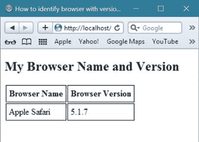
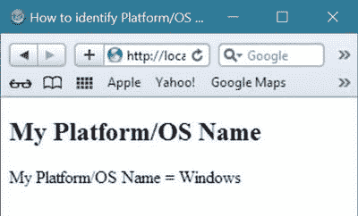
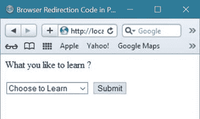
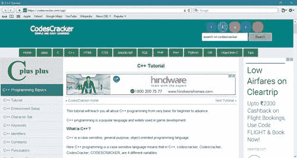

# PHP Web 开发

> 原文：<https://codescracker.com/php/php-web-technology.htm>

PHP 是一种流行的编程语言，在 web 开发中发挥着巨大的作用。

你可以用 PHP 动态开发你的[网页](/networking/web-sites-addresses-pages.htm)甚至整个 [网站](/networking/web-sites-addresses-pages.htm)。

PHP 支持更多种类的数据库。这意味着在 PHP 的帮助下，你可以使用更多的数据库来连接和使用你的网站。在所有这些数据库中，MySQL 是在 web 开发中与 PHP 一起使用的最流行的数据库。

## 为什么在 Web 开发中使用 PHP

如果你想动态开发你的网页或网站，或者数据库驱动，那么你可以选择 PHP。

PHP 帮助 web 开发者开发动态的和数据库驱动的网站。

## PHP 在 Web 开发中的优势

在 web 开发中使用 PHP 有更多的好处。这里列出了 PHP 在 web 开发中最常见的用法。

您可以使用 PHP 来

*   开发一个像亚马逊一样的电子商务网站
*   建立一个在线社区网站
*   建立问答论坛
*   开发一个像 facebook 一样的社交网站
*   生成 PDF 文件
*   建立邮件列表程序
*   开发图像处理和生成系统
*   创建内容管理系统
*   创建动态网站
*   开发用户互动页面，如反馈
*   还有更多

## PHP 如何用于 Web 开发

目前，PHP 在网站开发中的应用与日俱增。

今天，几乎每个 web 开发者都想开发数据库驱动的网站，只是为了让他/她的网站对用户来说更有吸引力。

这里有一个例子展示了 PHP 如何被用于开发网页和网站。

首先创建一个名为**codescracker.php**的文件，并将下面的代码放入其中， ，然后将该文件保存在目录 **C:\xampp\htdocs\** 中。

```
<!DOCTYPE html>
<html>
<head>
   <title>About my current position</title>
</head>
<body>
<?php
   echo "<h2>My Current Position</h2>";
   include("dynamic.php");
?>
</body>
</html>
```

从上面的 PHP 代码可以看出，**是另一个 PHP 文件，包含了一些 PHP 代码和内容 在那个文件里面，你可以把这个文件称为动态文件。**

 **动态文件是指当你改变了里面的内容，也就是**dynamic.php**，那么文件**codescracker.php**产生的整个输出 也会随之改变。

**dynamic.php**文件包含以下内容。

```
<?php 
   echo "<p>I am reading the technical topics in PHP.</p>";
   echo "<p>Right now, i am learning about web developments
      using PHP.</p>";
   echo "<p>I love reading PHP right now as it is the language
      that i was looking for to increase my knowledge about 
      developing websites and webpages dynamically and 
      sometime database-driven.</p>";
   echo "<p>I am planning to design a 
      public forum of questions and answers, where anyone can 
      ask their required question and answered by the public.</p>";
   echo "<p>And without PHP, i think it can not be possible to 
      develop question and answer forum.</p>";
?>
```

创建**dynamic.php**文件并将上述内容放入其中后，运行上述文件，命名为 codescracker.php **。您将看到以下输出。**


现在如果你改变文件**dynamic.php**的内容，那么**codescracker.php** 的整个输出也会改变。现在把下面的内容放在 dynamic.php 的**里面并保存。**

```
<?php 
   echo "<p>Now i am feeling something better than previous
      after learning about web developments using PHP</P>";
   echo "<p>Now i am going to learn next topics of PHP.</p>";
   echo "<p>I will learn each and every topics of PHP here.</p>";
?>
```

更改文件**dynamic.php**的内容后，刷新页面或在浏览器中再次键入**localhost/codescracker . PHP** ，你会看到下面的输出，不是之前的输出。


这只是一个简单的例子，展示了如何在 web 开发中使用 PHP。

您将在后面学习更多的主题，以便使用 PHP 开发动态网站或数据库驱动的网站。

## 如何使用 PHP 识别浏览器名称和版本

您可以使用 PHP 找到或识别浏览器的名称及其版本。下面是一个例子，展示了如何使用 PHP 识别浏览器名称和浏览器版本。

```
<!DOCTYPE html>
<html>
<head>
   <title>How to identify browser with version using PHP ?</title>
   <style>
      table th, td{padding:5px;border:1px solid black;}
   </style>
</head>
<body>
<h2>My Browser Name and Version</h2>
<?php
   function myBrowserName()
   {
      $userAgt = $_SERVER['HTTP_USER_AGENT'];
      $myBrowserNm = 'Unknown';
      $myBrowserVersion= "";
      if(preg_match('/MSIE/i',$userAgt) && !preg_match('/Opera/i',$userAgt))
      {
         $myBrowserNm = 'Internet Explorer';
         $ub = "MSIE";
      }
      elseif(preg_match('/Firefox/i',$userAgt))
      {
         $myBrowserNm = 'Mozilla Firefox';
         $ub = "Firefox";
      }
      elseif(preg_match('/Chrome/i',$userAgt))
      {
         $myBrowserNm = 'Google Chrome';
         $ub = "Chrome";
      }
      elseif(preg_match('/Safari/i',$userAgt))
      {
         $myBrowserNm = 'Apple Safari';
         $ub = "Safari";
      }
      elseif(preg_match('/Opera/i',$userAgt))
      {
         $myBrowserNm = 'Opera';
         $ub = "Opera";
      }
      elseif(preg_match('/Netscape/i',$userAgt))
      {
         $myBrowserNm = 'Netscape';
         $ub = "Netscape";
      }
      $known = array('Version', $ub, 'other');
      $pattern = '#(?<browser>' . join('|', $known) . ')[/ ]+(?<version>[0-9.|a-zA-Z.]*)#';
      if(!preg_match_all($pattern, $userAgt, $matches))
      {
      }
      $i = count($matches['browser']);
      if($i != 1)
      {
         if(strripos($userAgt,"Version") < strripos($userAgt,$ub))
         {
            $myBrowserVersion= $matches['version'][0];
         }
         else
         {
            $myBrowserVersion= $matches['version'][1];
         }
      }
      else
      {
         $myBrowserVersion= $matches['version'][0];
      }
      if($myBrowserVersion==null || $myBrowserVersion=="") {$myBrowserVersion="?";}
      return array
      (
         'userAgent' => $userAgt,
         'name'      => $myBrowserNm,
         'version'   => $myBrowserVersion,
         'pattern'    => $pattern 
      );
   }
   $ua=myBrowserName();
   echo "<table>";
   echo "<tr>";
      echo "<th>Browser Name</th>";
      echo "<th>Browser Version</th>";
   echo "</tr>";
   echo "<tr>";
      echo "<td>".$ua['name']."</td>";
      echo "<td>".$ua['version']."</td>";
   echo "</tr>";
   echo "</table>";
?>
</body>
</html>
```

下面是上面的浏览器标识示例代码使用 PHP 生成的示例输出。



你会看到上面的输出，因为我使用的是 **Safari** 浏览器的 **5.1.7** <sup>th</sup> 版本。

## 如何使用 PHP 识别平台/操作系统

你也可以使用 PHP 来查找或识别你正在使用的平台或操作系统。下面是一个例子，展示了如何使用 PHP 代码识别操作系统或平台。

```
<!DOCTYPE html>
<html>
<head>
   <title>How to identify Platform/OS using PHP ?</title>
</head>
<body>
<h2>My Platform/OS Name</h2>
<?php
   function myPlatformName()
   {
      $userAgt = $_SERVER['HTTP_USER_AGENT'];
      $platformNm = 'Unknown';
      if(preg_match('/linux/i', $userAgt))
      {
         $platformNm = 'linux';
      }
      elseif(preg_match('/macintosh|mac os x/i', $userAgt))
      {
         $platformNm = 'mac';
      }
      elseif(preg_match('/windows|win32/i', $userAgt))
      {
         $platformNm = 'windows';
      }
      return array
      (
         'platform'  => $platformNm
      );
   }
   $ua=myPlatformName();
   echo "My Platform/OS Name = ".ucfirst($ua['platform']);
?>
</body>
</html>
```

上面使用 PHP 识别平台或操作系统的示例代码将产生以下输出:



由于上述程序运行在 windows 操作系统上，因此产生的输出是 Windows。

## PHP 中的浏览器重定向代码

您可以使用 PHP 创建浏览器重定向代码。浏览器重定向有多种形式。浏览器重定向意味着您的将被重定向到另一个网页。

下面是一个使用 PHP 进行浏览器重定向的简单例子。在本例中，您将被重定向到另一个浏览器窗口中的另一个网页，而不是重定向到同一浏览器窗口中的另一个网页。

```
<?php
   // below code will check, if user submitted 
   // the data or not
   if(isset($_POST["redirectURL"]))
   {
      // below code will get the location url
      $location = $_POST["redirectURL"];
      // below code will redirect user to 
      // the choosen url present in $location variable
      header("Location: $location");
      // below code will skip executing the below code 
      // after it
      exit();
   }
?>
<html>
<head>
   <title>Browser Redirection Code in PHP</title>
</head>
<body>
<p>What you like to learn ?</p>
<form method="POST" target="_blank">
   <select name="redirectURL">
   <option value="">Choose to Learn</option>
   <option value="https://codescracker.com/html">
   HTML Tutorial
   </option>
   <option value="https://codescracker.com/java">
   Java Tutorial
   </option>
   <option value="https://codescracker.com/c">
   C Tutorial
   </option>
   <option value="https://codescracker.com/cpp">
   C++ Tutorial
   </option>
   <option value="https://codescracker.com/js">
   JavaScript Tutorial
   </option>
   <option value="https://codescracker.com/sql">
   SQL Tutorial
   </option>
   </select>
   <input type="submit" />
</form>
</body>
</html>
```

下面是上面用 PHP 编写的浏览器重定向示例代码产生的示例输出。



现在，要检查如何使用 PHP 中的浏览器重定向来重定向您，只需从下拉菜单中选择任何教程，比如说 [C++ 教程](/cpp/index.htm)并单击**提交**按钮，然后您将被重定向到另一个窗口中的 页面，如下图所示，这是在选择 C++ 并单击 提交按钮后您将看到的页面。



[PHP 在线测试](/exam/showtest.php?subid=8)

* * *

* * ***