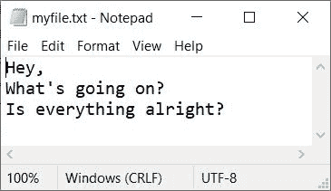

# PHP fwrite() |写入文件

> 原文：<https://codescracker.com/php/php-write-to-file.htm>

PHP **fwrite()** 函数在我们需要将一些内容写入文件时使用。例如:

```
<?php
   $fp = fopen("myfile.txt", "w");
   fwrite($fp, "PHP is Fun!");
   fclose($fp);
?>
```

执行完上面的 PHP 代码，内容/文字 **PHP 就好玩了！**将得到的内容写入名为 **myfile.txt** 的文件中

**注意-** 要将一些文本写入文件，必须在 **w** (写入)模式下打开文件，使用名为 [fopen()](/php/php-open-file.htm) 的 函数

## PHP fwrite()语法

PHP 中 **fwrite()** 函数的语法是:

```
fwrite(filePointer, text, length)
```

前两个( *filePointer* 和 *text* )参数是必需的，而最后一个( *length* ) 参数是可选的。

**注意-****文件指针**参数指定了指向文件的指针。

**注意-****文本**参数是必须写入文件的内容/文本。

**注意-** 当我们需要定义要写入的最大字节数时，使用**长度**参数。

函数的作用是:返回写入文件的字节数(字符数)。例如:

```
<?php
   $fp = fopen("myfile.txt", "w");
   if($fp)
   {
      echo fwrite($fp, "PHP is Fun! Isn't it?");
      fclose($fp);
   }
   else
      echo "<p>Unable to open the file</p>";
?>
```

自文 **PHP 好玩！不是吗？**是 21 个字符，因此上面的 PHP 示例 对 **fwrite()** 函数的输出应该是:


## PHP 使用 fwrite()逐行写入文件

要使用 PHP **fwrite()** 函数将内容逐行写入文件，请使用 **PHP_EOL** ，如下面给出的 示例所示:

```
<?php
   $fp = fopen("myfile.txt", "w");
   if($fp)
   {
      $line = "Hey,";
      fwrite($fp, $line.PHP_EOL);

      $line = "What's going on?";
      fwrite($fp, $line.PHP_EOL);

      $line = "Is everything alright?";
      fwrite($fp, $line.PHP_EOL);
      fclose($fp);
   }
   else
      echo "<p>Unable to open the file</p>";
?>
```

这三个文本将被逐行写入。因此，在执行上述 PHP 示例后，这里是文件 **myfile.txt** 的快照



[PHP 在线测试](/exam/showtest.php?subid=8)

* * *

* * *