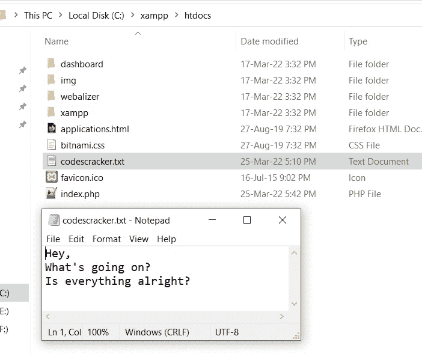
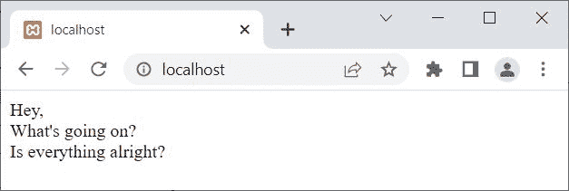
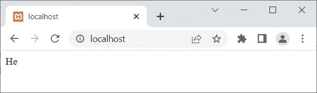

# PHP fgets() |从文件中获取单行

> 原文：<https://codescracker.com/php/php-fgets-function.htm>

PHP **fgets()** 函数在我们需要逐行读取文件时使用。例如:

```
<?php
   $fp = fopen("codescracker.txt", "r");
   echo fgets($fp);
   fclose($fp);
?>
```

上面的 PHP 示例在 **fgets()** 函数上生成的输出是:


你看到的上例输出的**，**，是名为 **codescracker.txt** 的文件的第一行文本。以下是打开文件的快照，可在当前目录中找到:



**注-**[fopen()](/php/php-open-file.htm)打开一个文件。

**注意-**[fclose()](/php/php-close-file.htm)关闭一个文件。

要获得所有行，使用 **fgets()** ，需要遍历文件的全部内容，使用 **feof()** 函数。这里有一个例子:

```
<?php
   $fp = fopen("codescracker.txt", "r");
   if($fp)
   {
      while(!feof($fp))
      {
         $line = fgets($fp);
         echo $line;
         echo "<br>";
      }
      fclose($fp);
   }
   else
      echo "<p>Unable to open the file!</p>";
?>
```

现在输出应该是:



**注意-**[feof()](/php/php-feof-function.htm)检查文件指针是否已经 到达文件的末尾。

## PHP fgets()语法

PHP 中 **fgets()** 函数的语法是:

```
fgets(filePointer, size)
```

**文件指针**参数是必需的，而**大小**参数是可选的。

**注意-****大小**参数在我们需要获取特定数量的字节时使用。举 的例子:

```
<?php
   $fp = fopen("codescracker.txt", "r");
   if($fp)
   {
      $content = fgets($fp, 3);
      echo $content;
      fclose($fp);
   }
   else
      echo "<p>Unable to open the file!</p>";
?>
```

上面的 PHP 示例在使用**大小**参数的 **fgets()** 函数上生成的输出是:



**注意-** 当出现新的一行时，文件的读取停止。因此，由于 **codescracker.txt** 文件的第一行包含了**嘿，**。可以使用 **fgets($fp，5)** 读取。但是如果你增加大小，那么在 的情况下，你将得到相同的输出，这将是第一行的内容。

[PHP 在线测试](/exam/showtest.php?subid=8)

* * *

* * *