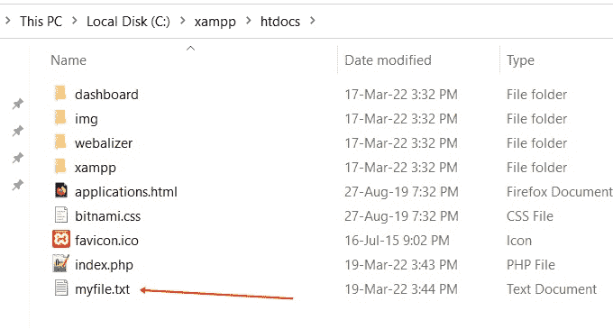
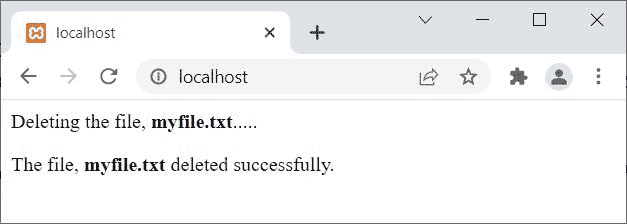
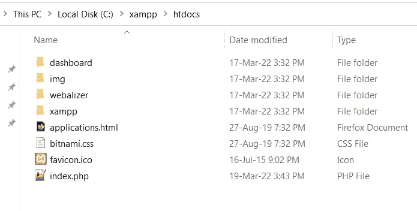

# PHP unlink()函数|删除文件

> 原文：<https://codescracker.com/php/php-delete-file.htm>

PHP **unlink()** 函数在我们需要删除/移除文件时使用。例如:

```
<?php
   if(unlink("codescracker.txt"))
      echo "The file deleted successfully";
   else
      echo "Unable to delete the file";
?>
```

上述 PHP 示例的输出是:


并且在执行完上面的 PHP 代码后，当前目录下的名为 **codescracker.txt** 的文件已经被删除， 。

## PHP unlink()函数语法

PHP 中 **unlink()** 函数的语法是:

```
unlink(file, context)
```

第二个或 **context** 参数是可选的，用于定义文件处理程序的上下文。

**注-****unlink()**函数成功返回**真**，失败返回**假**。

## PHP unlink()函数示例

在使用 PHP 脚本删除任何文件之前。让我向您展示当前目录的快照，在我的例子中:



下面是删除名为 **myfile.txt** 的文件的 PHP 脚本:

```
<?php
   $file = "myfile.txt";
   echo "<p>Deleting the file, <b>$file</b>.....</p>";
   if(unlink($file))
      echo "<p>The file, <b>$file</b> deleted successfully.</p>";
   else
      echo "<p>Unable to delete the file, <b>$file</b></p>";
?>
```

上面的 PHP 示例执行后的输出是:



以下是在执行上述 PHP 脚本删除名为 **myfile.txt** 的文件后，同一目录的新快照:



[PHP 在线测试](/exam/showtest.php?subid=8)

* * *

* * *