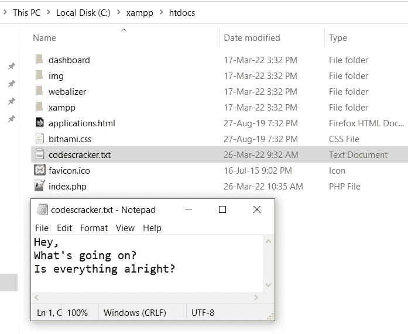

# PHP `file_get_contents()` |将文件读入字符串

> 原文：<https://codescracker.com/php/php-file-get-contents-function.htm>

PHP **file_get_contents()** 函数在我们需要将文件读入字符串时使用。例如:

```
<?php
   $mystr = file_get_contents("codescracker.txt");
   echo $mystr;
?>
```

上面的 PHP 示例在 **file_get_contents()** 函数上的输出是:


以下是打开的文件 **codescracker.txt** 的快照，以及当前目录:



## PHP 将文件读入字符串并保留换行符

你可以看到文件 **codescracker.txt** 的快照和输出，如上所示。文件 包含分三行的文本。但是上一个例子产生的输出，在将 文件的内容转换成一个字符串之后，忽略了所有的换行符。于是， **nl2br()** 就出现了。下面是一个例子:

```
<?php
   $mystr = file_get_contents("codescracker.txt");
   $mystr = nl2br($mystr);
   echo $mystr;
?>
```

或者

```
<?php
   $mystr = file_get_contents("codescracker.txt");
   echo nl2br($mystr);
?>
```

上述两个示例将产生相同的输出，即:


## PHP `file_get_contents()`语法

PHP 中 **file_get_contents()** 函数的语法是:

```
file_get_contents(path, include_path, context, start, length)
```

第一个参数( **path** )是必需的，而所有三个参数都是可选的。

**注意-** 当我们需要在 *include_path* (在 *php.ini* )中搜索文件时，会用到 **include_path** 参数。为此，我们需要用 **1** 指定这个参数。

**注意-****上下文**参数用于指定处理文件的上下文。

**注意-** 当我们需要从任何特定的 位置将文件读入字符串时，会用到**开始**参数。负值将用于从指定位置开始读取，从末尾开始。

**注意-****长度**参数在我们需要将一个文件读入字符串到指定的 最大字符长度时使用。

[PHP 在线测试](/exam/showtest.php?subid=8)

* * *

* * *