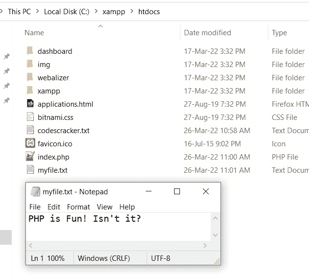
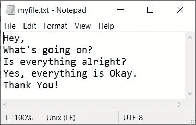

# PHP 文件内容函数

> 原文：<https://codescracker.com/php/php-file-put-contents-function.htm>

PHP **file_put_contents()** 函数在我们需要将一些数据/内容写入/放入文件时使用。 例如:

```
<?php
   file_put_contents("myfile.txt", "PHP is Fun! Isn't it?");
?>
```

上面的 PHP 例子在 **file_put_contents()** 函数上产生的输出什么都没有，但是文本 **PHP 很好玩！不是吗？**写入当前目录下的文件 **myfile.txt** 。 这里是在执行上述 PHP 示例后，当前目录以及打开的文件 *myfile.txt* 的快照:



**注意-** 如果文件已经有了一些内容，那么以前的内容会被新的内容覆盖。 但是我们可以使用 **FILE_APPEND** 来避免擦除或覆盖之前的内容。

**注意-** 如果指定的文件不存在，那么将创建一个新文件。

## PHP `文件内容()`语法

PHP 中 **file_put_contents()** 函数的语法是:

```
file_put_contents(file, data, mode, context)
```

前两个(*文件*和*数据*)参数是必需的，而后两个(*模式*和 T6】上下文)参数是 可选的。

**注意-****文件**参数用于指定文件的名称，我们需要在其中写入 的内容。

**注-****数据**参数用于指定要放入文件的数据。

**注-****模式**参数用于当我们需要指定打开文件的方式来将数据放入/写入 其中时。我们可以通过以下三种方式中的任何一种来指定打开文件的方式:

*   **FILE_APPEND** -当我们需要避免覆盖时使用。也就是说，如果文件已经存在，并且里面有 的一些内容，那么新的数据将被追加。
*   **FILE_USE_INCLUDE_PATH** -用于在 *include_path* 中搜索文件
*   **LOCK_EX** -用于在向文件中写入内容时给文件加锁

**注意-****上下文**参数用于指定处理文件的上下文。

## PHP 文件内容示例

```
<?php
   $file = "myfile.txt";
   $content = "Hey,\nWhat's going on?\nIs everything alright?";

   if(file_put_contents($file, $content))
      echo "<p>The content is written into the file.</p>";
   else
      echo "<p>Unable to write the content into the file.</p>";
?>
```

上述 PHP 示例的输出是:


现在让我创建另一个例子，用 **FILE_APPEND** 作为**模式**参数的值:

```
<?php
   $file = "myfile.txt";
   $content = "\nYes, everything is Okay.\nThank You!";

   if(file_put_contents($file, $content, FILE_APPEND))
      echo "<p>The content is written into the file.</p>";
   else
      echo "<p>Unable to write the content into the file.</p>";
?>
```

在执行这个示例之后，您将获得与上一个示例相同的输出。下面是执行了前面两个 PHP 示例后， **myfile.txt** 文件的快照:



[PHP 在线测试](/exam/showtest.php?subid=8)

* * *

* * *