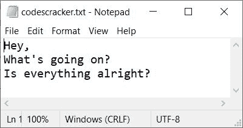
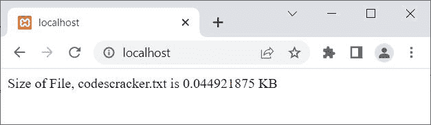
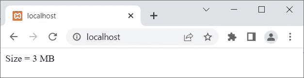
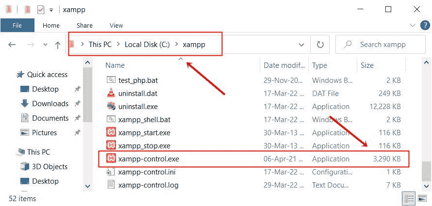

# PHP `filesize()` |获取文件大小

> 原文：<https://codescracker.com/php/php-filesize-function.htm>

函数的作用是:返回指定文件的大小，以字节为单位。例如:

```
<?php
   echo filesize("codescracker.txt");
?>
```

上面的 PHP 示例在 **filesize()** 函数上生成的输出是:


这里是上面例子中使用的文件 **codescracker.txt** 的快照:



## PHP `文件大小()`语法

PHP 中 **filesize()** 函数的语法是:

```
filesize(fileName)
```

## PHP 使用 File Size()获得以 KB 为单位的文件大小

```
<?php
   $myfile = "codescracker.txt";
   $x = filesize($myfile);
   $x = $x/1024;

   echo "<p>Size of File, $myfile is $x KB</p>";
?>
```

上面的 PHP 示例生成的输出是，查找并打印一个文件的大小(以 KB 为单位),如下所示:



如果你想删除小数点后的所有数字，那么在尺寸前加上 **(int)** ，类似下面程序中的 :

```
<?php
   $myfile = "favicon.ico";
   $x = filesize($myfile);
   $x = (int)($x/1024);

   echo "<p>Size = $x KB</p>";
?>
```

现在输出应该是 **Size = 30 KB** ，因为文件 **favicon.ico** 是 30 KB。我在上面的例子中没有使用 *codescracker.txt* 文件，因为该文件的大小是 **46 字节**，这将给出 0 KB 作为输出。

## PHP 使用 File Size()获取文件大小(MB)

```
<?php
   $myfile = "C:/xampp/xampp-control.exe";
   $x = filesize($myfile);
   $x = (int)($x/1024/1024);

   echo "<p>Size = $x MB</p>";
?>
```

这个 PHP 示例产生的输出显示了在 **C:/xampp/** 目录中可用的**xampp-control.exe**文件的大小，如下面给出的快照所示:



这是上面示例中使用的文件和目录的快照:



## PHP 使用 File Size()获得以 GB 为单位的文件大小

```
<?php
   $myfile = "F:/sw/os/windows64.iso";
   $x = filesize($myfile);
   $x = (int)($x/1024/1024/1024);

   echo "<p>Size = $x GB</p>";
?>
```

由于文件 **windows64.iso** 的大小是 **5.1GB** ，因此移除. 1 后，你将得到 **Size = 5 GB** 作为输出。

[PHP 在线测试](/exam/showtest.php?subid=8)

* * *

* * *