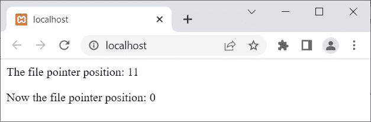

# PHP `rewind()` |将文件指针移动到文件开头

> 原文：<https://codescracker.com/php/php-rewind-function.htm>

PHP **rewind()** 函数在我们需要将文件指针回退到文件开头时使用。 例如:

```
<?php
   $fp = fopen("myfile.txt", "w");
   fwrite($fp, "PHP is Fun!");

   echo "<p>The file pointer position: " .ftell($fp). "</p>";
   rewind($fp);
   echo "<p>Now the file pointer position: " .ftell($fp). "</p>";

   fclose($fp);
?>
```

下面给出的快照显示了上面的 PHP 示例产生的输出:



让我在 PHP 中创建另一个关于 **rewind()** 函数的例子:

```
<?php
   $file = "myfile.txt";
   $fp = fopen($file, "w+");
   if($fp)
   {
      fwrite($fp, "PHP is Fun!");

      rewind($fp);
      $content = fread($fp, filesize($file));
      echo $content;

      fclose($fp);
   }
   else
      echo "<p>Unable to open the file</p>";
?>
```

上面的 PHP 示例在 **rewind()** 函数上的输出显示在下面给出的快照中:


就是写完正文 **PHP 好玩！**到名为 **myfile.txt** 的文件，使用函数 [fwrite()](/php/php-write-to-file.htm) 。文件指针($fp)指向文件的末尾。因此， 在 **rewind()** 函数的帮助下，文件指针移动到文件的开头，并使用 函数 **fread()** 读取内容并初始化为 **$content** 变量。最后，使用 [echo](/php/php-echo.htm) 语句/关键字，在输出中打印出 **$content** 变量的 值。

## PHP `rewind()`语法

PHP 中 **rewind()** 函数的语法是:

```
rewind(filePointer)
```

[PHP 在线测试](/exam/showtest.php?subid=8)

* * *

* * *