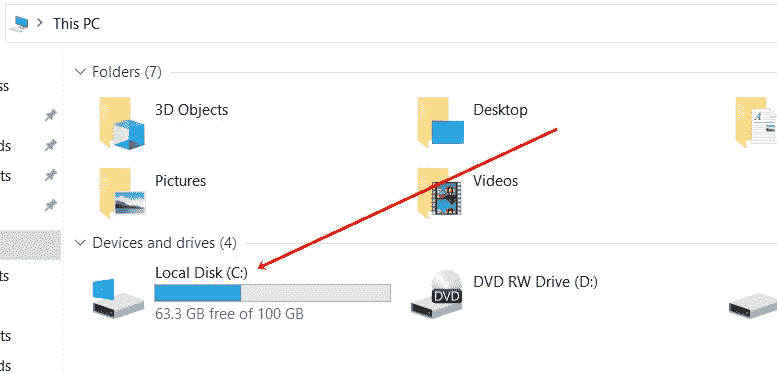

# PHP `disk_free_space()` |查找空闲磁盘空间的数量

> 原文：<https://codescracker.com/php/php-disk-free-space-function.htm>

PHP **disk_free_space()** 函数用于在指定的 磁盘或文件系统中寻找可用的空闲空间。默认情况下，使用该函数返回的空间将以字节为单位。例如:

```
<?php
   $space = disk_free_space("C:");
   echo $space;
?>
```

上一个示例的输出是:


即 **67981537280** 字节。这是我电脑系统的 **C 盘**的快照:



## PHP 找到以 GB 为单位的空闲磁盘空间

要修改上面的程序，打印出 **GB** 中的 **C** 驱动器中的可用空间量，那么使用下面的例子:

```
<?php
   $spaceBytes = disk_free_space("C:");

   $spaceKb = $spaceBytes/1024;
   $spaceMb = $spaceKb/1024;
   $spaceGb = $spaceMb/1024;

   echo "<p>Free Space available in <b>C</b> Drive is <b>$spaceGb</b> GB</p>";
?>
```

现在输出应该是:


要删除小数后的所有数字，则在 **$spaceGb** 前使用 **(int)** 。例如:

```
<?php
   $spaceBytes = disk_free_space("C:");

   $spaceGb = $spaceBytes/1024/1024/1024;
   $spaceGb = (int)$spaceGb;

   echo "<p><b>C</b> Drive Free Space = <b>$spaceGb</b> GB</p>";
?>
```

现在输出应该是:


## PHP `磁盘空闲空间()`语法

PHP 中 **disk_free_space()** 函数的语法是:

```
disk_free_space(x)
```

**x** 参数是必需的，指的是我们需要找到/查看其空闲空间的文件系统或磁盘。

[PHP 在线测试](/exam/showtest.php?subid=8)

* * *

* * *