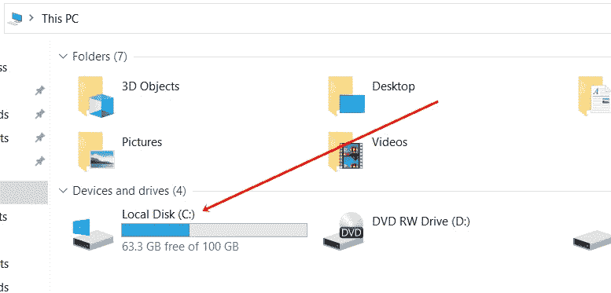

# PHP `disk_total_space()` |查找总磁盘空间

> 原文：<https://codescracker.com/php/php-disk-total-space-function.htm>

PHP **disk_total_space()** 函数在我们需要找到指定的 磁盘或文件系统中可用的总空间时使用。默认情况下，使用该函数返回的空间将以字节为单位。例如:

```
<?php
   $space = disk_total_space("C:");
   echo $space;
?>
```

上面的 PHP 示例在 **disk_total_space()** 函数上的输出是:


也就是说， **107427655680** 字节是我的 **C** 驱动器中可用的总空间。这是我电脑系统的 **C 盘**的快照 :



## 使用 PHP 查找以 GB 为单位的总磁盘空间

要修改上面的程序来打印 **GB** 中 **C** 驱动器的可用总空间，那么使用下面的 示例:

```
<?php
   $spaceBytes = disk_total_space("C:");

   $spaceKb = $spaceBytes/1024;
   $spaceMb = $spaceKb/1024;
   $spaceGb = $spaceMb/1024;

   echo "<p>Total Space available in <b>C</b> Drive is <b>$spaceGb</b> GB</p>";
?>
```

现在输出应该是:


要删除小数后的所有数字，则在 **$spaceGb** 前使用 **(int)** 。例如:

```
<?php
   $spaceBytes = disk_total_space("C:");

   $spaceGb = $spaceBytes/1024/1024/1024;
   $spaceGb = (int)$spaceGb;

   echo "<p><b>C</b> Drive Total Space = <b>$spaceGb</b> GB</p>";
?>
```

现在输出应该是:


## PHP `disk_total_space()`语法

PHP 中 **disk_total_space()** 函数的语法是:

```
disk_total_space(x)
```

**x** 参数是必需的，指的是我们需要查看其总空间的文件系统或磁盘。

[PHP 在线测试](/exam/showtest.php?subid=8)

* * *

* * *