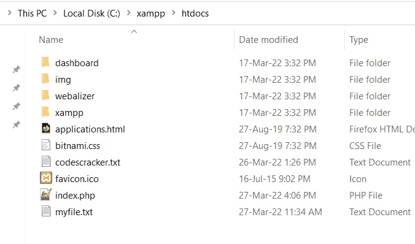
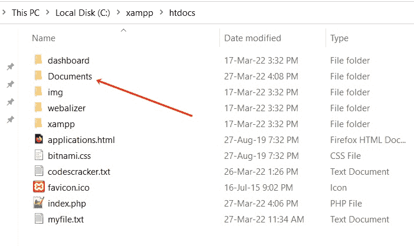

# PHP mkdir() |创建目录

> 原文：<https://codescracker.com/php/php-mkdir-function.htm>

PHP **mkdir()** 函数在我们需要创建一个新目录时使用。例如:

```
<?php
   $dir = "Documents";
   $chk = mkdir($dir);
   if($chk)
      echo "<p>A new directory is created</p>";
   else
      echo "<p>Unable to create</p>";
?>
```

在执行上面的 PHP 代码之前，下面是当前目录的快照:



在执行上述 PHP 代码/示例后，以下是 web 浏览器中产生的输出:


这是执行上述 PHP 代码后当前目录的新快照:



## PHP mkdir()语法

PHP 中 **mkdir()** 函数的语法是:

```
mkdir(directory, permissions, recursive, context)
```

第一个(*目录*)参数是必需的，而所有三个参数都是可选的。

**注意-****目录**参数用于指定要创建的目录。

**注意-****权限**参数用于指定权限。默认值为 **0777**

**注意-****递归**参数在我们需要允许创建嵌套目录时使用。 默认值为**假**

**注意-****上下文**参数用于指定上下文资源。 默认值为 **null**

**mkdir("xyz")** 与 **mkdir("xyz "，0777，假，空)**相同

[PHP 在线测试](/exam/showtest.php?subid=8)

* * *

* * *