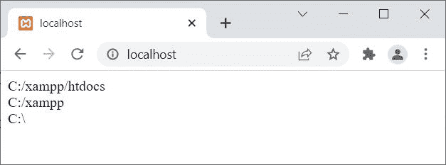

# PHP `dirname()` |获取父目录的路径

> 原文：<https://codescracker.com/php/php-dirname-function.htm>

PHP **dirname()** 函数在我们需要获取父目录的路径时使用。例如:

```
<?php
   echo dirname("C:/xampp/htdocs/index.php");
?>
```

上述 PHP 示例的输出是:


## PHP `dirname()`语法

PHP 中 **dirname()** 函数的语法是:

```
dirname(path, levels)
```

第二或**级**参数是可选的。该参数的默认值为 **1** 。 当我们需要指定要增加的目录数量时，使用**级别**参数。例如:

```
<?php
   echo dirname("C:/xampp/htdocs/index.php", 1) . "<br>";
   echo dirname("C:/xampp/htdocs/index.php", 2) . "<br>";
   echo dirname("C:/xampp/htdocs/index.php", 3) . "<br>";
?>
```

上述 PHP 示例的输出是:



[PHP 在线测试](/exam/showtest.php?subid=8)

* * *

* * *