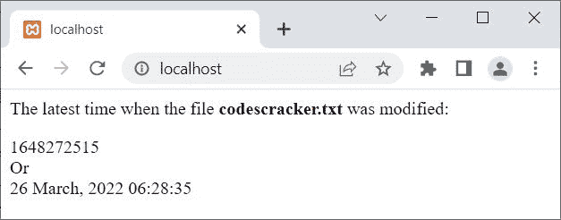
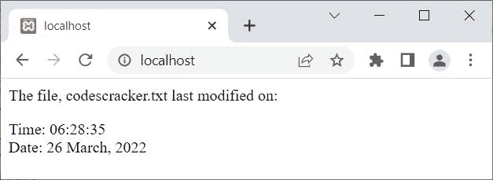

# PHP filemtime() |获取文件的最后修改时间/日期

> 原文：<https://codescracker.com/php/php-filemtime-function.htm>

PHP **filemtime()** 函数在我们需要查找文件被 修改的最后时间和日期时使用。例如:

```
<?php
   echo "<p>The latest time when the file <b>codescracker.txt</b> was modified:</p>";
   echo filemtime("codescracker.txt");
   echo "<br>Or<br>";
   echo date("d F, Y H:i:s", filemtime("codescracker.txt"));
?>
```

上面的 PHP 示例在 **filemtime()** 函数上产生的输出是:



由于 **filemtime()** 函数返回文件的最后修改时间/日期，在 *Unix 中时间戳*， 对于普通用户来说几乎是无法理解的。因此，让我使用 **date()** 函数来 将时间转换成普通用户可以理解的格式。

```
<?php
   $file = "codescracker.txt";
   echo "<p>The file, $file last modified on:</p>";

   $mt = filemtime($file);
   if($mt)
   {
      echo "Time: " .date("H:i:s", $mt);
      echo "<br>";
      echo "Date: " .date("d F, Y", $mt);
   }
   else
      echo "Unable to find time, when the file last modified!";
?>
```

现在上面的 PHP 示例产生的输出应该是:



## PHP filemtime()语法

PHP 中 **filemtime()** 函数的语法是:

```
filemtime(filename)
```

函数 *filemtime()* 失败时返回 **False** 。

[PHP 在线测试](/exam/showtest.php?subid=8)

* * *

* * *