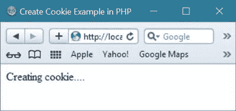

# PHP Cookies

> 原文：<https://codescracker.com/php/php-cookies.htm>

PHP 中的 cookie 是存储在用户计算机上的数据。

Cookie 的数据从网站发送，并通过本地计算机或用户计算机的 web 浏览器存储在本地计算机或用户计算机上。

Cookie 的数据仅用于识别每个用户，并在下次浏览同一网站时提供更好的用户体验。

## 在 PHP 中创建 Cookie

要在 PHP 中创建 cookie，请使用 PHP 的 setcookie()函数。

下面是用 PHP 创建 cookie 的语法或一般形式。以下创建 cookie 的语法仅包括 cookie 名称这一基本参数。

```
setcookie(cookie_name);
```

现在，下面的语法包括了在 PHP 中创建 cookie 时使用的所有参数。

```
setcookie(cookieName, cookieValue, cookieExpire, cookiePath, cookieDomain, cookieSecure, cookieHttponly);
```

除了 cookieName，PHP 中用于创建 cookie 的所有其他参数都是可选的。只有 cookieName 是在 PHP 中创建新 cookie 所必需的参数。

## PHP 创建 Cookie 示例

这是一个用 PHP 创建 cookie 的例子。

```
<!DOCTYPE html>
<?php
   $cookieName = "codescracker";
   $cookieValue = "Computer Programmer";
   // set cookie for 30 days with above name and value
   setcookie($cookieName, $cookieValue, time() + (86400 * 30));
   // 86400 seconds = 1 day
   // 1 * 30 = 30 days
?>
<html>
<head>
   <title>Create Cookie Example in PHP</title>
</head>
<body>
<?php 
   if(!isset($_COOKIE[$cookieName]))
   {
      echo "Creating cookie....";
   }
   else 
   {
      echo "Cookie created.";
   }
?>
</body>
</html>
```

下面是上面用 PHP 创建 cookie 示例代码的输出示例。这是上述 PHP 程序在 web 浏览器中首次运行时的示例输出的屏幕截图:



现在，如果您第一次在 PHP 中运行上述创建 cookie 程序，名为 **codescracker** 和值为 **计算机程序员**的 cookie 将被创建 30 天。因此，如果您重新运行相同的程序或刷新浏览器以运行相同的程序，那么 此时您将看到以下输出。


如果您只创建了上面的 cookie 2 秒钟，那么您将看到您的 cookie 将在 2 秒钟内创建并过期。在创建您的 cookie 2 秒钟后，如果您在 2 秒钟后刷新您的浏览器，您将会看到消息**正在创建 cookie....**在运行上面用于在 PHP 中创建 cookie 的程序 2 秒钟后创建 cookie。

从上面的陈述中，您可以意识到在 PHP 中设置或创建 cookie 需要多少时间。

## PHP 检索 Cookie 示例

下面是一个例子，展示了如何在 PHP 中检索 cookie。

```
<!DOCTYPE html>
<?php
   $cookieName = "codescracker";
   if(!isset($_COOKIE[$cookieName]))
   {
      $cookieValue = "Computer Programmer";
      setcookie($cookieName, $cookieValue, time() + (86400 * 30));
   }
?>
<html>
<head>
   <title>Retrieve Cookie Example in PHP</title>
</head>
<body>
<?php 
   if(isset($_COOKIE[$cookieName]))
   {
      echo "Cookie is retrieving...<br/>";
      echo "Cookie is retrieved successfully...<br/><br/>";
      echo "Name of the cookie = ".$cookieName."<br/>";
      echo "Value of the cookie = ".$_COOKIE[$cookieName]."<br/>";
   }
   else 
   {
      echo "Error occurred...<br/>";
      echo "exiting...<br/>";
   }
?>
</body>
</html>
```

下面是上面用 PHP 检索 cookie 的示例代码产生的示例输出


## PHP 检查 Cookie 是否已设置

要检查 PHP 中是否设置了 cookie，请对$_COOKIE 使用 is set()函数，这是一个超全局变量。让我们以检查 cookie 是否已经设置为例。

```
<html>
<head>
   <title>Checking cookie is set or not in PHP</title>
</head>
<body>
<?php
   // this php example check whether the cookie 
   // is set or not - CodesCracker
   // use isset to check that cookie is set 
   // or not set
   $count = 0;
   if(isset($_COOKIE['cookieName']))
   {
      // cookie is set
      echo "Cookie is set<br/>";
      echo "You can proceed!";
      $count++;
   }
   else 
   {
      // cookie is not set
      echo "Cookie is not set<br/>";
      echo "You can't proceed!";
   }
   if($count==1)
   {
      echo "<br/>You are ".$_COOKIE['cookieName'];
   }
?>
</body>
</html>
```

由于没有设置 cookie，因此这里是上面的 the cookie 示例代码产生的示例输出。


现在尝试另一个例子来检查 cookie 是否在用户的计算机上用 PHP 设置。

```
<html>
<head>
   <title>Checking cookie is set or not in PHP</title>
</head>
<body>
<?php
   $cookieName = "codescracker";
   $count = 0;
   if(isset($_COOKIE[$cookieName]))
   {
      echo "Cookie is set<br/>";
      echo "You can proceed!";
      $count++;
   }
   else 
   {
      echo "Cookie is not set<br/>";
      echo "You can't proceed!";
   }
   if($count==1)
   {
      echo "<br/>You are ".$_COOKIE[$cookieName];
   }
?>
</body>
</html>
```

由于名为 **codescracker** 的 cookie 是从创建 cookie 的示例程序中设置的，因此这次上述检查 cookie 的输出 是否被设置将是 PHP 中的示例代码。


## PHP 删除 Cookie

要删除 PHP 中的任何 cookie，只需使用相同的名称重新创建 cookie，但将到期时间设置为 1 小时之前，即设置时间为 **time()-3600** 。

下面是一个例子，展示了如何从用户的电脑中删除 PHP 中的 cookie。

```
<html>
<head>
   <title>Delete Cookie Example in PHP</title>
</head>
<body>
<?php
   // deleting cookie example in PHP - CodesCracker
   echo "Deleting the cookie <b>codescracker</b>....<br/>";
   // To delete cookie in PHP, just set/create the 
   // cookie with expiration time as 1 hour ago/back
   // using the same name
   setcookie("codescracker", "", time()-3600);
   echo "The cookie is deleted successfully.";
?>
</body>
</html>
```

下面是上面用 PHP 删除 cookie 的示例代码产生的示例输出。


## PHP 检查 Cookie 是否被删除

下面是一个例子，展示了如何在 PHP 中检查 cookie 是否被删除。

```
<html>
<head>
   <title>Check Cookie is deleted or not Example in PHP</title>
</head>
<body>
<?php
   $cookieName = "codescracker";
   if(isset($_COOKIE[$cookieName]))
   {
      echo "The cookie <b>$cookieName</b> is not deleted.";
   }
   else 
   {
      echo "The cookie <b>$cookieName</b> is deleted.";
   }
?>
</body>
</html>
```

下面是上面的 PHP 示例程序产生的示例输出，用于检查 cookie 是否被删除。


[PHP 在线测试](/exam/showtest.php?subid=8)

* * *

* * *