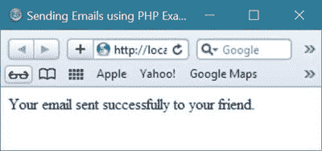
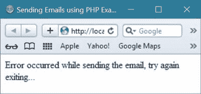

# PHP 发送电子邮件

> 原文：<https://codescracker.com/php/php-sending-emails.htm>

在这里，你将了解如何使用 [PHP](/php/index.htm) 轻松发送邮件。你也可以使用 PHP 一次性发送大量电子邮件 。

## 使用 PHP 发送电子邮件之前要做什么

在使用 PHP 发送任何电子邮件之前，首先你必须设置好你的环境，这样你就可以使用 PHP 无中断地发送电子邮件。

让我们看看如何为 XAMPP 用户设置使用 PHP 从本地主机发送电子邮件的环境。

## PHP XAMPP 设置发送电子邮件

使用 PHP，你可以在 XAMPP 的帮助下从你的系统中自由发送电子邮件。

但是在从你的计算机系统使用 XAMPP 发送电子邮件之前，你必须打开 **php.ini** 和 **sendmail.ini** 文件并做一些修改。

可以在 [目录](/operating-system/directories.htm) **下找到 php.ini [文件](/operating-system/files.htm)，在 目录**下找到 sendmail.ini 文件【C:\xampp\sendmail\** 。**

让我们首先按照下面给出的说明编辑 **php.ini** 文件。

搜索 **SMTP，smtp_port，sendmail_from，**和 **sendmail_path** ，然后初始化 smtp.gmail.com， 587，和**" \ " C:\ xampp \ sendmail \ sendmail . exe \ "-t "**到这些，如下面的 代码所示:

```
SMTP=smtp.gmail.com
smtp_port=587
sendmail_from=codescracker@gmail.com
sendmail_path="\"C:\xampp\sendmail\sendmail.exe\" -t"
```

现在让我们按照下面给出的说明编辑名为 **sendmail.ini** 的文件:

这次搜索 **smtp_server，smtp_port，error_logfile，debug_logfile，auth_username， auth_password，**和 **force_sender** ，然后将【smtp.gmail.com】587，error.log，debug.log， codescracker@gmail.com，mypassword，和**codescracker@gmail.com**初始化为这些，如下面的 示例代码所示:

```
smtp_server=smtp.gmail.com
smtp_port=587
error_logfile=error.log
debug_logfile=debug.log
auth_username=codescracker@gmail.com
auth_password=mypassword
force_sender=codescracker@gmail.com
```

你只需要用你自己的电子邮件 id 替换**codescracker@gmail.com**(这个电子邮件 id 将被 用来给任何人发送电子邮件)并用你自己的密码替换**我的密码**。

在做了上面提供的所有设置后，你必须重启你的 XAMPP 服务器，然后你可以进一步用 PHP 编写你的电子邮件发送代码，开始用代码发送电子邮件。让我们看看如何做到这一点。

**注意** -如果您在按照上述说明成功设置后发现一些错误，那么 您可以使用目录 **C:\xampp\sendmail\** 中的文件轻松找到并修复错误。 在这个目录中搜索名为 **error.txt** 的文件，并打开该文件查找并修复任何 错误。

## PHP 发送电子邮件示例

让我们举一个例子来了解如何用 PHP 编写发送邮件的代码。

```
<?php 
   // below variable contains the email address of the person
   // who will get the email using this example of sending email
   $sendEmailTo = "codescrackerParther@gmail.com";
   // below variable contains the subject value
   $sendEmailSubject = "Hello partner, greeting email for you";
   // now put the message in a php variable
   $sendEmailMessage = "How are you my partner";
?>
<html>
<head>
   <title>Sending Emails using PHP Example - codescracker.com</title>
</head>
<body>
<?php
   // now set the content-type before sending html email
   $headers = "MIME-Version: 1.0 \r\n";
   $headers = $headers . "Content-type:text/html;charset=UTF-8 \r\n";
   $headers = $headers . "From:codescracker@gmail.com \r\n";
   $checkMail = mail($sendEmailTo, $sendEmailSubject, $sendEmailMessage, $headers);
   if($checkMail == true)
   {
      echo "Your email sent successfully to your friend.";
      exit();
   }
   else 
   {
      echo "Error occurred while sending the email, try again";
      echo "<br/>exiting...";
      exit();
   }
?>
</body>
</html>
```

下面是上面的电子邮件发送示例在成功发送电子邮件后使用 PHP 生成的示例输出。



这里是使用上面的电子邮件发送示例发送电子邮件时，如果发生了一些错误，您将看到的输出:



[PHP 在线测试](/exam/showtest.php?subid=8)

* * *

* * *