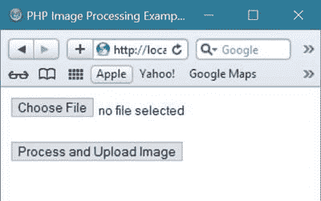
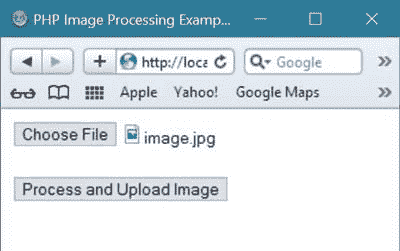
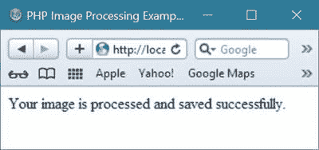

# PHP 图像处理

> 原文：<https://codescracker.com/php/php-image-processing.htm>

使用 PHP 可以轻松处理图像。在这里你将学习使用 [PHP](/php/index.htm) 处理图像。

## 何时处理图像

通常情况下，您可以在下列情况下使用 PHP 处理图像:

*   当你想处理[上传的](/php/php-file-uploading.htm)图像并将处理后的图像 存储到你的计算机系统(或[网络服务器](/networking/web-browser-server.htm)中时
*   当您想要处理和显示来自您的计算机系统(或网络服务器)的任何图像到您的[网站](/networking/web-sites-addresses-pages.htm)

现在让我们先来学习如何处理你的网站用户上传到你的服务器上的图片。

## 使用 PHP 上传图片的过程

由于你已经在之前的教程中学习了如何使用 PHP 上传任何文件，因此我们不再讨论这个 。在这里，我们将只讨论在将图像文件保存到服务器 或你的计算机系统之前，用 PHP 处理图像文件的正确方法。

下面是使用 PHP 进行图像处理的完整例子。

```
<?php 
$count = 0;
if($_SERVER["REQUEST_METHOD"] == "POST")
{
   // let's first check whether the image is selected or not
   if(empty($_FILES['ImageToProcess']))
   {
      echo "<p>Image is required before doing processing using PHP.</p>";
      echo "<p>Exiting...</p>";
      exit();
   }
   else 
   {
      $tmp_image = $_FILES['ImageToProcess']['tmp_name'];
      // in last part of code given below contains double \ 
      // where first \ is the part of directory and second 
      // \ is to make double inverted comma works
      $where_to_process_image = "C:/xampp/htdocs/uploaded-file/";
      $original_image_name = basename($_FILES['ImageToProcess']['name']);
      $original_image_name_with_directory = $where_to_process_image.$original_image_name;
      $process_image_type = pathinfo($original_image_name_with_directory, PATHINFO_EXTENSION);
      if(isset($_POST['submit']))
      {
         $check_image_before_process = getimagesize($_FILES['ImageToProcess']['tmp_name']);
         if($check_image_before_process != false)
         {
            // if image is correct according to image size
         }
         else 
         {
            echo "<p>Error before processing the given image.</p>";
            echo "<p>Exiting...</p>";
            exit();
         }
      }
      $processed_image = $original_image_name.".".$process_image_type;
      $process_image_size = $_FILES['ImageToProcess']['size'];
      // now check whether the processing image size is less than 
      // 10MB or not. You can also change the size value according
      // to your requirement. Here you have to provide the byte value
      // for 10 MB it will be 1024*1024*10, which will be 
      // 10485760 bytes
      if($process_image_size > 10485760)
      {
         echo "<p>Image with size greather than 10MB is not allowed to processs...exiting...</p>";
         exit();
      }
      // now check the type of image before finalizing the process of given image
      if($process_image_type != "jpg" && $process_image_type != "png" && $process_image_type != "jpeg")
      {
         echo "<p>Image other than jpeg, jpg and png is not allowed to process...exiting...</p>";
         exit();
      }
      // now move the processed image from temporary directory to your 
      // provided directory and at the same time also check whether 
      // the image is successfully moved or not
      if(move_uploaded_file($tmp_image, $where_to_process_image.$processed_image))
      {
         $save_processed_image = $where_to_process_image.$processed_image;
         $image_file = $where_to_process_image.$processed_image;
         list($width, $height) = getimagesize($image_file);
         $tln = imagecreatetruecolor($width, $height);
         $target = $where_to_process_image.$processed_image;
         $image_info = getimagesize($target);
         $tln = imagecreatetruecolor($width, $height);
         $target = $where_to_process_image.$processed_image;
         $image_info = getimagesize($target);
         if($image_info['mime'] == 'image/jpeg')
         {
            $image = imagecreatefromjpeg($image_file);
         }
         elseif($image_info['mime'] == 'image/png')
         {
            $image = imagecreatefrompng($image_file);
         }
         imagecopyresampled($tln, $image, 0, 0, 0, 0, $width, $height, $width, $height);
         $count++;
      }
      else 
      {
         echo "<p>Error occurred in saving the image in your given directory..exiting..</p>";
         exit();
      }
   }
}
?>
<html>
<head>
   <title>PHP Image Processing Example - codescracker</title>
</head>
<body>
<?php 
   if($count==0) 
   { 
?>
      <form method="post" enctype="multipart/form-data">
         <input type="file" name="ImageToProcess" required><br/><br/>
         <input type="submit" value="Process and Upload Image">
      </form>
<?php 
   }
   else 
   {
      echo "<p>Your image is processed and saved successfully.</p>";
   }
?>
</body>
</html>
```

下面是上面使用 PHP 进行图像处理的示例代码产生的初始示例输出。



现在，为了检查上面的示例代码的演示工作，即上面的 PHP 代码如何进行图像处理并将文件保存在上面的示例中提供的计算机[目录](/operating-system/directories.htm) 中，首先选择任意图像文件和 单击**处理和上传图像**按钮。

下面是选择要处理和上传的图像文件后的示例截图。



现在点击**流程和上传图像**按钮。如果图像文件正确且处理/上传成功，您将在 [浏览器](/networking/web-browser-server.htm)、 中看到以下示例输出。



现在，如果您打开执行上述操作的文件夹，也就是说，这里的**上传文件** 是文件夹名称，那么您 将看到文件夹包含一个名为【image】的[文件](/operating-system/files.htm) ，这是一个图像文件。下面是运行上述示例后的示例截图 。


现在你已经知道了如何在你指定的地方处理任何上传/保存的图像文件，现在让我们来学习如何处理来自计算机或服务器的图像并在网络上显示它。

## 用 PHP 在 Web 上处理和显示图像

下面是一个例子，展示了如何使用 PHP 处理和显示网页或网站上的图像。这里我们将使用 PHP 图像处理教程中给出的例子来处理上面上传的图像。

```
<?php 
   $process_image_dir = 'uploaded-file/';
   $process_image_name = 'image.jpg';
   $image_with_dir = $process_image_dir.$process_image_name;
?>
<html>
<head>
   <title>Image Processing using PHP Example - codescracker.com</title>
</head>
<body>
<?php
   echo "";
?>
</body>
</html>
```

下面是上面用 PHP 进行图像处理的例子产生的示例输出。


正如您从上面的示例输出截图中看到的，图像的完整尺寸显示在 web 上。

现在让我们修改上面的例子，使用 [CSS](/css/index.htm) 来查看特定大小的图像。

```
<?php 
   $process_image_dir = 'uploaded-file/';
   $process_image_name = 'image.jpg';
   $image_with_dir = $process_image_dir.$process_image_name;
?>
<html>
<head>
   <title>Process and display image on web using PHP</title>
   <style>
      .imageDimension img{max-width:300px;}
   </style>
</head>
<body>
   <p>Image processed and displayed using PHP.</p>
<?php
   echo "<div class=\"imageDimension\"></div>";
?>
</body>
</html>
```

这是示例输出，现在您将在浏览器中看到使用 PHP 修改处理和显示 web 上任何图像的代码。


[PHP 在线测试](/exam/showtest.php?subid=8)

* * *

* * *