# PHP 和 MySQLi 教程

> 原文：<https://codescracker.com/php/php-mysql.htm>

在这里，你将通过例子一步一步地学习 PHP 和 MySQLi。

## 什么是 PHP 和 MySQLi

众所周知， [PHP](/php/index.htm) 是一种脚本语言，MySQL 是 MySQL 数据库的改进版本 。

## 为什么在 MySQLi 中使用 PHP

你可以在你的网站上使用 PHP 脚本语言，像 MySQL 一样连接你的数据库。

如果你想操作你的数据库或者使用你的数据库来[馈送](/php/php-mysqli-insert-record.htm)、 、[检索](/php/php-mysqli-fetch-record.htm)、[更新](/php/php-mysqli-update-record.htm)或者 、T6】从你的[网站](/networking/web-sites-addresses-pages.htm)或者从网络上删除你的数据库中的数据，那么就用 PHP 和 MySQLi 吧。

使用 PHP，在像 MySQL 这样的数据库上执行操作时，一切皆有可能。

## PHP 和 MySQLi 教程主题

本 PHP 和 MySQLi 教程分为以下几个独立的部分:

*   [PHP 和 MySQLi 数据库设置](/php/php-mysqli-setup.htm)
*   [PHP 和 MySQLi 连接数据库](/php/php-mysqli-connect-to-database.htm)
*   [PHP 和 MySQLi 创建数据库](/php/php-mysqli-create-database.htm)
*   [PHP 和 MySQLi 创建表](/php/php-mysqli-create-table.htm)
*   [PHP 和 MySQLi 将记录插入数据库](/php/php-mysqli-insert-record.htm)
*   [PHP 和 MySQLi 更新以前的记录](/php/php-mysqli-update-record.htm)
*   [PHP 和 MySQLi 从数据库中获取记录](/php/php-mysqli-fetch-record.htm)
*   [PHP 和 MySQLi 从数据库中删除记录](/php/php-mysqli-delete-record.htm)
*   [PHP 和 MySQLi 创建注册页面](/php/php-mysqli-signup-page.htm)
*   [PHP 和 MySQLi 创建登录页面](/php/php-mysqli-login-page.htm)
*   [PHP 和 MySQLi 在数据库中存储用户数据](/php/php-mysqli-store-user-data.htm)
*   [PHP 和 MySQLi 关闭数据库连接](/php/php-mysqli-close-database-connection.htm)

你将一步一步地学习 PHP 和 MySQLi 的所有上述主题，这些主题被分成单独的教程。

## 在 MySQLi 中使用 PHP 的优势

以下是在 MySQLi 中使用 PHP 的一些优点。

*   允许用户创建他们的帐户
*   允许用户登录他们的帐户
*   为了允许用户存储他们的数据以备将来使用
*   允许用户修改他们的信息
*   允许用户从他/她的帐户中删除一些信息
*   允许用户删除他们的整个帐户

以上是使用 PHP 和 MySQL 的一些简单的优点，因为 MySQL 使用 PHP 和 MySQL 有很多优点。

现在让我们以 PHP 和 MySQLi 为例。如果你不能理解下面的例子，那么就离开它，去下一个教程。从下一个教程开始，你将一步一步地学习 PHP 和 MySQLi。在花一些时间学习下一个关于 PHP 和 MySQLi 的教程后，你会感觉更好，并能理解下面的例子。

## PHP 和 MySQLi 示例

现在让我们一步一步地举例说明如何使用 PHP 和 MySQL 实现 MySQL 数据库。

这里有一个 PHP 和 MySQLi 的简单例子。

打开 **XAMPP** 软件，如下图所示。这是打开 XAMPP 的窗口

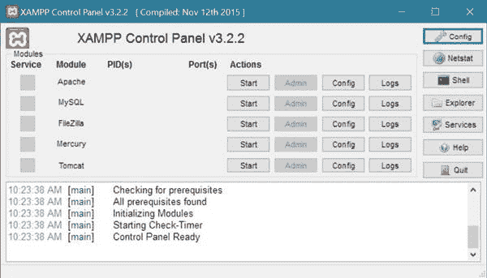

点击两个模块旁边的启动按钮，启动名为 **Apache** (服务器)和 **MySQL** (数据库)的模块。 启动 apache 服务器和 mysql 数据库后，你的 XAMPP 窗口将看起来像这样:

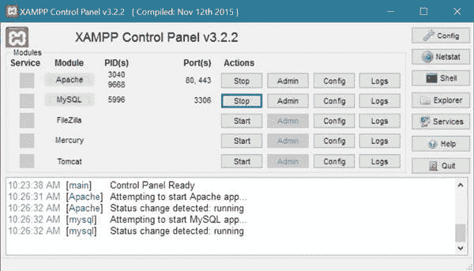

现在点击 MySQL 开始按钮或 MySQL 停止按钮旁边的**管理**按钮(启动 MySQL 数据库后， 开始按钮变为停止)。

执行上述操作后，您将被定向到默认的浏览器窗口，该窗口将包含 **phpMyAdmin** 面板。下面是 phpMyAdmin 窗口的截图。

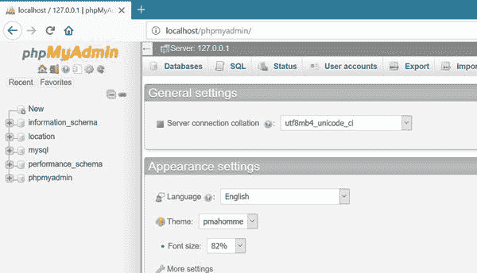

现在点击 phpMyAdmin 窗口顶部的**数据库**链接。

单击数据库链接后，您将在浏览器中看到以下窗口:

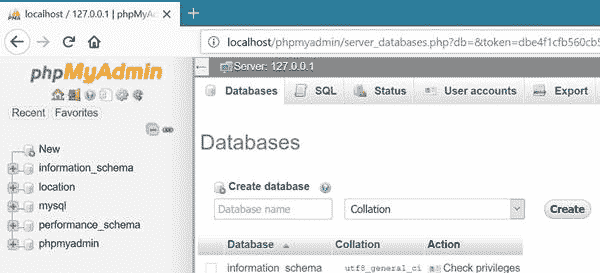

现在首先你必须在使用 MySQL 数据库 之前[创建数据库](/php/php-mysqli-create-database.htm)。

要创建数据库，只需点击**创建数据库**的输入框，输入数据库名称，如 **codescracker** 。下面是进入 MySQL 数据库名称 say **codescracker** 后的演示截图:

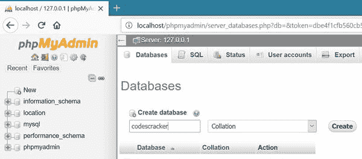

现在点击**创建**按钮。你的数据库将在点击创建按钮后创建，这里是点击创建按钮后出现的 演示截图。

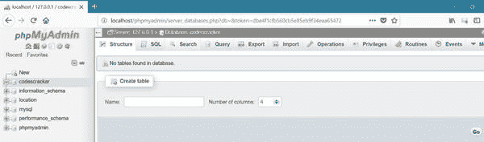

该窗口将要求输入表格详细信息(以[创建表格](/php/php-mysqli-create-table.htm) ) ，这些信息将存储在最近创建的数据库中。

在这里，您将输入表的名称和该表将容纳的列总数。

您可以稍后编辑列数或表格的其他详细信息。现在，我们将创建一个名为 **codescrackerTable** 的 4 列表。下面是在 MySQL 数据库中创建表之前输入数据的截图演示。

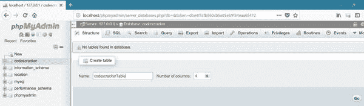

如上所示填写完详细信息后，只需点击 **Go** 按钮。这里是 点击**的**按钮创建 MySQL 数据库表后出现的窗口。

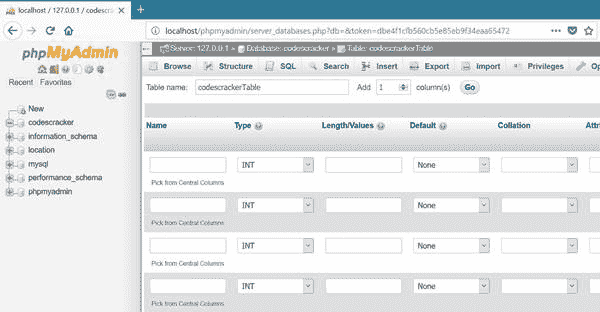

正如您在上面的窗口中看到的，您将被要求输入表的详细信息，即列名及其基本的详细信息。

在填写完最近创建的名为 **codescrackerTable** 的表的详细信息后，填写如下截图所示的基本字段:

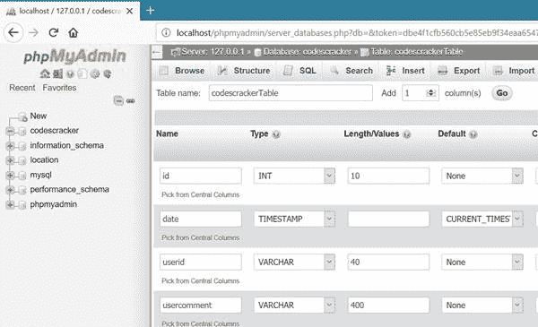

这是详细信息，你必须逐一输入所有 4 个字段。

| 名字 | 类型 | 长度/值 | 默认 | 属性 | 索引 | A_I |
| 身份证明（identification） | （同 Internationalorganizations）国际组织 | Ten |  |  | 主要(然后点击确定) | 勾选复选框 |
| 日期 | 时间戳 |  | 当前时间戳 | 在更新当前时间戳时 |  |  |
| 使用者辩证码 | Forty |  |  |  |  |  |
| 用户评论 | four hundred |  |  |  |  |  |

如果是名为 **id** 的列，当您从**索引**的下拉列表中选择**主**时，会弹出 窗口:

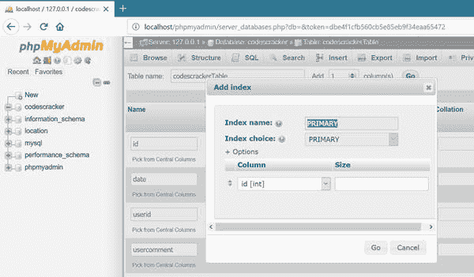

你必须点击 **OK** 按钮。

在上面的字段**中，A_I** 代表自动增量。

完成上述所有操作后，只需点击同一窗口右下方的**保存**按钮。

保存输入的详细信息后或点击**保存**按钮后，将会弹出 窗口的屏幕截图。

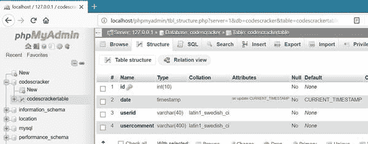

现在，在您的 **codescracker** 数据库中，您有了一个新创建的包含 4 列的空白表。要检查它，点击 phpMyAdmin 窗口左面板的 **codescrackerTable** 按钮。这是点击 **codescrackerTable** 表后出现的窗口 的演示截图。

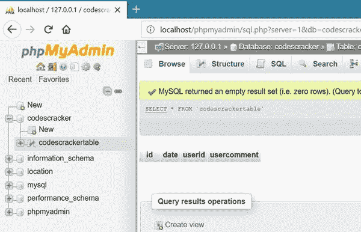

现在这里是 PHP 和 MySQL 的例子，它被用来存储数据或者使用 PHP 将数据输入 MySQL 数据库。

```
<?php 
   $conn = mysqli_connect('localhost', 'root', '', 'codescracker');
   if(mysqli_connect_error())
   {
      echo "<p>Error occurred while connecting to the MySQL database.</p>";
      echo "<p>Kindly try again later.</p>";
      echo "<p>Thank You!</p>";
      echo "<p><i>by CodesCracker Admin</i></p>";
      exit();
   }
?>
<html>
<head>
   <title>PHP and MySQLi Example</title>
</head>
<body>
<?php
   $userid = "codescracker@gmail.com";
   $usercomment = "this tutorial is only for those, who are interesting to 
   develop a user-friendly and database-driven website using PHP and MySQL";
   $queryStr = "insert into codescrackerTable(userid, usercomment) values('$userid', '$usercomment')";
   $result = $conn->query($queryStr);
   if($result)
   {
      echo "<p>Data inserted successfully.</p>";
   }
   else 
   {
      echo "<p>Error occurred while inserting the data into the MySQL database.</p>";
      echo "<p>Please try again later.</p>";
      echo "<p>Exiting.....</p>";
   }
?>
</body>
</html>
```

输入上面的 PHP 和 MySQLi 代码，或者复制粘贴上面的 PHP 和 MySQLi 代码，将[文件](/operating-system/files.htm)保存在[目录](/operating-system/directories.htm) **C:\ xampp \ htdocs \**中，文件名为**codescracker.php**，打开 [web 浏览器](/networking/web-browser-server.htm)，输入**localhost/codescracker . PHP**。

下面是上面的 PHP 和 MySQLi 示例代码生成的演示输出:

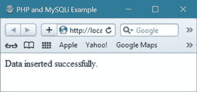

在你的浏览器中运行上述 PHP 和 MySQLi 代码后，你的数据将被插入到名为 **codescracker** 的数据库中。

这里是名为 **codescrackerTable** 的表的截图，该表保存了上述 PHP 和 MySQLi 程序最近插入的数据。

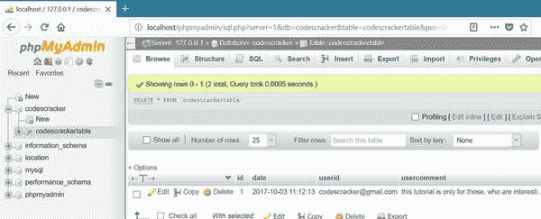

现在从下一个教程开始，你将一步一步地学习 PHP 和 MySQL 教程，包括从[打开 MySQL 数据库连接](/php/php-mysqli-connect-to-database.htm)到 [关闭 MySQL 数据库连接](/php/php-mysqli-close-database-connection.htm)的细节和例子。

[PHP 在线测试](/exam/showtest.php?subid=8)

* * *

* * *