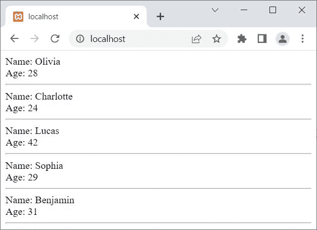
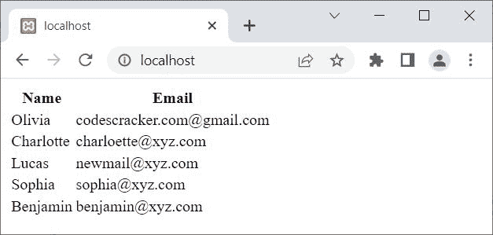
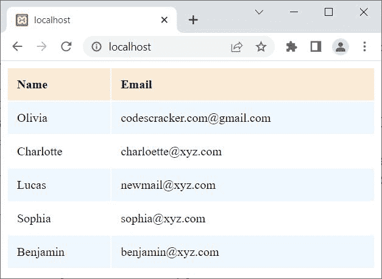

# PHP MySQLi 从数据库获取数据

> 原文：<https://codescracker.com/php/php-mysqli-fetch-record.htm>

本文旨在描述从 MySQL 数据库获取和显示数据的方法。

下面是使用 PHP MySQLi 脚本从 MySQL 数据库中获取数据的函数列表:

*   [fetch_row()](/php/php-fetch-row-and-mysqli-fetch-row.htm) 用于以面向对象的方式获取并返回作为枚举数组的 结果
*   [mysqli_fetch_row()](/php/php-fetch-row-and-mysqli-fetch-row.htm) 用于获取结果， 以枚举数组的形式返回结果，以过程化的方式
*   [fetch_assoc()](/php/php-fetch-assoc-and-mysqli-fetch-assoc.htm) 用于获取并返回 结果作为一个关联数组，采用面向对象的风格
*   [mysqli_fetch_assoc()](/php/php-fetch-assoc-and-mysqli-fetch-assoc.htm) 用于获取结果， 以关联数组的形式返回结果，以过程化的方式
*   [fetch_array()](/php/php-fetch-array-and-mysqli-fetch-array.htm) 被使用，当我们需要以面向对象的 方式 以枚举数组或关联数组或两者的形式获取结果时
*   [当我们 需要以 过程式的方式，以枚举数组或关联数组或两者的形式获取结果时，使用 mysqli_fetch_array()](/php/php-fetch-array-and-mysqli-fetch-array.htm)

**注-****fetch _ row()**、 **fetch_assoc()** 、 **fetch_array()** 在 PHP MySQLi <u>面向对象</u>脚本中使用。

**注-****MySQLi _ fetch _ row()**、 **mysqli_fetch_assoc()** 、**MySQLi _ fetch _ array()** 在 PHP MySQLi <u>过程化</u>脚本中使用。

## 使用 fetch_row()获取数据的 PHP MySQLi 脚本

```
<?php
   $server = "localhost";
   $user = "root";
   $pass = "";
   $db = "codescracker";

   $conn = new mysqli($server, $user, $pass, $db);

   if($conn -> connect_errno)
   {
      echo "Connection to the database failed!<BR>";
      echo "Reason: ", $conn -> connect_error;
      exit();
   }

   $sql = "SELECT * FROM customer";

   $result = $conn -> query($sql);
   if($result)
   {
      while($row = $result -> fetch_row())
      {
         echo "Name: ", $row[1];
         echo "<BR>";
         echo "Age: ", $row[2];
         echo "<HR>";
      }
      $result -> free_result();
   }
   else
   {
      echo "Something went wrong!<BR>";
      echo "Error Description: ", $conn -> error;
   }
   $conn -> close();
?>
```

上面的 PHP 示例在*从数据库*获取数据时产生的输出显示在下面给出的快照 中:



在上面的例子中，由于第二列的**名称**字段可用，因此我使用了 **1** 作为索引来获取该列。在 array 中，索引从 0 开始，因此 1 表示第二列。

**注意-**[MySQL()](/php/php-mysqli-connect-to-database.htm)用于以面向对象的方式打开到 MySQL 数据库服务器的 连接。

**注意-**[new](/php/php-new-keyword.htm)关键字用于创建一个新对象。

**注意-**[connect _ errno](/php/php-connect-errno-and-mysqli-connect-errno.htm)用于 以面向对象的方式获取/返回上次 connect 调用的错误代码(如果有)。

**注意-**[connect _ error](/php/php-connect-error-and-mysqli-connect-error.htm)用于 以面向对象的方式从最后一次连接中获取错误描述(如果有的话)。

**注意-**[exit()](/php/php-exit-function.htm)用于终止 当前 PHP 脚本的执行。

**注-**[query()](/php/php-query-and-mysqli-query.htm)用于对 MySQL 数据库进行查询，采用面向对象的方式。

**注意-**[free _ result()](/php/php-free-result-and-mysqli-free-result.htm)用于 释放存储的结果，采用面向对象的方式。

**注-**[错误](/php/php-error-and-mysqli-error.htm)用于通过最近一次函数调用，以面向对象的方式返回错误的描述 (如果有的话)。

**注意-**[close()](/php/php-mysqli-close-database-connection.htm)用于关闭一个 打开的连接，采用面向对象的方式。

上面的例子，也可以写成:

```
<?php
   $conn = new mysqli("localhost", "root", "", "codescracker");

   if(!$conn -> connect_errno)
   {
      $sql = "SELECT * FROM customer";
      if($result = $conn -> query($sql))
      {
         while($row = $result -> fetch_row())
         {
            echo "Name: ", $row[1];
            echo "<BR>";
            echo "Age: ", $row[2];
            echo "<HR>";
         }
         $result -> free_result();
      }
   }
   $conn -> close();
?>
```

## 使用 mysqli_fetch_row()获取数据的 PHP MySQLi 脚本

```
<?php
   $conn = mysqli_connect("localhost", "root", "", "codescracker");

   if(!mysqli_connect_errno())
   {
      $sql = "SELECT * FROM customer";
      if($result = mysqli_query($conn, $sql))
      {
         while($row = mysqli_fetch_row($result))
         {
            echo "Name: ", $row[1];
            echo "<BR>";
            echo "Age: ", $row[2];
            echo "<HR>";
         }
         mysqli_free_result($result);
      }
   }
   mysqli_close($conn);
?>
```

**注意-**[MySQL _ connect()](/php/php-mysqli-connect-to-database.htm)用于以过程化的方式打开到 MySQL 数据库服务器的 连接。

**注意-**[mysqli _ connect _ errno()](/php/php-connect-errno-and-mysqli-connect-errno.htm) 用于获取/返回上一次 connect 调用的错误代码(如果有)，以过程的方式。

**注-**[MySQL _ query()](/php/php-query-and-mysqli-query.htm)用于在 MySQL 数据库上执行查询 ，以程序化的方式。

**注意-**[mysqli _ free _ result()](/php/php-free-result-and-mysqli-free-result.htm)用于 释放存储的结果，以过程的方式。

**注意-**[MySQL _ close()](/php/php-mysqli-close-database-connection.htm)用于关闭 一个打开的到 MySQL 数据库的连接，以过程的方式。

## 使用 fetch_assoc()获取数据的 PHP MySQLi 脚本

```
<?php
   $conn = new mysqli("localhost", "root", "", "codescracker");

   if(!$conn -> connect_errno)
   {
      $sql = "SELECT * FROM customer";
      if($result = $conn -> query($sql))
      {
         while($row = $result -> fetch_assoc())
         {
            echo "Name: ", $row['name'];
            echo "<BR>";
            echo "Age: ", $row['age'];
            echo "<HR>";
         }
         $result -> free_result();
      }
   }
   $conn -> close();
?>
```

## 使用 mysqli_fetch_assoc()获取数据的 PHP MySQLi 脚本

```
<?php
   $conn = mysqli_connect("localhost", "root", "", "codescracker");

   if(!mysqli_connect_errno())
   {
      $sql = "SELECT * FROM customer";
      if($result = mysqli_query($conn, $sql))
      {
         while($row = mysqli_fetch_assoc($result))
         {
            echo "Name: ", $row['name'];
            echo "<BR>";
            echo "Age: ", $row['age'];
            echo "<HR>";
         }
         mysqli_free_result($result);
      }
   }
   mysqli_close($conn);
?>
```

## PHP MySQLi 脚本使用 fetch_array()获取数据

```
<?php
   $conn = new mysqli("localhost", "root", "", "codescracker");

   if(!$conn -> connect_errno)
   {
      $sql = "SELECT * FROM customer";
      if($result = $conn -> query($sql))
      {
         while($row = $result -> fetch_array())
         {
            echo "Name: ", $row['name'];
            echo "<BR>";
            echo "Age: ", $row[2];
            echo "<HR>";
         }
         $result -> free_result();
      }
   }
   $conn -> close();
?>
```

作为一名教练，我的工作就是给出最好的建议。所以我想建议的是，使用 **fetch_array()** (如果使用面向对象的 PHP MySQLi)或 **mysqli_fetch_array()** (如果使用 PHP MySQLi procedural)，这样就可以使用名称和编号来访问字段。

## PHP MySQLi 脚本使用 mysqli_fetch_array()获取数据

```
<?php
   $conn = mysqli_connect("localhost", "root", "", "codescracker");

   if(!mysqli_connect_errno())
   {
      $sql = "SELECT * FROM customer";
      if($result = mysqli_query($conn, $sql))
      {
         while($row = mysqli_fetch_array($result))
         {
            echo "Name: ", $row[1];
            echo "<BR>";
            echo "Age: ", $row['age'];
            echo "<HR>";
         }
         mysqli_free_result($result);
      }
   }
   mysqli_close($conn);
?>
```

上面所有从 MySQL 数据库获取数据的例子都做了同样的工作。

## PHP MySQLi 获取数据并显示在表格中

你也可以把输出打包成一个 HTML 表格，来显示数据，看起来印象深刻，可读性更强。让我创建另一个 PHP MySQLi 脚本来获取数据，使用任何获取函数，比如说 **fetch_array()** ，以表格的形式显示数据，这次:

```
<?php
   $driver = new mysqli_driver();
   $driver -> report_mode = MYSQLI_REPORT_OFF;

   $server = "localhost";
   $user = "root";
   $pass = "";
   $db = "codescracker";

   $conn = @new mysqli($server, $user, $pass, $db);

   if($conn -> connect_errno)
   {
      echo "Connection to the database failed!<BR>";
      echo "Reason: ", $conn -> connect_error;
      exit();
   }

   $sql = "SELECT name, email FROM customer";

   $result = $conn -> query($sql);
   if($result)
   {
      echo "<TABLE>";
      echo "<TR>";
      echo "<TH>Name</TH>";
      echo "<TH>Email</TH>";
      echo "</TR>";
      while($row = $result -> fetch_array())
      {
         echo "<TR>";
         echo "<TD>$row[0]</TD>";
         echo "<TD>$row[1]</TD>";
         echo "</TR>";
      }
      echo "</TABLE>";
      $result -> free_result();
   }
   else
   {
      echo "Something went wrong!<BR>";
      echo "Error Description: ", $conn -> error;
   }
   $conn -> close();
?>
```

现在输出应该是:



**注-**[mysqli _ driver()](/php/php-mysqli-driver-and-mysqli-report.htm)用于 修改错误报告模式，采用面向对象的方式。

上例中的前两条语句用于隐藏默认错误。例如，如果我使用了错误的列名，比如说**全名**来代替**名**，在获取数据时，输出看起来像 :

```
Data has not been inserted!
Reason: Unknown column 'FullName' in 'field list'
```

**注意-****new**前的 **@** 用于隐藏错误(如果有的话)，同时创建一个 *mysqli* 类的 对象。

如果您想要更多的样式，那么您可以用 HTML 包装 PHP 脚本，如下所示:

```
<HTML>
<HEAD>
<STYLE>
   table{width: 100%;}
   th, td{padding: 12px;}
   th{text-align: left; background-color: antiquewhite;}
   tr:nth-child(even){background-color: aliceblue;}
</STYLE>
</HEAD>
<BODY>

<?php
   // PHP script goes here
?>

</BODY>
</HTML>
```

现在输出应该是:



**注-** 由于这篇文章不是关于 [CSS](/css/index.htm) 的，所以我就不在 细说了。但是如果你愿意，可以参考它的单独教程。

[PHP 在线测试](/exam/showtest.php?subid=8)

* * *

* * *