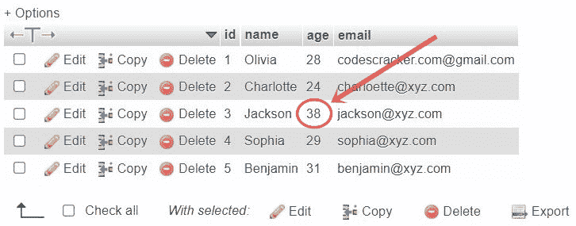
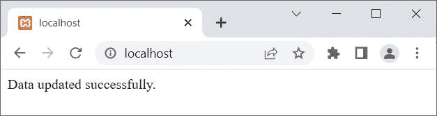
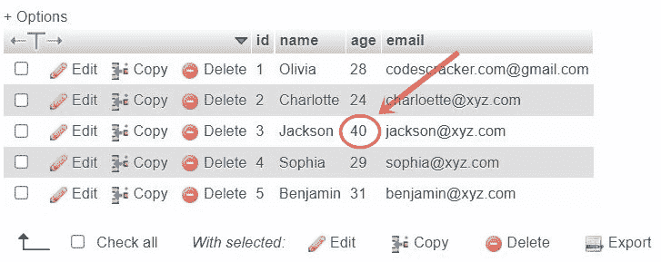

# PHP MySQLi 更新数据

> 原文：<https://codescracker.com/php/php-mysqli-update-record.htm>

本文旨在描述使用 PHP MySQLi 脚本更新或修改特定数据的方法。有两种方法可用于更新数据库中的任何特定数据或所有数据:

*   使用 PHP MySQLi 面向对象脚本
*   使用 PHP MySQLi 过程脚本

无论我们选择什么方法来更新数据。我们需要遵循这些简单的步骤:

*   [打开与数据库的连接](/php/php-mysqli-connect-to-database.htm)
*   编写一条关于数据修改的 SQL 语句
*   将编写的 SQL 语句初始化为一个[变量](/php/php-variables.htm)
*   使用此变量对数据库执行查询，修改特定数据
*   [关闭数据库连接](/php/php-mysqli-close-database-connection.htm)

更新特定数据的 SQL 语句是:

```
UPDATE tableName
SET column1=value1, column2=value2, column3=value3, ..., columnN=valueN
WHERE particularColumn=particularValue;
```

**重要** - **更新数据时要注意**。当我们需要 更新特定记录时，使用 **WHERE** 子句。

**注意**——省略 **WHERE** 子句，更新表中的所有记录。间接的，删除所有 以前的记录，所以要注意。

## 使用 PHP MySQLi 面向对象脚本更新数据

要使用 PHP MySQLi 面向对象脚本更新特定数据(记录或行),请遵循下面给出的示例。在本例中，我将更新 **id** 为 **3** 的记录的**年龄**:

```
<?php
   $servername = "localhost";
   $username = "root";
   $password = "";
   $dbname = "codescracker";

   $conn = new mysqli($servername, $username, $password, $dbname);

   if($conn->connect_errno)
   {
      echo "Connection to the database failed!<BR>";
      echo "Reason: ", $conn->connect_error;
      exit();
   }

   $sql = "UPDATE customer SET age='40' WHERE id=3";

   $result = $conn->query($sql);
   if($result)
   {
      echo "Data updated successfully.";

      // block of code, to process further...
   }
   else
   {
      echo "Error occurred while updating the record!<BR>";
      echo "Reason: ", $conn->error;
   }
   $conn->close();
?>
```

在执行上面的 PHP 脚本之前，这里是表 **customer** 的快照:



下面是上面的 PHP 示例在*使用 PHP MySQLi 面向对象的 脚本更新记录*时产生的输出:



下面是执行上述 PHP 脚本后名为 **student** 的表的快照:



**注意-**[MySQL()](/php/php-mysqli-connect-to-database.htm)用于以面向对象的方式打开到 MySQL 数据库服务器的 连接。

**注意-**[new](/php/php-new-keyword.htm)关键字用于创建一个新对象。

**注意-**[connect _ errno](/php/php-connect-errno-and-mysqli-connect-errno.htm)用于 以面向对象的方式获取/返回上次 connect 调用的错误代码(如果有)。

**注意-**[connect _ error](/php/php-connect-error-and-mysqli-connect-error.htm)用于 以面向对象的方式从最后一次连接中获取错误描述(如果有的话)。

**注意-**[exit()](/php/php-exit-function.htm)用于终止 当前 PHP 脚本的执行。

**注-**[query()](/php/php-query-and-mysqli-query.htm)用于对 MySQL 数据库进行查询，采用面向对象的方式。

**注-**[错误](/php/php-error-and-mysqli-error.htm)用于通过最近一次函数调用，以面向对象的方式返回错误的描述 (如果有的话)。

**注意-**[close()](/php/php-mysqli-close-database-connection.htm)用于关闭一个 打开的连接，采用面向对象的方式。

**注意-** 如果从上面的 PHP 脚本中删除 **WHERE** 子句，那么 所有行的 **age** 列将设置为 **40** 。

上面的例子，也可以写成:

```
<?php
   $conn = new mysqli("localhost", "root", "", "codescracker");

   if(!$conn->connect_errno)
   {
      if($conn->query("UPDATE customer SET age='40' WHERE id=3"))
         echo "Data updated successfully.";
   }
   $conn->close();
?>
```

## 使用 PHP MySQLi 程序脚本更新数据

要使用 PHP MySQLi 过程脚本更新数据，请遵循以下示例:

```
<?php
   $conn = mysqli_connect("localhost", "root", "", "codescracker");

   if(!mysqli_connect_errno())
   {
      $sql = "UPDATE customer SET age='42' WHERE id=3";

      if(mysqli_query($conn, $sql))
         echo "Data updated successfully.";
      else
      {
         echo "Error occurred while updating the record!<BR>";
         echo "Reason: ", mysqli_error($conn);
      }
   }
   mysqli_close($conn);
?>
```

**注意-**[MySQL _ connect()](/php/php-mysqli-connect-to-database.htm)用于以过程化的方式打开到 MySQL 数据库服务器的 连接。

**注意-**[mysqli _ connect _ errno()](/php/php-connect-errno-and-mysqli-connect-errno.htm) 用于获取/返回上一次 connect 调用的错误代码(如果有)，以过程的方式。

**注-**[MySQL _ query()](/php/php-query-and-mysqli-query.htm)用于在 MySQL 数据库上执行查询 ，以程序化的方式。

**注-**[mysqli _ error()](/php/php-error-and-mysqli-error.htm)用于通过最近一次函数调用，以面向对象的方式返回错误的描述 (如果有)。

**注意-**[MySQL _ close()](/php/php-mysqli-close-database-connection.htm)用于关闭 一个打开的到 MySQL 数据库的连接，以过程的方式。

## PHP MySQLi 面向对象-更新多个列

要一次更新多个列，除了 SQL 语句之外，所有操作都与在章节*使用 PHP MySQLi 面向对象脚本*更新数据中所做的一样。也就是说，要更新两个 列，即**年龄**和**电子邮件**，请使用以下 SQL 语句:

```
$sql = "UPDATE customer SET age='42', email='newmail@xyz.com' WHERE id=3";
```

要更新更多的列，比如三列，请使用以下 SQL 语句:

```
$sql = "UPDATE customer SET name='Lucas', age='42', email='newmail@xyz.com' WHERE id=3";
```

下面是一次更新多列的完整 PHP MySQLi 脚本:

```
<?php
   $conn = new mysqli("localhost", "root", "", "codescracker");

   if(!$conn->connect_errno)
   {
      $sql = "UPDATE customer SET name='Lucas', age='42', email='newmail@xyz.com' WHERE id=3";

      if($conn->query($sql))
         echo "Data updated successfully.";
      else
      {
         echo "Error occurred while updating the record!<BR>";
         echo "Reason: ", $conn->error;
      }
   }
   $conn->close();
?>
```

## PHP MySQLi 程序-更新多个列

```
<?php
   $conn = mysqli_connect("localhost", "root", "", "codescracker");

   if(!mysqli_connect_errno())
   {
      $sql = "UPDATE customer SET name='Lucas', age='42', email='newmail@xyz.com' WHERE id=3";

      if(mysqli_query($conn, $sql))
         echo "Data updated successfully.";
      else
      {
         echo "Error occurred while updating the record!<BR>";
         echo "Reason: ", mysqli_error($conn);
      }
   }
   mysqli_close($conn);
?>
```

## PHP MySQLi -一次更新所有行

要使用 PHP MySQLi 脚本更新所有行，所有的过程都是相同的，除了删除/省略 **WHERE** 子句。也就是说，要更新具有特定列的所有行，请使用以下类似的 SQL 语句:

```
$sql = "UPDATE customer SET email='newmail@xyz.com'";
```

要更新包含多列的所有行，请使用以下类似的 SQL 语句:

```
$sql = "UPDATE customer SET name='Lucas', age='42', email='newmail@xyz.com'";
```

[PHP 在线测试](/exam/showtest.php?subid=8)

* * *

* * *