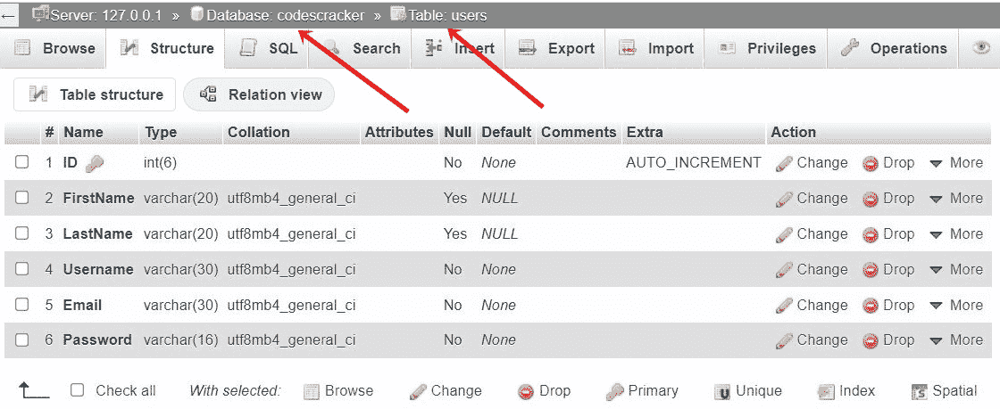
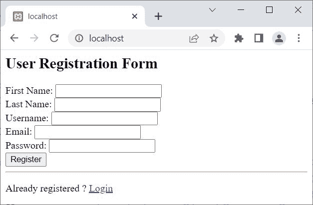
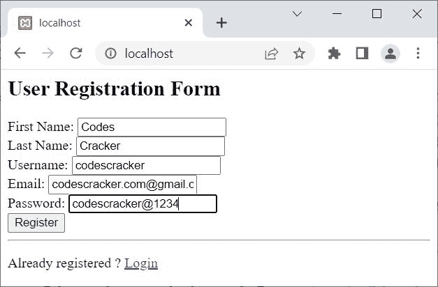
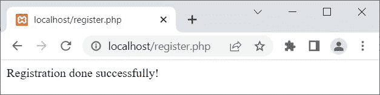
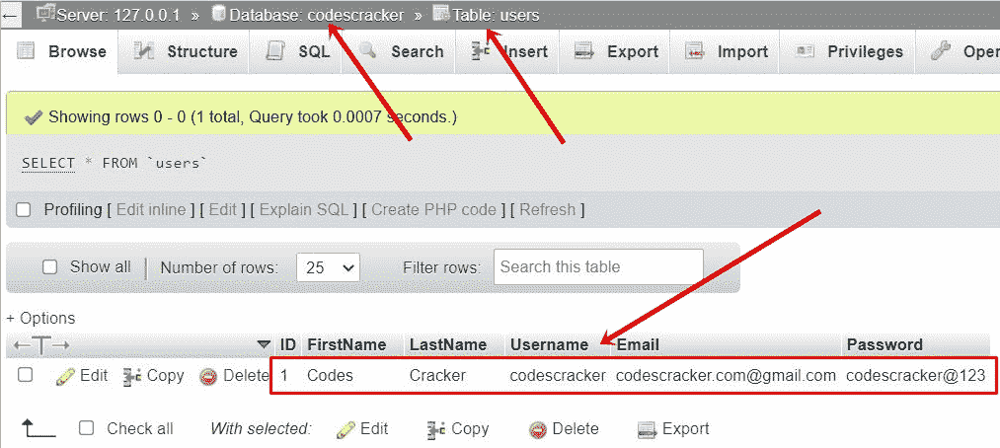
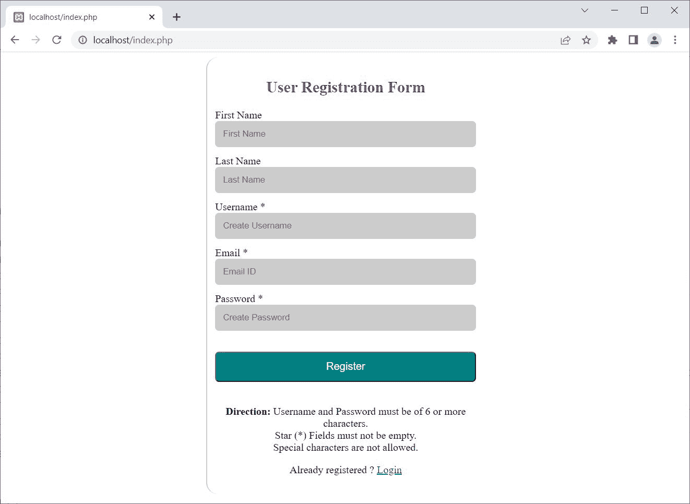
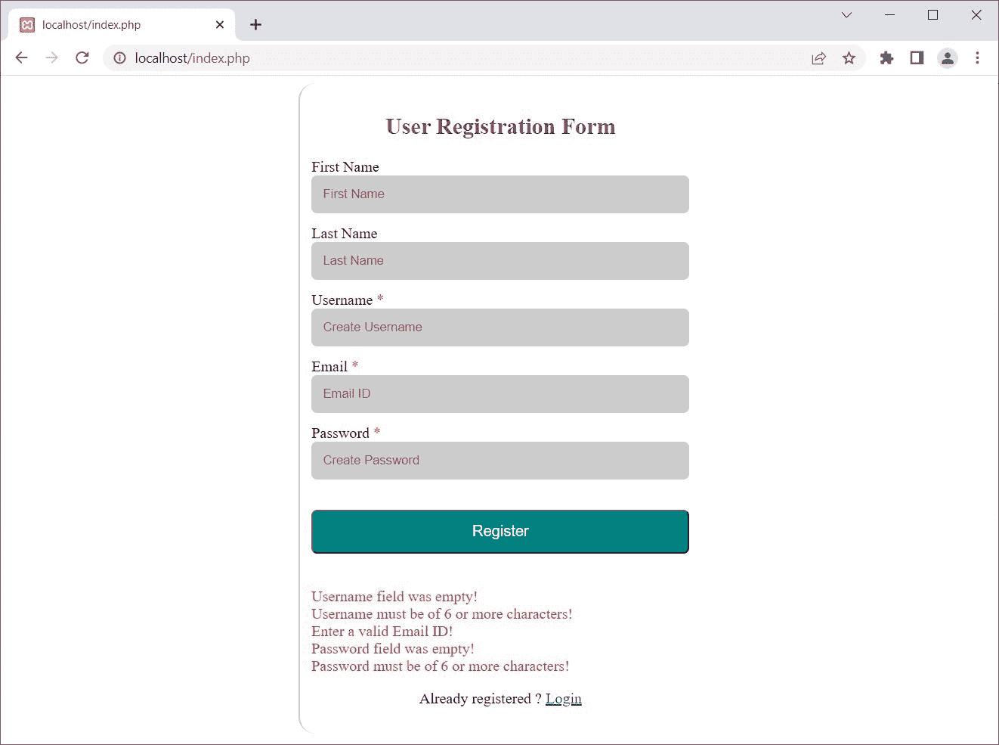

# PHP MySQLi 注册或注册页面/表单

> 原文：<https://codescracker.com/php/php-mysqli-signup-page.htm>

本文旨在描述如何使用 PHP MySQLi 面向对象和过程化脚本创建注册表单或页面。

但在创建注册表单之前，要允许用户注册，将他们的数据存储在数据库中。我们需要[创建一个数据库](/php/php-mysqli-create-database.htm)，然后 [在里面创建一个表](/php/php-mysqli-create-table.htm)，将用户注册数据存储在那个数据库的表 中。

**注意-** 一个数据库由一个或多个表组成。一个表格由行(记录)和列(字段)形式的 信息组成。

**注-** 我已经创建了一个名为 **codescracker** 的数据库。在该数据库中，创建了一个名为**用户** 的表，包含以下各列:

*   身份证明
*   西方人名的第一个字
*   姓
*   用户名
*   电子邮件
*   密码

下面是我的数据库中可用的表的快照:



您可以按照手动方式创建该表，也可以使用以下 SQL 语句:

```
CREATE TABLE users (
    ID INT(6) UNSIGNED AUTO_INCREMENT PRIMARY KEY,
    FirstName VARCHAR(20),
    LastName VARCHAR(20),
    Username VARCHAR(30) NOT NULL,
    Email VARCHAR(30) NOT NULL,
    Password VARCHAR(16) NOT NULL )
```

您也可以使用带有自定义字段/列的自定义表格。但是我建议用 same，来理解这里提供的东西，要容易得多。学习完这里给出的所有内容后，您可以根据自己的需求进一步修改和实现。

## PHP MySQLi 简单注册表单

在创建完整版本的注册表单或页面之前，使用 PHP MySQLi 脚本。让我们首先创建一个简单的和基本的。要创建一个简单而基本的注册表单，我们需要以下两个步骤来完成:

*   **第 1 步** -使用简单的 HTML 代码创建一个用户注册表单
*   **第二步**——创建一个 PHP MySQLi 脚本来获取表单数据，然后 发送/ [将数据插入数据库](/php/php-mysqli-insert-record.htm)

### PHP MySQLi 注册表单-第一步

现在让我们创建一个 HTML 表单，允许用户输入数据在网站上注册。在这里，我将创建一个简单和基本的 HTML 表单来获取用户的数据。稍后我将创建一个令人印象深刻的。

```
<H2>User Registration Form</H2>

<FORM action="register.php" METHOD="post">
   First Name: <INPUT type="text" name="firstname"><BR>
   Last Name: <INPUT type="text" name="lastname"><BR>
   Username: <INPUT type="text" name="username" required><BR>
   Email: <INPUT type="text" name="email" required><BR>
   Password: <INPUT type="text" name="password" required><BR>

   <BUTTON type="submit">Register</BUTTON><HR>

   <P>Already registered ? <a href="login.php">Login</a></P>
</FORM>
```

上面的用户注册表单代码产生的输出显示在下面给出的快照中:



**通知**到【register.php】的**页面**，分配给表单动作。也就是说，无论用户在 表单中输入什么，在提交表单后，通过点击**注册**按钮上的 ，表单数据将被发送到【register.php T4】页面。

现在填写用户注册表格中的数据，点击**注册**按钮进行注册。这里的 是同一个注册表的新快照，在填充数据后:



但是<u>在点击**注册**按钮</u>之前，我必须创建一个【register.php】的**页面**，由 处理表单数据并将数据发送到数据库中。让我来创建 register.php 页面。

### PHP MySQLi 注册表单-第 2 步

我将创建**register.php**页面，使用 **PHP MySQLi 面向对象脚本**作为 以及 **PHP MySQLi 过程脚本**。我们先从，面向对象开始。

#### PHP MySQLi 面向对象脚本-register.php

这是**register.php**页面，使用 PHP MySQLi 面向对象的脚本或代码创建。

```
<?php
   if($_SERVER["REQUEST_METHOD"] == "POST")
   {
      $server = "localhost";
      $user = "root";
      $pass = "";
      $db = "codescracker";

      $conn = new mysqli($server, $user, $pass, $db);

      if($conn -> connect_errno)
      {
         echo "Database connection failed!<BR>";
         echo "Reason: ", $conn->connect_error;
         exit();
      }
      else
      {
         $fname = $_POST["firstname"];
         $lname = $_POST["lastname"];
         $uname = $_POST["username"];
         $email = $_POST["email"];
         $pass = $_POST["password"];

         $sql = "INSERT INTO `users`(`FirstName`, `LastName`, `Username`, `Email`, `Password`)
            VALUES ('$fname', '$lname', '$uname', '$email', '$pass')";

         $qry = $conn -> query($sql);
         if($qry)
         {
            echo "Registration done successfully!";

            // block of code, to process further...
         }
         else
         {
            echo "Something went wrong while registration!<BR>";
            echo "Error Description: ", $conn -> error;
         }
      }
   }
   $conn -> close();
?>
```

**注意-**[MySQL()](/php/php-mysqli-connect-to-database.htm)用于以面向对象的方式打开到 MySQL 数据库服务器的 连接。

**注意-**[new](/php/php-new-keyword.htm)关键字用于创建一个新对象。

**注意-**[connect _ errno](/php/php-connect-errno-and-mysqli-connect-errno.htm)用于 以面向对象的方式获取/返回上次 connect 调用的错误代码(如果有)。

**注意-**[connect _ error](/php/php-connect-error-and-mysqli-connect-error.htm)用于 以面向对象的方式从最后一次连接中获取错误描述(如果有的话)。

**注意-**[exit()](/php/php-exit-function.htm)用于终止 当前 PHP 脚本的执行。

**注-**[query()](/php/php-query-and-mysqli-query.htm)用于对 MySQL 数据库进行查询，采用面向对象的方式。

**注-**[错误](/php/php-error-and-mysqli-error.htm)用于通过最近一次函数调用，以面向对象的方式返回错误的描述 (如果有的话)。

**注意-**[close()](/php/php-mysqli-close-database-connection.htm)用于关闭一个 打开的连接，采用面向对象的方式。

上面的 PHP MySQLi 面向对象脚本处理用户注册表单数据，也可以这样创建:

```
<?php
   if($_SERVER["REQUEST_METHOD"] == "POST")
   {
      $conn = new mysqli("localhost", "root", "", "codescracker");

      if(!$conn->connect_errno)
      {
         $fname = $_POST["firstname"];
         $lname = $_POST["lastname"];
         $uname = $_POST["username"];
         $email = $_POST["email"];
         $pass = $_POST["password"];

         $sql = "INSERT INTO `users`(`FirstName`, `LastName`, `Username`, `Email`, `Password`)
            VALUES ('$fname', '$lname', '$uname', '$email', '$pass')";

         if($conn->query($sql))
            echo "Registration done successfully!";
      }
   }
   $conn->close();
?>
```

#### PHP MySQLi 程序脚本-register.php

这里是使用 PHP MySQLi 程序脚本创建的**register.php**页面:。

```
<?php
   if($_SERVER["REQUEST_METHOD"] == "POST")
   {
      $server = "localhost";
      $user = "root";
      $pass = "";
      $db = "codescracker";

      $conn = mysqli_connect($server, $user, $pass, $db);

      if(mysqli_connect_errno())
      {
         echo "Database connection failed!<BR>";
         echo "Reason: ", mysqli_connect_error();
         exit();
      }
      else
      {
         $fname = $_POST["firstname"];
         $lname = $_POST["lastname"];
         $uname = $_POST["username"];
         $email = $_POST["email"];
         $pass = $_POST["password"];

         $sql = "INSERT INTO `users`(`FirstName`, `LastName`, `Username`, `Email`, `Password`)
            VALUES ('$fname', '$lname', '$uname', '$email', '$pass')";

         $qry = mysqli_query($conn, $sql);
         if($qry)
         {
            echo "Registration done successfully!";

            // block of code, to process further
         }
         else
         {
            echo "Something went wrong while registration!<BR>";
            echo "Error Description: ", mysqli_error($conn);
         }
      }
   }
   mysqli_close($conn);
?>
```

现在填写数据并点击**注册**按钮。以下是您将获得的输出:



现在，如果您打开数据库 **codescracker** 中名为 **users** 的表，就会插入一条记录 。以下是该表的新快照:



**注意-**[MySQL _ connect()](/php/php-mysqli-connect-to-database.htm)用于以过程化的方式打开到 MySQL 数据库服务器的 连接。

**注意-**[mysqli _ connect _ errno()](/php/php-connect-errno-and-mysqli-connect-errno.htm) 用于获取/返回上一次 connect 调用的错误代码(如果有)，以过程的方式。

**注意-**[mysqli _ connect _ error()](/php/php-connect-error-and-mysqli-connect-error.htm) 用于以过程化的方式返回上一次连接的错误描述(如果有的话)。

**注-**[MySQL _ query()](/php/php-query-and-mysqli-query.htm)用于在 MySQL 数据库上执行查询 ，以程序化的方式。

**注-**[mysqli _ error()](/php/php-error-and-mysqli-error.htm)用于通过最近一次函数调用，以面向对象的方式返回错误的描述 (如果有)。

**注意-**[MySQL _ close()](/php/php-mysqli-close-database-connection.htm)用于关闭 一个打开的到 MySQL 数据库的连接，以过程的方式。

## PHP MySQLi 安全问题登记表

在创建一个允许用户输入信息的 web 应用程序时，我们需要注意使我们的应用程序更加安全的步骤。

在互联网上，或者在你的应用程序上，许多可疑的用户可能试图利用你的应用程序，攻击你的应用程序，或者为了他们的利益而对你的应用程序采取任何措施。

因此，我们需要采取一些措施来避免对我们的数据库的可疑攻击:

*   使用准备好的语句，而不是普通的语句。因为在使用 prepared 语句时，参数总是被认为是参数，而不是命令
*   在将数据发送到数据库之前，对其进行过滤

我真的不知道，你正在构建或者将要构建什么类型的应用程序。但我想说的是，采取一切必要的措施来防止你的数据/数据库被攻击者窃取。现在让我在单页中创建完整的注册表。这一次，我采取了一些必要的措施来确保注册表。

## 在单页中完成 PHP MySQLi 注册表单和脚本

开发者想在注册表中实现什么是非常主观的。例如，一些开发人员希望允许用户输入长度应该在 8 到 16 之间用户名和/或密码，而一些开发人员不允许。由你来决定。因此，我将为用户注册页面创建一个普通的深度 PHP MySQLi 脚本。

这个 PHP MySQLi 脚本使用准备好的语句将用户数据注册到数据库中。此外，我在一个页面中创建了表单和表单处理程序脚本，以便在同一页面上显示关于表单的错误(如果有的话)。

```
<?php
   $driver = new mysqli_driver();
   $driver -> report_mode = MYSQLI_REPORT_OFF;

   if(isset($_SESSION['log']))
   {
      header('Location: welcome.php');
      exit();
   }
   else
   {
      if($_SERVER["REQUEST_METHOD"] == "POST")
      {
         function validData($x)
         {
            $x = trim($x);
            $x = stripslashes($x);
            $x = htmlspecialchars($x);
            return $x;
         }

         $server = "localhost";
         $user = "root";
         $pass = "";
         $db = "codescracker";

         $conn = @new mysqli($server, $user, $pass, $db);

         if($conn->connect_errno)
         {
            echo "Database connection failed!<BR>";
            echo "Reason: ", $conn->connect_error;
            exit();
         }

         $fname = $lname = $uname = $email = $pass = "";
         $unameE = $emailE = $passE = "";

         $fname = validData($_POST["firstname"]);
         $lname = validData($_POST["lastname"]);
         $uname = validData($_POST["username"]);
         $email = validData($_POST["email"]);
         $pass = validData($_POST["password"]);

         if(empty($uname))
            $unameE = "Username field was empty!<BR>";
         if(empty($email))
            $emailE = "Email Id field was empty!<BR>";
         if(empty($pass))
            $passE = "Password field was empty!<BR>";
         if(strlen($uname)<6)
            $unameE .= "Username must be of 6 or more characters!<BR>";
         if(strlen($pass)<6)
            $passE .= "Password must be of 6 or more characters!<BR>";
         if(!filter_var($email, FILTER_VALIDATE_EMAIL))
            $emailE .= "Enter a valid Email ID!<BR>";

         if(!empty($unameE) || !empty($emailE) || !empty($passE))
            $err = "Try again";
         else
         {
            $sql = "INSERT INTO `users`(`FirstName`, `LastName`, `Username`, `Email`, `Password`)
               VALUES (?, ?, ?, ?, ?)";

            $stmt = $conn->prepare($sql);
            $stmt->bind_param("sssss", $fname, $lname, $uname, $email, $pass);

            if($stmt->execute())
            {
               $_SESSION['log'] = $uname;
               header('Location: welcome.php');
               exit();
            }
            else
               $execE = "Something went wrong<BR>Please try again!";
         }
         $conn->close();
      }
   }
?>
<HTML>
<HEAD>
<STYLE>
   .form{width: 400px; margin: auto; padding: 12px; border-left: 2px solid #ccc; border-radius: 18px;}
   h2{color: purple; text-align: center;}
   input{padding: 12px; width: 100%; margin-bottom: 12px; border: 0px; border-radius: 6px;
      background-color: #ccc;}
   button{margin: 20px 0px; width: 100%; background-color: #008080; color: white; padding: 12px;
      font-size: 1rem; border-radius: 6px;}
   p{text-align: center;}
   button:hover{cursor: pointer;}
   .red{color: red;}
</STYLE>
</HEAD>
<BODY>

<DIV class="form">
   <H2>User Registration Form</H2>
   <FORM name="register" method="post" action="<?php echo htmlspecialchars($_SERVER["PHP_SELF"]);?>">
      <LABEL>First Name</LABEL><BR>
      <INPUT type="text" name="firstname" placeholder="First Name"><BR>
      <LABEL>Last Name</LABEL><BR>
      <input type="text" name="lastname" placeholder="Last Name"><BR>
      <LABEL>Username
      <?php
         if(!empty($unameE))
            echo "<SPAN class=\"red\">*</SPAN>";
         else
            echo "*";
      ?>
      </LABEL><BR>
      <INPUT type="text" name="username" placeholder="Create Username" required><BR>
      <LABEL>Email
      <?php
         if(!empty($emailE))
            echo "<SPAN class=\"red\">*</SPAN>";
         else
            echo "*";
      ?>
      </LABEL><BR>
      <INPUT type="text" name="email" placeholder="Email ID" required><BR>
      <LABEL>Password
      <?php
         if(!empty($passE))
            echo "<SPAN class=\"red\">*</SPAN>";
         else
            echo "*";
      ?>
      </LABEL><BR>
      <INPUT type="text" name="password" placeholder="Create Password" required><BR>
      <BUTTON type="submit">Register</BUTTON>
   </FORM>
   <?php
   if(isset($err))
   {
      echo "<DIV class=\"red\">";
      if(!empty($unameE))
         echo $unameE;
      if(!empty($emailE))
         echo $emailE;
      if(!empty($passE))
         echo $passE;
      echo "</DIV>";
   }
   elseif(isset($execE))
      echo $execE;
   else
   {
      echo "<P><B>Direction: </B> Username and Password must be of 6 or more characters.<BR>";
      echo "Star (*) Fields must not be empty.<BR>";
      echo "Special characters are not allowed.</P>";
   }
   ?>
   <P>Already registered ? <a href="login.php">Login</a></P>
</DIV>

</BODY>
</HTML>
```

上面的 PHP MySQLi 用户注册表单产生的输出显示在下面给出的快照中:



现在，如果您输入无效/错误的输入，您将在同一页面上看到错误消息。以下是提供**代码#xyz.com** 作为**电子邮件 ID** 并且其他字段为空后的快照:



在点击**注册**按钮之前，我删除了**必需的**属性，留下了 字段**用户名**和**密码**为空，以及**电子邮件 ID** 字段和**代码#xyz.com** 。

提供有效数据后，用户在网站上注册，页面将被重定向到**welcome.php**页面。

**注-**[mysqli _ driver()](/php/php-mysqli-driver-and-mysqli-report.htm)用于 修改错误报告模式，采用面向对象的方式。

**注意-**[header()](/php/php-header-function.htm)函数用于发送原始的 HTTP 报头。大部分时间，用于重定向。

**注意-**[prepare()](/php/php-prepare-and-mysqli-prepare.htm)用于在 MySQL 数据库上执行 SQL 语句之前，以面向对象的方式准备该语句，以避免 SQL 注入。

**注意-**[bind _ param()](/php/php-bind-param-and-mysqli-stmt-bind-param.htm)用于 以面向对象的方式将变量作为参数绑定到准备好的语句。

**注意-**[execute()](/php/php-execute-and-mysqli-stmt-execute.htm)用于在 MySQL 数据库上以面向对象的方式执行 准备好的语句。

[PHP 在线测试](/exam/showtest.php?subid=8)

* * *

* * *