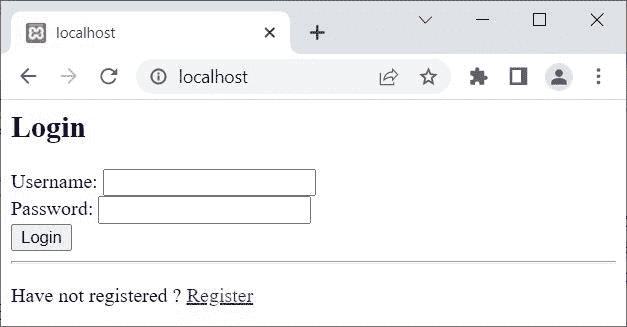
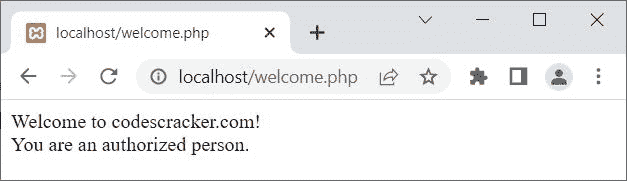
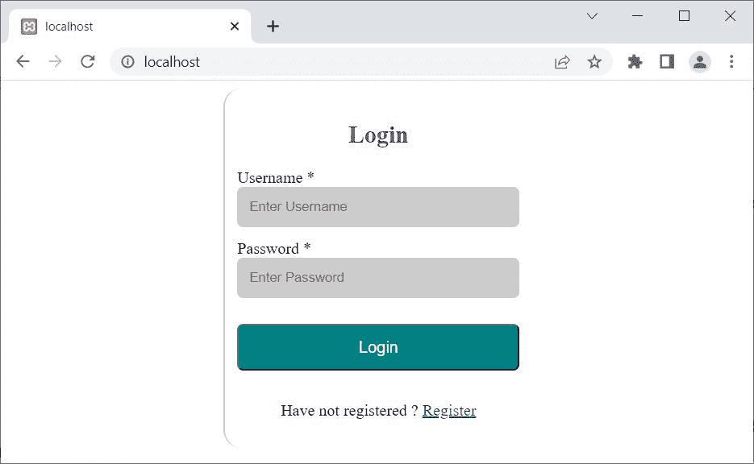
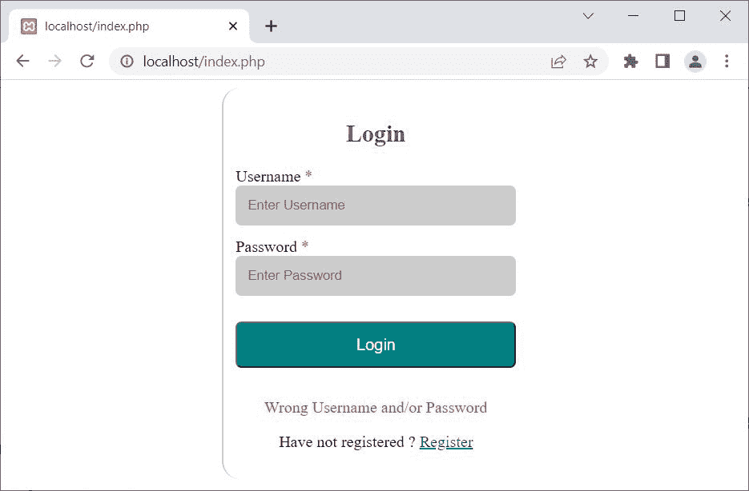
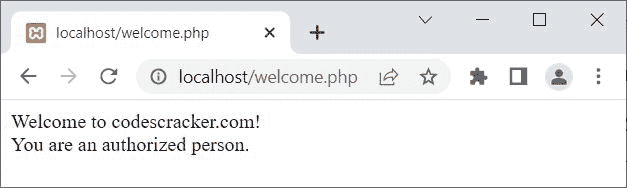

# PHP MySQLi 登录页面或表单

> 原文：<https://codescracker.com/php/php-mysqli-login-page.htm>

本文旨在描述如何使用 PHP MySQLi 面向对象和过程化脚本创建登录页面或表单。

在本文中，首先我将创建一个简单的基本登录系统，它由以下三个文件组成:

*   一个**index.php**文件，由 HTML 登录表单组成
*   一个**login.php**文件，由 PHP MySQLi 脚本组成，用来处理表单数据，以便登录
*   一个**welcome.php**文件，在验证用户后执行

在本文的最后，我将创建一个完整的登录页面，由登录表单和数据处理程序脚本组成。此外，我将登录表单的样式，使它看起来令人印象深刻。但是现在，让我们从简单和基本的开始。

## PHP MySQLi 登录页面-获取登录数据的 HTML 表单

```
<H2>Login</H2>

<FORM action="login.php" method="post">
   Username: <INPUT type="text" name="username" required><BR>
   Password: <INPUT type="text" name="password" required><BR>
   <BUTTON type="submit">Login</BUTTON><HR>
</FORM>

<P>Have not registered ? <a href="register.php">Register</a></P>
```

输出是:



现在输入数据说 **codescracker** 为**用户名**和 **codescracker@1234** 为**密码**。 但是<u>在点击**登录**按钮</u>之前，让我先创建**login.php**文件 使用面向对象以及过程化的风格。然后会创建**welcome.php**文件。

## PHP MySQLi 面向对象的脚本来处理登录数据

```
<?php
   if($_SERVER["REQUEST_METHOD"] == "POST")
   {
      $server = "localhost";
      $user = "root";
      $pass = "";
      $db = "codescracker";

      $conn = new mysqli($server, $user, $pass, $db);

      if($conn -> connect_errno)
      {
         echo "Database connection failed!<BR>";
         echo "Reason: ", $conn -> connect_error;
         exit();
      }
      else
      {
         $uname = $_POST["username"];
         $pass = $_POST["password"];

         $sql = "SELECT * FROM users WHERE Username='$uname' and Password='$pass'";
         $stmt = $conn -> query($sql);

         if($stmt)
         {
            $_SESSION['log'] = $uname;
            header('Location: welcome.php');
            exit();
         }
         else
         {
            echo "Something went wrong!<BR>";
            echo "Error Description: ", $conn -> error;
      }
   }
   $conn -> close();
?>
```

**注意-**[MySQL()](/php/php-mysqli-connect-to-database.htm)用于以面向对象的方式打开到 MySQL 数据库服务器的 连接。

**注意-**[new](/php/php-new-keyword.htm)关键字用于创建一个新对象。

**注意-**[connect _ errno](/php/php-connect-errno-and-mysqli-connect-errno.htm)用于 以面向对象的方式获取/返回上次 connect 调用的错误代码(如果有)。

**注意-**[connect _ error](/php/php-connect-error-and-mysqli-connect-error.htm)用于 以面向对象的方式从最后一次连接中获取错误描述(如果有的话)。

**注意-**[exit()](/php/php-exit-function.htm)用于终止 当前 PHP 脚本的执行。

**注-**[query()](/php/php-query-and-mysqli-query.htm)用于对 MySQL 数据库进行查询，采用面向对象的方式。

**注意-**[header()](/php/php-header-function.htm)函数用于发送原始的 HTTP 报头。大部分时间，用于重定向。

**注-**[错误](/php/php-error-and-mysqli-error.htm)用于通过最近一次函数调用，以面向对象的方式返回错误的描述 (如果有的话)。

**注意-**[close()](/php/php-mysqli-close-database-connection.htm)用于关闭一个 打开的连接，采用面向对象的方式。

上面的脚本或代码，也可以这样写:

```
<?php
   if($_SERVER["REQUEST_METHOD"] == "POST")
   {
      $conn = new mysqli("localhost", "root", "", "codescracker");
      if(!$conn->connect_errno)
      {
         $uname = $_POST["username"];
         $pass = $_POST["password"];
         $sql = "SELECT * FROM users WHERE Username='$uname' and Password='$pass'";
         if($conn->query($sql))
         {
            $_SESSION['log'] = $uname;
            header('Location: welcome.php');
            exit();
         }
      }
      $conn->close();
   }
?>
```

## 处理登录数据的 PHP MySQLi 程序脚本

以下是 PHP MySQLi 程序风格的**login.php**文件脚本:

```
<?php
   if($_SERVER["REQUEST_METHOD"] == "POST")
   {
      $conn = mysqli_connect("localhost", "root", "", "codescracker");
      if(!mysqli_connect_errno())
      {
         $uname = $_POST["username"];
         $pass = $_POST["password"];
         $sql = "SELECT * FROM users WHERE Username='$uname' and Password='$pass'";
         if(mysqli_query($conn, $sql))
         {
            $_SESSION['log'] = $uname;
            header('Location: welcome.php');
            exit();
         }
      }
      mysqli_close($conn);
   }
?>
```

**注意-**[MySQL _ connect()](/php/php-mysqli-connect-to-database.htm)用于以过程化的方式打开到 MySQL 数据库服务器的 连接。

**注意-**[mysqli _ connect _ errno()](/php/php-connect-errno-and-mysqli-connect-errno.htm) 用于获取/返回上一次 connect 调用的错误代码(如果有)，以过程的方式。

**注-**[MySQL _ query()](/php/php-query-and-mysqli-query.htm)用于在 MySQL 数据库上执行查询 ，以程序化的方式。

**注意-**[MySQL _ close()](/php/php-mysqli-close-database-connection.htm)用于关闭 一个打开的到 MySQL 数据库的连接，以过程的方式。

## welcome.php 文件的 PHP MySQLi 脚本

下面是**welcome.php**文件的脚本:

```
<?php 
   session_start();

   if(isset($_SESSION['log']))
   {
      echo "Welcome to codescracker.com!<BR>";
      echo "You are an authorized person.";

      // block of code, to process further...
   }
   else
   {
      header('Location: index.php');
      exit();
   }

   // block of code, to process further...
?>
```

现在点击**登录**按钮。点击**登录**按钮后，表单数据将被提交 或发送到**login.php**文件。在验证用户后，**login.php**页面将用户发送到 **welcome.php**页面。下面是成功登录后的最终输出，我们将看到:



## PHP MySQLi 完整登录页面

我将使用准备好的语句创建一个完整的登录系统，使用 PHP MySQLi 面向对象的脚本，使登录系统更加安全可靠。

```
<?php
   error_reporting(0);
   if($_SERVER["REQUEST_METHOD"] == "POST")
   {
      function validData($x)
      {
         $x = trim($x);
         $x = stripslashes($x);
         $x = htmlspecialchars($x);
         return $x;
      }
      $conn = new mysqli("localhost", "root", "", "codescracker");
      if(!$conn->connect_errno)
      {
         $uname = validData($_POST["username"]);
         $pass = validData($_POST["password"]);
         if(!empty($uname) and !empty($pass))
         {
            $sql = "SELECT * FROM users WHERE Username=? and Password=?";
            $stmt = $conn->prepare($sql);
            $stmt->bind_param("ss", $uname, $pass);
            if($stmt->execute())
            {
               $result = $stmt->get_result();
               if($result->num_rows)
               {
                  $_SESSION['log'] = $uname;
                  header('Location: welcome.php');
                  exit();
               }
               else
                  $err = "Wrong Username and/or Password";
            }
         }
      }
      $conn->close();
   }
?>
<HTML>
<HEAD>
<STYLE>
   .form{width: 280px; margin: auto; padding: 12px; border-left: 2px solid #ccc;
      border-radius: 18px;}
   h2{color: purple; text-align: center;}
   input{padding: 12px; width: 100%; margin-bottom: 12px; border: 0px;
      border-radius: 6px; background-color: #ccc;}
   button{margin: 14px 0px; width: 100%; background-color: #008080; color: white;
      padding: 12px; font-size: 1rem; border-radius: 6px;}
   p{text-align: center;}
   button:hover{cursor: pointer;}
   .red{text-align: center; color: red;}
</STYLE>
</HEAD>
<BODY>

<DIV class="form">
   <H2>Login</H2>
   <FORM name="login" method="post" action="<?php echo htmlspecialchars($_SERVER["PHP_SELF"]);?>">
      <LABEL>Username
      <?php
         if(!empty($err))
            echo "<SPAN class=\"red\">*</SPAN>";
         else
            echo "*";
      ?></LABEL><BR>
      <INPUT type="text" name="username" placeholder="Enter Username" required><BR>
      <LABEL>Password
      <?php
         if(!empty($err))
            echo "<SPAN class=\"red\">*</SPAN>";
         else
            echo "*";
      ?></LABEL><BR>
      <INPUT type="text" name="password" placeholder="Enter Password" required><BR>
      <BUTTON type="submit">Login</BUTTON>
   </FORM>
   <?php
      echo "<DIV class=\"red\">"; 
      if(isset($err))
         echo $err;
      echo "</DIV>";
   ?>
   <P>Have not registered ? <a href="login.php">Register</a></P>
</DIV>

</BODY>
</HTML>
```

下面是上面的 PHP 示例产生的初始输出:



现在让我先输入一些错误的输入，说**未知**为用户名，**未知**为密码。这里的 是点击**登录**按钮后的输出:



现在让我提供注册的用户名和密码，即用户名 **codescracker** 和密码 **codescracker@123** :



你看到的输出是 welcome.php 的文件。您可以根据需要修改这个文件。

**注-**[error _ reporting()](/php/php-error-reporting-function.htm)用于定义，要显示什么 错误。

**注意-**[prepare()](/php/php-prepare-and-mysqli-prepare.htm)用于在 MySQL 数据库上执行 SQL 语句之前，以面向对象的方式准备该语句，以避免 SQL 注入。

**注意-**[bind _ param()](/php/php-bind-param-and-mysqli-stmt-bind-param.htm)用于 以面向对象的方式将变量作为参数绑定到准备好的语句。

**注意-**[execute()](/php/php-execute-and-mysqli-stmt-execute.htm)用于在 MySQL 数据库上以面向对象的方式执行 准备好的语句。

[PHP 在线测试](/exam/showtest.php?subid=8)

* * *

* * *