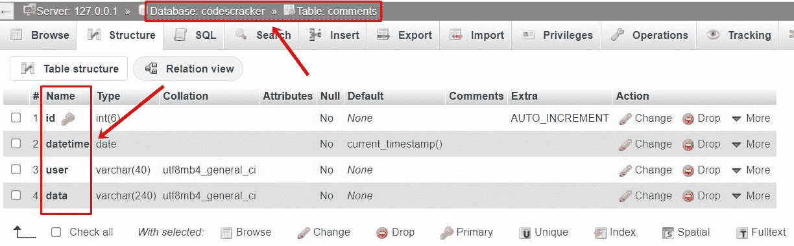
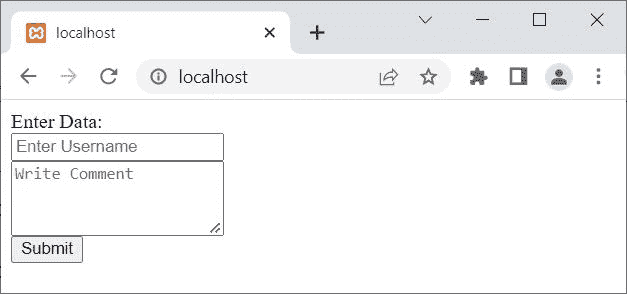
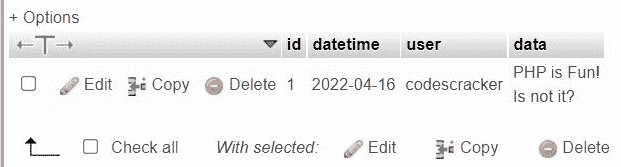
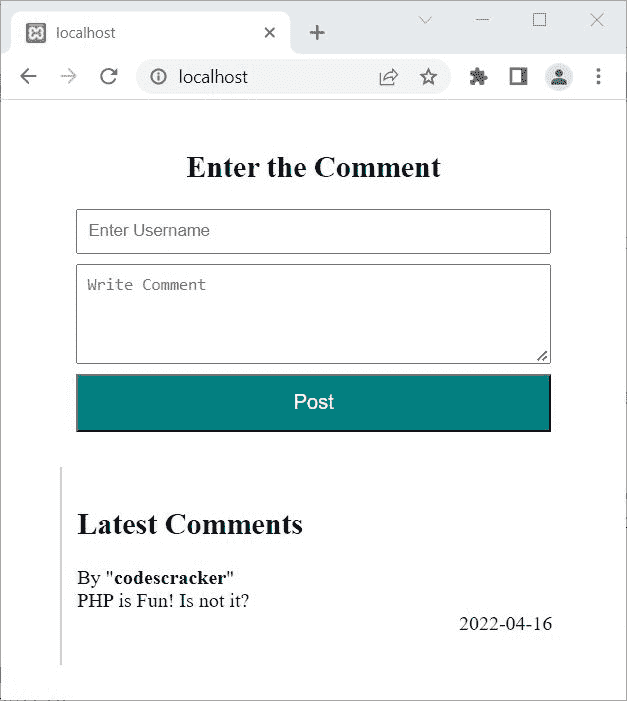
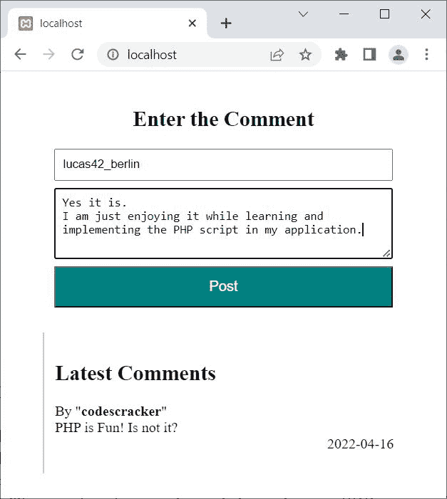
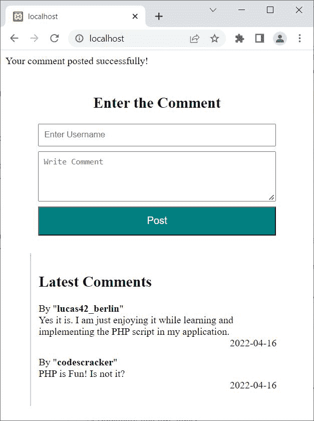

# PHP MySQLi 代码在数据库中存储表单数据

> 原文：<https://codescracker.com/php/php-mysqli-store-user-data.htm>

本文旨在描述如何使用 PHP MySQLi 面向对象和过程化脚本来存储表单数据或用户在 web 上输入的数据。

## 使用 PHP MySQLi 面向对象脚本存储表单数据

我真的不知道你的要求，在数据库中保存或存储用户(表格)数据。我是说，你需要存储什么类型的数据？
但是在这里，我将创建一个表单，用户填写他们的用户名和评论，存储在 数据库中。

无论您需要存储什么数据，过程都是一样的，如下例所示:

```
<?php
   if($_SERVER["REQUEST_METHOD"] == "POST")
   {
      $server = "localhost";
      $user = "root";
      $pass = "";
      $db = "codescracker";

      $conn = new mysqli($server, $user, $pass, $db);

      if($conn -> connect_errno)
      {
         echo "Database connection failed!<BR>";
         echo "Reason: ", $conn -> connect_error;
         exit();
      }
      else
      {
         $user = $_POST["user"];
         $data = $_POST["data"];

         $sql = "INSERT INTO comments(user, data)
            VALUES('$user', '$data');";

         $res = $conn -> query($sql);
         if($res)
         {
            echo "Data inserted into the database successfully!";

            // block of code, to process further...
         }
         else
         {
            echo "Something went wrong!<BR>";
            echo "Error description: ", $conn -> error;
            exit();
         }
      }
      $conn -> close();
   }
?>
<HTML>
<BODY>

<FORM METHOD="POST">
   Enter Data:<BR>
   <INPUT TYPE="text" NAME="user" MAXLENGTH="40" PLACEHOLDER="Enter Username"><BR>
   <TEXTAREA TYPE="text" STYLE="height:60px;" NAME="data" MAXLENGTH="240" PLACEHOLDER="Write Comment"></TEXTAREA><BR>
   <INPUT TYPE="submit" NAME="comment" VALUE="Submit">
</FORM>

</BODY>
</HTML>
```

在执行上面的*将表单数据存储到数据库*的例子之前，必须有一个名为 **codescracker** ， 的数据库，其中有一个名为 **comments** 的表，有以下字段:



所有的数据，都应该存储在这个表中。下面是上面 PHP MySqLi 面向对象脚本产生的初始输出示例，用于在数据库中存储用户数据/评论:



现在输入数据，在用户名栏说 **codescracker** ，而 **PHP 很有趣？
不就是吗？**在评论栏里。然后点击**提交**按钮。这里是输出，您将看到:


以下是执行上述脚本后，表 **customer** 的快照:



**注意-**[MySQL()](/php/php-mysqli-connect-to-database.htm)用于以面向对象的方式打开到 MySQL 数据库服务器的 连接。

**注意-**[new](/php/php-new-keyword.htm)关键字用于创建一个新对象。

**注意-**[connect _ errno](/php/php-connect-errno-and-mysqli-connect-errno.htm)用于 以面向对象的方式获取/返回上次 connect 调用的错误代码(如果有)。

**注意-**[connect _ error](/php/php-connect-error-and-mysqli-connect-error.htm)用于 以面向对象的方式从最后一次连接中获取错误描述(如果有的话)。

**注-**[query()](/php/php-query-and-mysqli-query.htm)用于对 MySQL 数据库进行查询，采用面向对象的方式。

**注-**[错误](/php/php-error-and-mysqli-error.htm)用于通过最近一次函数调用，以面向对象的方式返回错误的描述 (如果有的话)。

**注意-**[exit()](/php/php-exit-function.htm)用于终止 当前 PHP 脚本的执行。

**注意-**[close()](/php/php-mysqli-close-database-connection.htm)用于关闭一个 打开的连接，采用面向对象的方式。

上面的例子，也可以这样创建:

```
<?php
   if($_SERVER["REQUEST_METHOD"] == "POST")
   {
      $conn = new mysqli("localhost", "root", "", "codescracker");

      if(!$conn -> connect_errno)
      {
         $user = $_POST["user"];
         $data = $_POST["data"];

         $sql = "INSERT INTO comments(user, data)
            VALUES('$user', '$data');";

         if($conn -> query($sql))
            echo "Data inserted into the database successfully!";
      }
      $conn -> close();
   }
?>
<HTML>
<BODY>

<FORM METHOD="POST">
   Enter Data:<BR>
   <INPUT TYPE="text" NAME="user" MAXLENGTH="40" PLACEHOLDER="Enter Username"><BR>
   <TEXTAREA TYPE="text" STYLE="height:60px;" NAME="data" MAXLENGTH="240" PLACEHOLDER="Write Comment"></TEXTAREA><BR>
   <INPUT TYPE="submit" NAME="comment" VALUE="Submit">
</FORM>

</BODY>
</HTML>
```

## 使用 PHP MySQLi 程序脚本存储表单数据

要使用 PHP MySQLi 过程脚本存储表单数据，请遵循以下示例:

```
<?php
   if($_SERVER["REQUEST_METHOD"] == "POST")
   {
      $conn = mysqli_connect("localhost", "root", "", "codescracker");

      if(mysqli_connect_errno())
      {
         echo "Database connection failed!<BR>";
         echo "Reason: ", mysqli_connect_error();
         exit();
      }
      else
      {
         $user = $_POST["user"];
         $data = $_POST["data"];

         $sql = "INSERT INTO comments(user, data)
            VALUES('$user', '$data');";

         if(mysqli_query($conn, $sql))
            echo "Data inserted into the database successfully!";
         else
         {
            echo "Something went wrong!<BR>";
            echo "Error description: ", $conn -> error;
            exit();
         }
      }
      mysqli_close($conn);
   }
?>
<HTML>
<BODY>

<FORM METHOD="POST">
   Enter Data:<BR>
   <INPUT TYPE="text" NAME="user" MAXLENGTH="40" PLACEHOLDER="Enter Username"><BR>
   <TEXTAREA TYPE="text" STYLE="height:60px;" NAME="data" MAXLENGTH="240" PLACEHOLDER="Write Comment"></TEXTAREA><BR>
   <INPUT TYPE="submit" NAME="comment" VALUE="Submit">
</FORM>

</BODY>
</HTML>
```

**注意-**[MySQL _ connect()](/php/php-mysqli-connect-to-database.htm)用于以过程化的方式打开到 MySQL 数据库服务器的 连接。

**注意-**[mysqli _ connect _ errno()](/php/php-connect-errno-and-mysqli-connect-errno.htm) 用于获取/返回上一次 connect 调用的错误代码(如果有)，以过程的方式。

**注意-**[mysqli _ connect _ error()](/php/php-connect-error-and-mysqli-connect-error.htm) 用于以过程化的方式返回上一次连接的错误描述(如果有的话)。

**注-**[MySQL _ query()](/php/php-query-and-mysqli-query.htm)用于在 MySQL 数据库上执行查询 ，以程序化的方式。

**注-**[mysqli _ error()](/php/php-error-and-mysqli-error.htm)用于通过最近一次函数调用，以面向对象的方式返回错误的描述 (如果有)。

**注意-**[MySQL _ close()](/php/php-mysqli-close-database-connection.htm)用于关闭 一个打开的到 MySQL 数据库的连接，以过程的方式。

上面给出的例子看起来非常简单和基本。此外，数据被保存在数据库中，甚至没有基本的过滤器，这可能有时是恶意的。因此，让我创建另一个安全的 PHP MySQLi 脚本，做同样的工作，在数据库中存储表单数据。

## PHP MySQLi 安全和安全的脚本保存数据库中的表单数据

这个在数据库中存储用户表单数据的例子是使用 PHP MySQLi 安全的面向对象的脚本创建的。

```
<?php
   $conn = new mysqli("localhost", "root", "", "codescracker");
   if($conn->connect_errno)
   {
      echo "Database connection failed!<BR>";
      echo "Reason: ", $conn->connect_error;
      exit();
   }
   if($_SERVER["REQUEST_METHOD"] == "POST")
   {
      function validate($x)
      {
         $x = trim($x);
         $x = stripslashes($x);
         $x = htmlspecialchars($x);
         return $x;
      }
      $stmt = $conn->prepare("INSERT INTO comments(user, data) VALUES (?, ?)");
      $stmt->bind_param("ss", $user, $data);
      $user = validate($_POST["user"]);
      $data = validate($_POST["data"]);
      if($stmt->execute())
         echo "Your comment posted successfully!";
   }
?>
<HEAD>
<STYLE>
   .myForm{width: 380px; margin: auto; padding: 12px;}
   .myForm h2{text-align: center;}
   .myForm input, textarea{width: 100%;}
   .myForm input{padding: 8px; margin-bottom: 8px;}
   .myForm textarea{height: 80px; padding: 8px; margin-bottom: 8px;}
   button{width: 100%; background-color: #008080; color: white; font-size: 1em; padding: 12px;}
   button:hover{cursor: pointer;}
   .display{width: 380px; margin: auto; border-left: 2px solid #ccc; padding: 12px;}
   .commentBox{margin-bottom: 12px;}
   .right{text-align: right;}
</STYLE>
<HTML>
<BODY>

<DIV CLASS="myForm">
   <FORM METHOD="POST">
   <h2>Enter the Comment</h2>
      <INPUT TYPE="text" NAME="user" MAXLENGTH="40" PLACEHOLDER="Enter Username"><BR>
      <TEXTAREA TYPE="text" NAME="data" MAXLENGTH="240" PLACEHOLDER="Write Comment"></TEXTAREA><BR>
      <BUTTON TYPE="submit">Post</BUTTON>
   </FORM>
</DIV>

<DIV CLASS="display">
<h2>Latest Comments</h2>
<?php 
   $sql = "SELECT * FROM comments ORDER BY id DESC LIMIT 10";
   if($result = $conn->query($sql))
   {
      while($row = $result->fetch_row())
      {
         echo "<div class=\"commentBox\">";
         echo "By <B>", $row[2], "</B><BR>";
         echo $row[3];
         echo "<div class=\"right\">", $row[1], "</div>";
         echo "</div>";
      }
   }
   $conn->close();
?>
</DIV>

</BODY>
</HTML>
```

上面的 PHP 示例产生的输出是:



现在输入你的用户名和评论，然后点击**发布**按钮，在 网站上发布你的评论。例如，让我键入一些随机的匿名用户名和注释:



现在点击 **Post** 按钮，下面是新的输出:



请注意您最新的评论，它被添加到网站上。

**注意-**[prepare()](/php/php-prepare-and-mysqli-prepare.htm)用于在 MySQL 数据库上执行 SQL 语句之前，以面向对象的方式准备该语句，以避免 SQL 注入。

**注意-**[bind _ param()](/php/php-bind-param-and-mysqli-stmt-bind-param.htm)用于 以面向对象的方式将变量作为参数绑定到准备好的语句。

**注意-**[execute()](/php/php-execute-and-mysqli-stmt-execute.htm)用于在 MySQL 数据库上以面向对象的方式执行 准备好的语句。

[PHP 在线测试](/exam/showtest.php?subid=8)

* * *

* * *