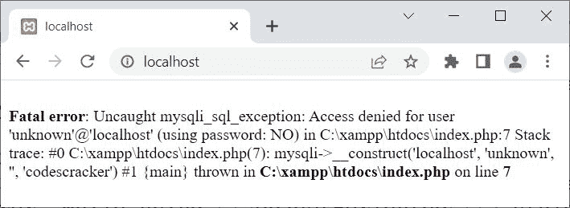
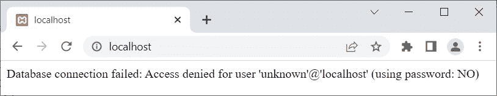

# PHP 连接错误和 mysqli 连接错误()

> 原文：<https://codescracker.com/php/php-connect-error-and-mysqli-connect-error.htm>

本文涵盖了 PHP 的两个主题，即:

*   连接错误
*   mysqli_connect_error()

两者都返回上次连接的错误描述(如果有)。唯一不同的是， **connect_error** 使用 PHP MySQLi <u>面向对象</u>脚本，而 **mysqli_connect_error()** 使用 PHP MySQLi <u>过程化</u>脚本。

## PHP 连接错误

PHP **connect_error** 在我们需要获取并打印上次连接 错误引发的错误描述时使用，同时使用 PHP MySQLi *面向对象*脚本连接数据库。例如:

```
<?php
   $server = "localhost";
   $user = "unknown";
   $password = "";
   $database = "codescracker";

   $conn = new mysqli($server, $user, $password, $database);

   if($conn->connect_errno)
   {
      echo "Database connection failed: ", $conn->connect_error;
      exit();
   }
   $conn -> close();
?>
```

因为用户**未知**不能作为我的 MySQL 数据库服务器的用户。因此，上面的例子产生的输出 是:



那就是:

```
Fatal error: Uncaught mysqli_sql_exception: Access denied for user 'unknown'@'localhost' (using password: NO) in C:\xampp\htdocs\index.php:7 Stack trace: #0 C:\xampp\htdocs\index.php(7): mysqli->__construct('localhost', 'unknown', '', 'codescracker') #1 {main} thrown in C:\xampp\htdocs\index.php on line 7
```

现在我想的是，你可能期望输出，类似于:

```
Database connection failed: ...... // i.e., followed by error description
```

因此，让我澄清一下，您看到的输出是默认产生的。要隐藏/抑制那些致命错误，您需要使用以下两条语句关闭错误报告:

```
$driver = new mysqli_driver();
$driver -> report_mode = MYSQLI_REPORT_OFF;
```

也就是说，这是上述示例的修改版本:

```
<?php
   $driver = new mysqli_driver();
   $driver -> report_mode = MYSQLI_REPORT_OFF;

   $server = "localhost";
   $user = "unknown";
   $password = "";
   $database = "codescracker";

   $conn = @new mysqli($server, $user, $password, $database);

   if($conn->connect_errno)
   {
      echo "Database connection failed: ", $conn->connect_error;
      exit();
   }
   // block of code to process further, on successful connection

   $conn -> close();
?>
```

现在输出应该是:



**注-****new**前的 **@** 是为了抑制默认错误而写的。

**注意-**[MySQL()](/php/php-mysqli-connect-to-database.htm)用于以面向对象的方式打开到 MySQL 数据库服务器的 连接。

**注意-**[new](/php/php-new-keyword.htm)关键字用于创建一个新对象。

**注意-**[connect _ errno](/php/php-connect-errno-and-mysqli-connect-errno.htm)用于 以面向对象的方式获取/返回上次 connect 调用的错误代码(如果有)。

**注意-**[exit()](/php/php-exit-function.htm)用于终止 当前 PHP 脚本的执行。

**注意-**[close()](/php/php-mysqli-close-database-connection.htm)用于关闭一个 打开的连接，采用面向对象的方式。

**注-**[mysqli _ driver()](/php/php-mysqli-driver-and-mysqli-report.htm)用于 修改错误报告模式，采用面向对象的方式。

## PHP `mysqli_connect_error()`

PHP**MySQLi _ connect _ error()**在我们需要获取并打印 上次连接错误所引发的错误描述时使用，同时使用 PHP MySQLi *程序性*脚本连接数据库。例如:

```
<?php
   mysqli_report(MYSQLI_REPORT_OFF);

   $server = "localhost";
   $user = "unknown";
   $password = "";
   $database = "codescracker";

   $conn = @mysqli_connect($server, $user, $password, $database);

   if(mysqli_connect_errno())
   {
      echo "Database connection failed: ", mysqli_connect_error();
      exit();
   }
   mysqli_close($conn);
?>
```

您将获得与上一个相同的输出，即:

```
Database connection failed: Access denied for user 'unknown'@'localhost' (using password: NO)
```

**注-**[mysqli _ report()](/php/php-mysqli-driver-and-mysqli-report.htm)用于 修改报错方式，程序化。

**注意-**[MySQL _ connect()](/php/php-mysqli-connect-to-database.htm)用于以过程化的方式打开到 MySQL 数据库服务器的 连接。

**注意-**[mysqli _ connect _ errno()](/php/php-connect-errno-and-mysqli-connect-errno.htm) 用于获取/返回上一次 connect 调用的错误代码(如果有)，以过程的方式。

**注意-**[MySQL _ close()](/php/php-mysqli-close-database-connection.htm)用于关闭 一个打开的到 MySQL 数据库的连接，以过程的方式。

[PHP 在线测试](/exam/showtest.php?subid=8)

* * *

* * *