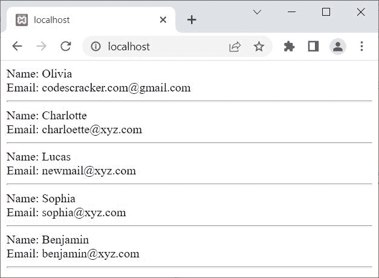

# PHP fetch_row()和 mysqli_fetch_row()

> 原文：<https://codescracker.com/php/php-fetch-row-and-mysqli-fetch-row.htm>

本文旨在介绍 PHP 的两个功能，即:

*   fetch_row()
*   mysqli_fetch_row()

这两个函数都用于获取结果集的下一行作为枚举数组。唯一不同的是， **fetch_row()** 用于 PHP MySQLi <u>面向对象</u>脚本，而 **mysqli_fetch_row()** 用于 PHP MySQLi <u>过程化</u>脚本。

## PHP fetch_row()

PHP **fetch_row()** 函数以 PHP MySQLi 面向对象的方式获取结果集的下一行作为枚举数组。例如:

```
<?php
   $server = "localhost";
   $user = "root";
   $pass = "";
   $db = "codescracker";

   $conn = new mysqli($server, $user, $pass, $db);

   if($conn -> connect_errno)
   {
      echo "Connection to the database failed!<BR>";
      echo "Reason: ", $conn -> connect_error;
      exit();
   }

   $sql = "SELECT name, email FROM customer";

   $result = $conn -> query($sql);
   if($result)
   {
      while($row = $result -> fetch_row())
      {
         echo "Name: ", $row[0];
         echo "<BR>";
         echo "Email: ", $row[1];
         echo "<HR>";
      }
   }
   else
   {
      echo "Something went wrong!<BR>";
      echo "Error Description: ", $conn -> error;
   }
   $result -> free_result();
   $conn -> close();
?>
```

上面的 PHP 示例在 *fetch_row()* 上产生的输出显示在下面给出的快照中:



**注意-**[MySQL()](/php/php-mysqli-connect-to-database.htm)用于以面向对象的方式打开到 MySQL 数据库服务器的 连接。

**注意-**[new](/php/php-new-keyword.htm)关键字用于创建一个新对象。

**注意-**[connect _ errno](/php/php-connect-errno-and-mysqli-connect-errno.htm)用于 以面向对象的方式获取/返回上次 connect 调用的错误代码(如果有)。

**注意-**[connect _ error](/php/php-connect-error-and-mysqli-connect-error.htm)用于 以面向对象的方式从最后一次连接中获取错误描述(如果有的话)。

**注-**[query()](/php/php-query-and-mysqli-query.htm)用于对 MySQL 数据库进行查询，采用面向对象的方式。

**注意-**[free _ result()](/php/php-free-result-and-mysqli-free-result.htm)用于 释放存储的结果，采用面向对象的方式。

**注-**[错误](/php/php-error-and-mysqli-error.htm)用于通过最近一次函数调用，以面向对象的方式返回错误的描述 (如果有的话)。

**注意-**[close()](/php/php-mysqli-close-database-connection.htm)用于关闭一个 打开的连接，采用面向对象的方式。

在上面的例子中，下面的代码:

```
$row = $result -> fetch_row()
```

写成[的条件表达式 while 循环](/php/php-while-loop.htm)，继续 取行，直到最后一行。

另外，由于使用了 SQL 代码 **SELECT name，email FROM customer** ，所以只提取了名为 **name** 和 **email** 的列，因此**$ row[0】**引用 **name** ，而**$ row[1】**引用 到 **email** 。

上面的例子，也可以写成:

```
<?php
   $conn = new mysqli("localhost", "root", "", "codescracker");

   if(!$conn -> connect_errno)
   {
      if($result = $conn -> query("SELECT name, email FROM customer"))
      {
         while($row = $result -> fetch_row())
         {
            echo "Name: ", $row[0];
            echo "<BR>";
            echo "Email: ", $row[1];
            echo "<HR>";
         }
      }
   }
   $conn -> close();
?>
```

### PHP fetch_row()语法

PHP 中 **fetch_row()** 的语法是:

```
$result -> fetch_row()
```

其中 **$result** 是指查询数据时返回的结果集。

## PHP mysqli_fetch_row()

PHP **mysqli_fetch_row()** 函数以 PHP MySQLi 过程式的方式获取结果集的下一行作为枚举数组。例如:

```
<?php
   $conn = mysqli_connect("localhost", "root", "", "codescracker");

   if(!mysqli_connect_errno())
   {
      if($result = mysqli_query($conn, "SELECT name, email FROM customer"))
      {
         while($row = mysqli_fetch_row($result))
         {
            echo "Name: ", $row[0];
            echo "<BR>";
            echo "Email: ", $row[1];
            echo "<HR>";
         }
      }
   }
   mysqli_close($conn);
?>
```

**注意-**[MySQL _ connect()](/php/php-mysqli-connect-to-database.htm)用于以过程化的方式打开到 MySQL 数据库服务器的 连接。

**注意-**[mysqli _ connect _ errno()](/php/php-connect-errno-and-mysqli-connect-errno.htm) 用于获取/返回上一次 connect 调用的错误代码(如果有)，以过程的方式。

**注-**[MySQL _ query()](/php/php-query-and-mysqli-query.htm)用于在 MySQL 数据库上执行查询 ，以程序化的方式。

**注意-**[MySQL _ close()](/php/php-mysqli-close-database-connection.htm)用于关闭 一个打开的到 MySQL 数据库的连接，以过程的方式。

## 使用 PHP MySQLi 面向对象获取所有行的所有列

要获取所有行的所有列，只需将 SQL 代码改为 **SELECT * FROM customer** 。现在如果你写 **$row[0]** ，那么它将引用所有行的第一列，在我的例子中就是 **id** 。下面是 完整的脚本:

```
<?php
   $conn = new mysqli("localhost", "root", "", "codescracker");

   if(!$conn -> connect_errno)
   {
      $sql = "SELECT * FROM customer";
      if($result = $conn -> query($sql))
      {
         while($row = $result -> fetch_row())
         {
            echo "Name: ", $row[1];
            echo "<BR>";
            echo "Age: ", $row[2];
            echo "<BR>";
            echo "Email: ", $row[3];
            echo "<HR>";
         }
         $result -> free_result();
      }
   }
   $conn -> close();
?>
```

输出应该是:

```
Name: Olivia
Age: 28
Email: codescracker.com@gmail.com

Name: Charlotte
Age: 24
Email: charloette@xyz.com

Name: Lucas
Age: 42
Email: newmail@xyz.com

Name: Sophia
Age: 29
Email: sophia@xyz.com

Name: Benjamin
Age: 31
Email: benjamin@xyz.com

```

由于**姓名**、**年龄**、**邮箱**在第二、第三和第四列数字可用，因此 我改变了索引。另外，因为 PHP 数组中的索引默认从 0 开始，所以索引号 1 指的是第二列。

## 使用 PHP MySQLi 程序获取所有行的所有列

```
<?php
   $conn = mysqli_connect("localhost", "root", "", "codescracker");

   if(!mysqli_connect_errno())
   {
      $sql = "SELECT * FROM customer";
      if($result = mysqli_query($conn, $sql))
      {
         while($row = mysqli_fetch_row($result))
         {
            echo "Name: ", $row[1];
            echo "<BR>";
            echo "Age: ", $row[2];
            echo "<BR>";
            echo "Email: ", $row[3];
            echo "<HR>";
         }
         mysqli_free_result($result);
      }
   }
   mysqli_close($conn);
?>
```

您将获得前一个版本的精确输出。

**注意-** 您可以更改 SQL 代码来获取不同的数据。你也可以指定其他代码，以指定的格式得到 一些指定的数据。这都是关于 SQL 代码的。但问题是，其余的所有过程 将是相同的，从数据库中获取数据，然后显示在网络上。

[PHP 在线测试](/exam/showtest.php?subid=8)

* * *

* * *