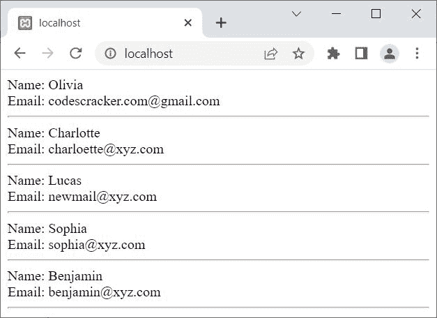

# PHP `fetch_array()`和 mysqli_fetch_array()

> 原文：<https://codescracker.com/php/php-fetch-array-and-mysqli-fetch-array.htm>

本文旨在介绍 PHP 的两个功能，即:

*   fetch_array()
*   mysqli _ fetch _ array()

这两个函数都用于将结果集的下一行提取为关联数组或数值数组，或者两者兼有。唯一的区别是， **fetch_array()** 使用 PHP MySQLi <u>面向对象的</u>脚本， 而 **mysqli_fetch_array()** 使用 PHP MySQLi <u>过程化</u>脚本。

## PHP `fetch_array()`

PHP **fetch_array()** 函数以 PHP MySQLi 面向对象的方式获取结果集的下一行，作为关联数组或 数值数组，或者两者兼有。例如:

```
<?php
   $server = "localhost";
   $user = "root";
   $pass = "";
   $db = "codescracker";

   $conn = new mysqli($server, $user, $pass, $db);

   if($conn -> connect_errno)
   {
      echo "Database connection failed!<BR>";
      echo "Reason: ", $conn -> connect_error;
      exit();
   }

   $sql = "SELECT * FROM customer";

   $result = $conn -> query($sql);
   if($result == true)
   {
      while($row = $result -> fetch_array())
      {
         echo "Name: ", $row['name'];
         echo "<BR>";
         echo "Email: ", $row['email'];
         echo "<HR>";
      }
      $result -> free_result();
   }
   else
   {
      echo "Something went wrong!<BR>";
      echo "Error Description: ", $conn -> error;
   }
   $conn -> close();
?>
```

上面的 PHP 示例在 **fetch_array()** 上产生的输出显示在下面给出的快照中:



上述输出中产生的数据存储在数据库中。

**注意-**[MySQL()](/php/php-mysqli-connect-to-database.htm)用于以面向对象的方式打开到 MySQL 数据库服务器的 连接。

**注意-**[new](/php/php-new-keyword.htm)关键字用于创建一个新对象。

**注意-**[connect _ errno](/php/php-connect-errno-and-mysqli-connect-errno.htm)用于 以面向对象的方式获取/返回上次 connect 调用的错误代码(如果有)。

**注意-**[connect _ error](/php/php-connect-error-and-mysqli-connect-error.htm)用于 以面向对象的方式从最后一次连接中获取错误描述(如果有的话)。

**注-**[query()](/php/php-query-and-mysqli-query.htm)用于对 MySQL 数据库进行查询，采用面向对象的方式。

**注意-**[free _ result()](/php/php-free-result-and-mysqli-free-result.htm)用于 释放存储的结果，采用面向对象的方式。

**注-**[错误](/php/php-error-and-mysqli-error.htm)用于通过最近一次函数调用，以面向对象的方式返回错误的描述 (如果有的话)。

**注意-**[close()](/php/php-mysqli-close-database-connection.htm)用于关闭一个 打开的连接，采用面向对象的方式。

上面的例子也可以写成:

```
<?php
   $conn = new mysqli("localhost", "root", "", "codescracker");

   if(!$conn -> connect_errno)
   {
      $sql = "SELECT * FROM customer";
      if($result = $conn -> query($sql))
      {
         while($row = $result -> fetch_array())
         {
            echo "Name: ", $row['name'];
            echo "<BR>";
            echo "Email: ", $row['email'];
            echo "<HR>";
         }
         $result -> free_result();
      }
   }
   $conn -> close();
?>
```

### PHP `fetch_array()`语法

PHP 中 **fetch_array()** 函数的语法是:

```
$result -> fetch_array(type)
```

**type** 参数是可选的，用于定义返回行的类型。这里有三个值， ，我们可以用来定义这个参数(**类型**参数):

*   **MYSQLI_BOTH** -这是<u>的默认</u>值，用于返回行结果作为关联的 以及数值数组
*   **MYSQLI_ASSOC** -用于以关联数组的形式返回行结果
*   **MYSQLI_NUM** -用于以数字数组的形式返回行结果

例如:

```
<?php
   $conn = new mysqli("localhost", "root", "", "codescracker");

   if(!$conn -> connect_errno)
   {
      $sql = "SELECT * FROM customer";
      if($result = $conn -> query($sql))
      {
         while($row = $result -> fetch_array(MYSQLI_BOTH))
         {
            echo "Name: ", $row['name'];
            echo "<BR>";
            echo "Email: ", $row[3];
            echo "<HR>";
         }
         $result -> free_result();
      }
   }
   $conn -> close();
?>
```

注意上面例子中的 **$row['name']** 和 **$row[3]** 。第一个指的是关联， 而第二个指的是数值。也就是说，使用第一个，我们得到每一行的数据，它的 列名是**名**。而使用第二种方法，我们使用列号 **3** 获得每一行的数据。在第 3 列，字段**电子邮件**可用。

但是如果我们使用，其他两个说 **MYSQLI_ASSOC** 或 **MYSQLI_NUM** ，那么我们需要访问字段， 只使用定义的类型。例如， **MYSQLI_ASSOC** 不能用于访问使用数字 数据的字段，而 **MYSQLI_NUM** 不能用于访问使用关联数据的字段。

## PHP `mysqli_fetch_array()`

PHP **mysqli_fetch_array()** 函数获取结果集的下一行作为关联数组，或者 作为数值数组，或者两者都是，这是 PHP MySQLi 的过程风格。例如:

```
<?php
   $conn = mysqli_connect("localhost", "root", "", "codescracker");

   if(!mysqli_connect_errno())
   {
      $sql = "SELECT * FROM customer";
      if($result = mysqli_query($conn, $sql))
      {
         while($row = mysqli_fetch_array($result))
         {
            echo "Name: ", $row['name'];
            echo "<BR>";
            echo "Email: ", $row['email'];
            echo "<HR>";
         }
         mysqli_free_result($result);
      }
   }
   mysqli_close($conn);
?>
```

**注意-**[MySQL _ connect()](/php/php-mysqli-connect-to-database.htm)用于以过程化的方式打开到 MySQL 数据库服务器的 连接。

**注意-**[mysqli _ connect _ errno()](/php/php-connect-errno-and-mysqli-connect-errno.htm) 用于获取/返回上一次 connect 调用的错误代码(如果有)，以过程的方式。

**注-**[MySQL _ query()](/php/php-query-and-mysqli-query.htm)用于在 MySQL 数据库上执行查询 ，以程序化的方式。

**注意-**[mysqli _ free _ result()](/php/php-free-result-and-mysqli-free-result.htm)用于 释放存储的结果，以过程的方式。

**注意-**[MySQL _ close()](/php/php-mysqli-close-database-connection.htm)用于关闭 一个打开的到 MySQL 数据库的连接，以过程的方式。

### PHP `mysqli_fetch_array()`语法

PHP 中 **mysqli_fetch_array()** 函数的语法是:

```
mysqli_fetch_array(result, type)
```

这里，**类型**也以类似的方式工作，如在 **fetch_array()语法**部分中定义的。

[PHP 在线测试](/exam/showtest.php?subid=8)

* * *

* * *