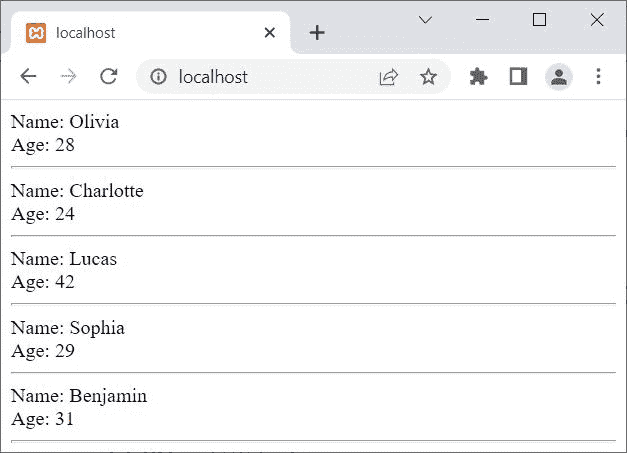
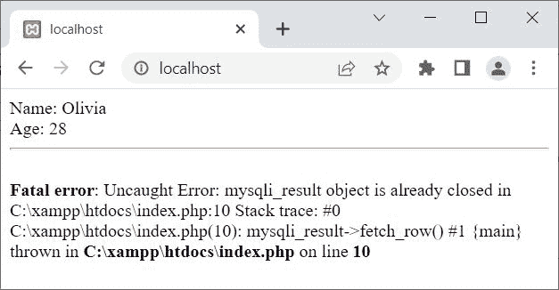

# PHP free_result()和 mysqli_free_result()

> 原文：<https://codescracker.com/php/php-free-result-and-mysqli-free-result.htm>

本文旨在介绍 PHP 的两个功能，即:

*   自由结果()
*   mysqli _ free _ result()

这两个功能都用于释放存储的结果存储器。唯一不同的是， **free_result()** 用于 PHP MySQLi <u>面向对象</u>脚本，而 **mysqli_free_result()** 用于 PHP MySQLi <u>过程</u>脚本。

## PHP free_result()

PHP **free_result()** 函数以 PHP MySQLi 面向对象的方式为指定/给定的语句 句柄释放存储的结果内存。例如:

```
<?php
   $server = "localhost";
   $user = "root";
   $pass = "";
   $db = "codescracker";

   $conn = new mysqli($server, $user, $pass, $db);

   if($conn -> connect_errno)
   {
      echo "Database connection failed!<BR>";
      echo "Reason: ", $conn -> connect_error;
      exit();
   }

   $sql = "SELECT name, age FROM customer";

   $result = $conn -> query($sql);
   if($result)
   {
      while($row = $result -> fetch_row())
      {
         echo "Name: ", $row[0];
         echo "<BR>";
         echo "Age: ", $row[1];
         echo "<HR>";
      }
      $result -> free_result();
   }
   else
   {
      echo "Something went wrong!<BR>";
      echo "Error Description: ", $conn -> error;
   }
   $conn -> close();
?>
```

上面的 PHP 示例在 **free_result()** 上产生的输出显示在下面给出的快照中:



**注意-**[MySQL()](/php/php-mysqli-connect-to-database.htm)用于以面向对象的方式打开到 MySQL 数据库服务器的 连接。

**注意-**[new](/php/php-new-keyword.htm)关键字用于创建一个新对象。

**注意-**[connect _ errno](/php/php-connect-errno-and-mysqli-connect-errno.htm)用于 以面向对象的方式获取/返回上次 connect 调用的错误代码(如果有)。

**注意-**[connect _ error](/php/php-connect-error-and-mysqli-connect-error.htm)用于 以面向对象的方式从最后一次连接中获取错误描述(如果有的话)。

**注-**[query()](/php/php-query-and-mysqli-query.htm)用于对 MySQL 数据库进行查询，采用面向对象的方式。

**注意-**[fetch _ row()](/php/php-fetch-row-and-mysqli-fetch-row.htm)用于获取 ，并以面向对象的方式将结果作为枚举数组返回。

**注-**[错误](/php/php-error-and-mysqli-error.htm)用于通过最近一次函数调用，以面向对象的方式返回错误的描述 (如果有的话)。

**注意-**[close()](/php/php-mysqli-close-database-connection.htm)用于关闭一个 打开的连接，采用面向对象的方式。

上面的例子也可以写成:

```
<?php   
   $conn = new mysqli("localhost", "root", "", "codescracker");

   if(!$conn -> connect_errno)
   {
      $sql = "SELECT name, age FROM customer";

      if($result = $conn -> query($sql))
      {
         while($row = $result -> fetch_row())
         {
            echo "Name: ", $row[0];
            echo "<BR>";
            echo "Age: ", $row[1];
            echo "<HR>";
         }
         $result -> free_result();
      }
   }
   $conn -> close();
?>
```

由于 **free_result()** 用于从内存中释放存储的结果，因此问题是， 如果我们在检索所有行之前使用 **free_result()** 会怎么样？
让我们用下面给出的 例子来找出答案:

```
<?php   
   $conn = new mysqli("localhost", "root", "", "codescracker");

   if(!$conn -> connect_errno)
   {
      $sql = "SELECT name, age FROM customer";

      if($result = $conn -> query($sql))
      {
         while($row = $result -> fetch_row())
         {
            echo "Name: ", $row[0];
            echo "<BR>";
            echo "Age: ", $row[1];
            echo "<HR>";
            $result -> free_result();
         }
      }
   }
   $conn -> close();
?>
```

注意 [while 循环](/php/php-while-loop.htm)中的 **free_result()** 。现在 的输出应该是:



也就是说，在使用了与 **$result** 关联的 **free_result()** 之后，存储的结果已经被 释放，因此我们不能从数据库中获取更多的行。

## PHP mysqli_free_result()

PHP **mysqli_free_result()** 函数以 PHP MySQLi 过程的方式为指定/给定的语句 句柄释放存储的结果内存。例如:

```
<?php   
   $conn = mysqli_connect("localhost", "root", "", "codescracker");

   if(!mysqli_connect_errno())
   {
      $sql = "SELECT name, age FROM customer";

      if($result = mysqli_query($conn, $sql))
      {
         while($row = mysqli_fetch_row($result))
         {
            echo "Name: ", $row[0];
            echo "<BR>";
            echo "Age: ", $row[1];
            echo "<HR>";
         }
         mysqli_free_result($result);
      }
   }
   mysqli_close($conn);
?>
```

**注意-**[MySQL _ connect()](/php/php-mysqli-connect-to-database.htm)用于以过程化的方式打开到 MySQL 数据库服务器的 连接。

**注意-**[mysqli _ connect _ errno()](/php/php-connect-errno-and-mysqli-connect-errno.htm) 用于获取/返回上一次 connect 调用的错误代码(如果有)，以过程的方式。

**注-**[MySQL _ query()](/php/php-query-and-mysqli-query.htm)用于在 MySQL 数据库上执行查询 ，以程序化的方式。

**注意-**[mysqli _ fetch _ row()](/php/php-fetch-row-and-mysqli-fetch-row.htm)用于 以枚举数组的形式获取并返回结果，以过程化的方式。

**注意-**[mysqli _ free _ result()](/php/php-free-result-and-mysqli-free-result.htm)用于 释放存储的结果，以过程的方式。

**注意-**[MySQL _ close()](/php/php-mysqli-close-database-connection.htm)用于关闭 一个打开的到 MySQL 数据库的连接，以过程的方式。

[PHP 在线测试](/exam/showtest.php?subid=8)

* * *

* * *