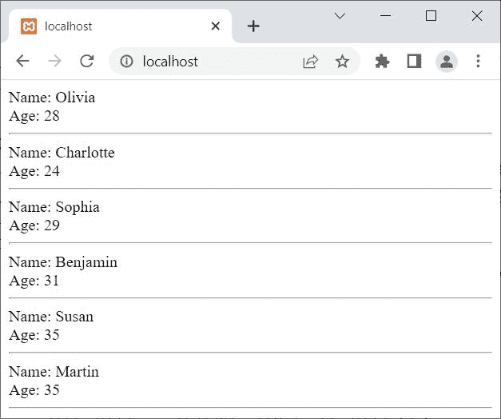

# PHP `get_result()`和 mysqli_stmt_get_result()

> 原文：<https://codescracker.com/php/php-get-result-and-mysqli-stmt-get-result.htm>

本文旨在介绍 PHP 的两个功能，即:

*   get_result()
*   mysqli_stmt_get_result()

这两个函数都用来从一个准备好的语句中获得一个结果集，作为一个 [mysqli_result](/php/php-mysqli-result-class.htm) 对象。唯一的区别是， **get_result()** 使用 PHP MySQLi <u>面向对象</u>脚本，而 **MySQLi _ stmt _ get _ result()**使用 PHP MySQLi <u>过程</u>脚本。

## PHP `get_result()`

PHP **get_result()** 函数从准备好的语句中返回一个结果集，作为一个面向对象风格的 *mysqli_result* 对象。例如:

```
<?php
   $server = "localhost";
   $user = "root";
   $pass = "";
   $db = "codescracker";

   $conn = new mysqli($server, $user, $pass, $db);

   if($conn->connect_errno)
   {
      echo "Database connection failed!<BR>";
      echo "Reason: ", $conn->connect_error;
   }
   else
   {
      $sql = "SELECT name, age FROM customer";
      $stmt = $conn->prepare($sql);

      if($stmt->execute() == true)
      {
         $result = $stmt->get_result();
         while($row = $result->fetch_array())
         {
            echo "Name: ", $row[0];
            echo "<BR>";
            echo "Age: ", $row[1];
            echo "<HR>";
         }
      }
   }
   $conn->close();
?>
```

上面的 PHP 示例在 **get_result()** 函数上的输出显示在下面给出的快照中:



**注意-**[MySQL()](/php/php-mysqli-connect-to-database.htm)用于以面向对象的方式打开到 MySQL 数据库服务器的 连接。

**注意-**[new](/php/php-new-keyword.htm)关键字用于创建一个新对象。

**注意-**[connect _ errno](/php/php-connect-errno-and-mysqli-connect-errno.htm)用于 以面向对象的方式获取/返回上次 connect 调用的错误代码(如果有)。

**注意-**[connect _ error](/php/php-connect-error-and-mysqli-connect-error.htm)用于 以面向对象的方式从最后一次连接中获取错误描述(如果有的话)。

**注意-**[prepare()](/php/php-prepare-and-mysqli-prepare.htm)用于在 MySQL 数据库上执行 SQL 语句之前，以面向对象的方式准备该语句，以避免 SQL 注入。

**注意-**[execute()](/php/php-execute-and-mysqli-stmt-execute.htm)用于在 MySQL 数据库上以面向对象的方式执行 准备好的语句。

**注意-** 使用 [fetch_array()](/php/php-fetch-array-and-mysqli-fetch-array.htm) ，当我们 需要以面向对象 的方式以枚举数组或关联数组或者两者的形式获取结果时。

**注意-**[close()](/php/php-mysqli-close-database-connection.htm)用于关闭一个 打开的连接，采用面向对象的方式。

上面的例子也可以写成:

```
<?php
   $conn = new mysqli("localhost", "root", "", "codescracker");

   if(!$conn->connect_errno)
   {
      $stmt = $conn->prepare("SELECT name, age FROM customer");
      $stmt->execute();
      $result = $stmt->get_result();
      while($row = $result->fetch_array())
      {
         echo "Name: ", $row[0];
         echo "<BR>";
         echo "Age: ", $row[1];
         echo "<HR>";
      }
   }
   $conn->close();
?>
```

### PHP `get_result()`语法

PHP 中 **get_result()** 函数的语法是:

```
$mysqli_stmt -> get_result()
```

## PHP `mysqli_stmt_get_result()`

PHP**mysqli _ stmt _ get _ result()**函数从一个准备好的语句中返回一个结果集，作为一个过程式的 *mysqli_result* 对象。例如:

```
<?php
   $conn = mysqli_connect("localhost", "root", "", "codescracker");

   if(!mysqli_connect_errno())
   {
      $stmt = mysqli_prepare($conn, "SELECT name, age FROM customer");
      mysqli_stmt_execute($stmt);
      $result = mysqli_stmt_get_result($stmt);
      while($row = mysqli_fetch_array($result))
      {
         echo "Name: ", $row[0];
         echo "<BR>";
         echo "Age: ", $row[1];
         echo "<HR>";
      }
   }
   mysqli_close($conn);
?>
```

**注意-**[MySQL _ connect()](/php/php-mysqli-connect-to-database.htm)用于以过程化的方式打开到 MySQL 数据库服务器的 连接。

**注意-**[mysqli _ connect _ errno()](/php/php-connect-errno-and-mysqli-connect-errno.htm) 用于获取/返回上一次 connect 调用的错误代码(如果有)，以过程的方式。

**注意-**[MySQL _ prepare()](/php/php-prepare-and-mysqli-prepare.htm)用于在 MySQL 数据库上执行 SQL 语句之前，以过程化的方式准备 该语句，以避免 SQL 注入。

**注意-**[mysqli _ stmt _ execute()](/php/php-execute-and-mysqli-stmt-execute.htm)用于 在 MySQL 数据库上以过程方式执行一条准备好的语句。

**注意-** 使用 [mysqli_fetch_array()](/php/php-fetch-array-and-mysqli-fetch-array.htm) ，当我们 需要以过程化 的方式，以枚举数组或关联数组或者两者的形式获取结果。

**注意-**[MySQL _ close()](/php/php-mysqli-close-database-connection.htm)用于关闭 一个打开的到 MySQL 数据库的连接，以过程的方式。

### PHP `mysqli_stmt_get_result()`语法

PHP 中 **mysqli_stmt_get_result()** 函数的语法是:

```
mysqli_stmt_get_result($mysqli_stmt)
```

[PHP 在线测试](/exam/showtest.php?subid=8)

* * *

* * *