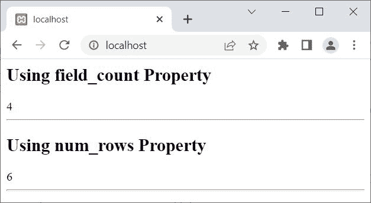

# PHP mysqli_result 类

> 原文：<https://codescracker.com/php/php-mysqli-result-class.htm>

本文列出了 mysqli_result 类的属性和方法，以及简短的 T2 描述和例子。

## PHP mysqli_result 类属性和描述

| 财产 | 描述 |
| 当前字段 | 用于获取结果指针的当前字段偏移量 |
| 字段 _ 计数 | 用于获取结果集中可用的字段(列)数 |
| 长 | 用于获取结果集中当前行的列的长度 |
| num_rows | 用于获取行数 |

## PHP mysqli_result 类方法和描述

| 方法 | 描述 |
| _ _ 构造() | 用于构造一个 **mysqli_result** 对象 |
| data_seek() | 用于将结果指针移动到结果集中的任意行 |
| fetch_all() | 用于将所有结果行提取为关联数组或数值数组或两者 |
| fetch_array() | 用于获取下一行，作为关联数组或数值数组或两者都是 |
| fetch_assoc() | 用于获取下一行作为关联数组 |
| 获取列() | 用于从下一行提取一列 |
| fetch_field_direct() | 用于获取单个字段(列)的元数据(关于数据的数据) |
| fetch_field() | 用于获取下一个字段(列) |
| fetch _ fields() | 用于获取表示字段的对象数组 |
| 获取对象() | 用于获取下一行作为对象 |
| fetch_row() | 用于获取下一行作为枚举数组 |
| field_seek() | 用于将结果指针设置为指定的字段偏移量 |
| 免费() | 用于释放与结果集关联的内存 |
| getIterator() | 用于检索外部迭代器 |

## PHP mysqli_result 类示例

在创建一个 **mysqli_result** 类的例子之前，让我们看一下将在 例子中使用的表格:


## PHP mysqli_result 类属性示例

这个例子使用了 PHP 中 **mysqli_result** 类的两个著名且最常用的属性:

```
<?php
   $conn = new mysqli("localhost", "root", "", "codescracker");

   if(!$conn->connect_errno)
   {
      $stmt = $conn->prepare("SELECT * FROM customer");
      $stmt->execute();
      $result = $stmt->get_result();

      echo "<h2>Using field_count Property</h2>";
      echo $result->field_count;
      echo "<HR>";

      echo "<h2>Using num_rows Property</h2>";
      echo $result->num_rows;
      echo "<HR>";
   }
   $conn->close();
?>
```

输出是:



## PHP mysqli_result 类方法示例

这个例子使用了 PHP **mysqli_result** 类的一些属性:

```
<?php
   $conn = new mysqli("localhost", "root", "", "codescracker");

   if(!$conn->connect_errno)
   {
      $stmt = $conn->prepare("SELECT * FROM customer");
      $stmt->execute();
      $result = $stmt->get_result();

      echo "<h2>Using fetch_all() Method</h2>";
      print_r($result->fetch_all());
      echo "<HR>";

      echo "<h2>Using fetch_field() Method</h2>";
      print_r($result->fetch_field());
      echo "<HR>";

      echo "<h2>Using fetch_fields() Method</h2>";
      print_r($result->fetch_fields());
      echo "<HR>";
   }
   $conn->close();
?>
```

根据我当前的**客户**表， 应该是:

```
Using fetch_all() Method
Array ( [0] => Array ( [0] => 1 [1] => Olivia [2] => 28 [3] => codescracker.com@gmail.com ) [1] => Array ( [0] => 2 [1] => Charlotte [2] => 24 [3] => charloette@xyz.com ) [2] => Array ( [0] => 4 [1] => Sophia [2] => 29 [3] => sophia@xyz.com ) [3] => Array ( [0] => 5 [1] => Benjamin [2] => 31 [3] => benjamin@xyz.com ) [4] => Array ( [0] => 6 [1] => Susan [2] => 35 [3] => susan@xyz.com ) [5] => Array ( [0] => 7 [1] => Martin [2] => 35 [3] => martin@xyz.com ) )

Using fetch_field() Method
stdClass Object ( [name] => id [orgname] => id [table] => customer [orgtable] => customer [def] => [db] => codescracker [catalog] => def [max_length] => 0 [length] => 6 [charsetnr] => 63 [flags] => 49699 [type] => 3 [decimals] => 0 )

Using fetch_fields() Method
Array ( [0] => stdClass Object ( [name] => id [orgname] => id [table] => customer [orgtable] => customer [def] => [db] => codescracker [catalog] => def [max_length] => 0 [length] => 6 [charsetnr] => 63 [flags] => 49699 [type] => 3 [decimals] => 0 ) [1] => stdClass Object ( [name] => name [orgname] => name [table] => customer [orgtable] => customer [def] => [db] => codescracker [catalog] => def [max_length] => 0 [length] => 120 [charsetnr] => 45 [flags] => 4097 [type] => 253 [decimals] => 0 ) [2] => stdClass Object ( [name] => age [orgname] => age [table] => customer [orgtable] => customer [def] => [db] => codescracker [catalog] => def [max_length] => 0 [length] => 2 [charsetnr] => 63 [flags] => 32768 [type] => 3 [decimals] => 0 ) [3] => stdClass Object ( [name] => email [orgname] => email [table] => customer [orgtable] => customer [def] => [db] => codescracker [catalog] => def [max_length] => 0 [length] => 160 [charsetnr] => 45 [flags] => 4097 [type] => 253 [decimals] => 0 ) )
```

[PHP 在线测试](/exam/showtest.php?subid=8)

* * *

* * *