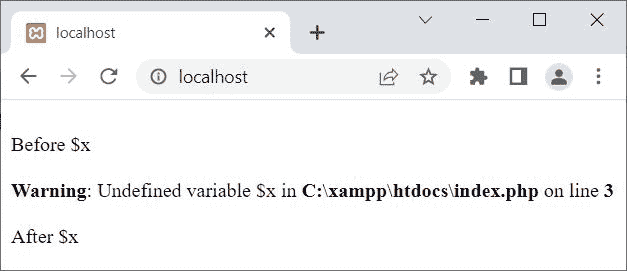

# PHP `error_reporting()` |启用/禁用错误报告

> 原文：<https://codescracker.com/php/php-error-reporting-function.htm>

PHP **error_reporting()** 函数在我们需要定义要显示什么错误时使用。举 的例子:

```
<?php
   error_reporting(0);

   echo "<BR>Before \$x<BR>";
   echo $x;
   echo "<BR>After \$x<BR>";
?>
```

上面的 PHP 示例在 **error_reporting()** 函数上产生的输出显示在下面给出的 的快照中:


**注意****$ x**，那是没有定义的。但是 web 浏览器中没有显示错误。之所以是 是因为，我已经使用第一个语句关闭了所有错误的报告，即**error _ reporting(0)；**。 但是，如果我删除这条语句，那么输出应该是:



## PHP `error_reporting()`语法

PHP 中 **error_reporting()** 函数的语法是:

```
error_reporting(level);
```

**级别**参数是可选的，用于指定错误报告级别。可用于定义**电平**、 的预定义 误差常数列表在单独的文章中描述。

[PHP 在线测试](/exam/showtest.php?subid=8)

* * *

* * *