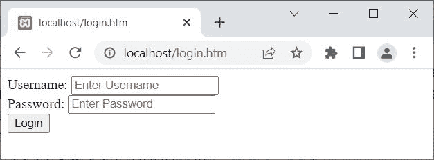
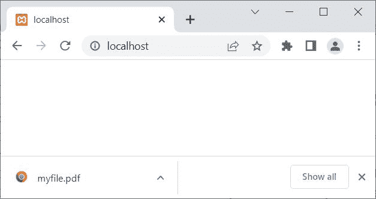

# PHP `header()`函数

> 原文：<https://codescracker.com/php/php-header-function.htm>

PHP **header()** 函数在我们需要发送原始 HTTP 头时使用。大多数时候， **header()** 函数用于重定向到另一个页面/URL。例如:

```
<?php
   if(isset($_SESSION['user']))
   {
      echo "Welcome to codescracker.com!";
      // block of code, to process 'user'
   }
   else
   {
      header('Location: login.htm');
      exit();
   }
?>
```

在上面的例子中，由于没有设置会话变量 **user** ，因此程序流程转到 [else](/php/php-if-elseif-else-statement.htm) 块并执行 **header()** 函数，该 重定向到**login.htm**页面。因为我已经在当前的 目录下创建了一个**login.htm**页面。因此，上述 PHP 示例的输出是:



由于页面在几秒钟内重定向到了 login.htm 的页面，因此我们直接看到了 login.htm 的页面。

## PHP `header()`语法

PHP 中 **header()** 函数的语法是:

```
header(header, replace, responseCode);
```

在所有三个参数中，只有**标头**参数是必需的。另外两个参数 是可选的。

**注意-****报头**参数用于指定要发送的报头。

**注-****替换**参数用于当我们需要指定割台是否应该替换 以前的类似割台或应该添加相同类型的新割台时。

**注意-****响应代码**参数在我们需要将默认 HTTP 响应代码 强制为特定代码时使用。

**注-****替换**参数的默认值为**真**。并且**真**指示 该报头替换了先前的报头。

## 使用 PHP `header()`开始自动下载文件

PHP **header()** 函数也可以用来在客户端的 浏览器上开始自动下载文件。例如:

```
<?php
   header('Content-Disposition: attachment; filename="myfile.pdf"');
?>
```

上面的 PHP 示例在 **header()** 函数上的输出，开始自动下载，显示在下面给出的 快照中:



您还可以使用**内容类型**来指示原始媒体类型资源。也就是说，当我们需要指示资源的原始媒体类型 时(在应用于发送的任何内容编码之前)，使用 **内容类型**表示(在**头()**中)。例如:

```
header('Content-Type: application/pdf');
```

如果您想在客户端计算机上下载其他名称的文件。例如，让我们假设，我在我的服务器上保存了一个名为 **class_details.pdf** 的文件。但是我想制作这个文件，下载到名为【download.pdf**的 客户端的计算机系统上。因此，出于此目的，下面是要遵循的代码:**

```
<?php
   header('Content-Type: application/pdf');
   header('Content-Disposition: attachment; filename="download.pdf"');
   readfile('class_details.pdf');
?>
```

现在，一个名为**download.pdf**的文件将被下载到客户端计算机上，其内容将与保存在我的服务器上的文件 **class_details.pdf** 的内容 相同。大多数情况下， 开发人员会使用这种方法来避免提供保存在服务器上的同名文件。

## 使用 PHP `header()`防止页面缓存

众所周知，PHP 脚本以其动态内容著称。并且动态内容不能由浏览器(客户端浏览器)或服务器和浏览器(客户端浏览器)之间的代理缓存来缓存。因此，我们需要使用一些 PHP 代码来防止用 PHP 编写的应用程序的某些页面/部分缓存:

```
<?php
   header("Expires: Sat, 26 Jul 1997 05:00:00 GMT");
   header("Cache-Control: no-cache");
?>
```

**注意-** 使用 PHP [getallheaders()](/php/php-getallheaders-function.htm) 函数获取所有 HTTP 头。

[PHP 在线测试](/exam/showtest.php?subid=8)

* * *

* * *