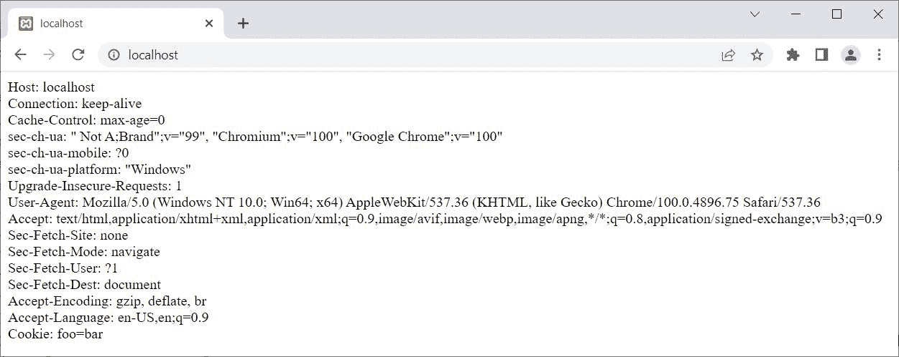
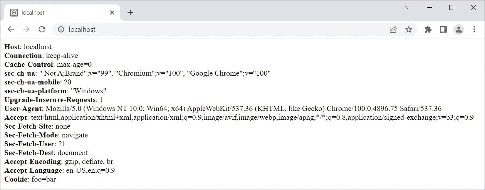

# PHP `getallheaders()` | Get All Headers

> 原文：<https://codescracker.com/php/php-getallheaders-function.htm>

PHP **getallheaders()** 函数在我们需要获取所有 HTTP 请求头时使用。例如:

```
<?php
   $headers = getallheaders();
   foreach ($headers as $key => $value)
   {
      echo "$key: $value";
      echo "<BR>";
   }
?>
```

上面的 PHP 示例在 **getallheaders()** 函数上的输出是:



那就是:

```
Host: localhost
Connection: keep-alive
Cache-Control: max-age=0
sec-ch-ua: " Not A;Brand";v="99", "Chromium";v="100", "Google Chrome";v="100"
sec-ch-ua-mobile: ?0
sec-ch-ua-platform: "Windows"
Upgrade-Insecure-Requests: 1
User-Agent: Mozilla/5.0 (Windows NT 10.0; Win64; x64) AppleWebKit/537.36 (KHTML, like Gecko) Chrome/100.0.4896.75 Safari/537.36
Accept: text/html,application/xhtml+xml,application/xml;q=0.9,image/avif,image/webp,image/apng,*/*;q=0.8,application/signed-exchange;v=b3;q=0.9
Sec-Fetch-Site: none
Sec-Fetch-Mode: navigate
Sec-Fetch-User: ?1
Sec-Fetch-Dest: document
Accept-Encoding: gzip, deflate, br
Accept-Language: en-US,en;q=0.9
Cookie: foo=bar
```

上面的例子，也可以这样写:

```
<?php
   foreach(getallheaders() as $key => $value)
      echo "<b>", $key, "</b>: ", $value, "<BR>";
?>
```

现在输出应该是:



您还可以使用下面的 PHP 脚本，以表格的形式显示所有 HTTP 头的信息:

```
<?php
   echo "<table><tr>";
   echo "<th>Name</th>";
   echo "<th>Value</th>";
   echo "</tr>";
   foreach(getallheaders() as $key => $value)
   {
      echo "<tr>";
      echo "<td>", $key, "</td>";
      echo "<td>", $value, "</td>";
      echo "</tr>";
   }
   echo "</table>";
?>
```

### PHP `getallheaders()` Syntax

PHP 中 **getallheaders()** 函数的语法是:

```
getallheaders()
```

[PHP 在线测试](/exam/showtest.php?subid=8)

* * *

* * *