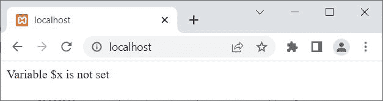
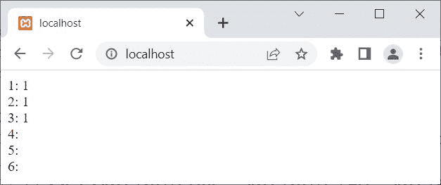

# PHP `isset()` |检查是否设置了变量

> 原文：<https://codescracker.com/php/php-isset-function.htm>

PHP **isset()** 函数在我们需要检查一个变量是否为 [set](/php/php-variables.htm) 时使用。例如:

```
<?php
   if(isset($x))
   {
      echo "Variable \$x is set";
   }
   else
   {
      echo "Variable \$x is not set";
   }
?>
```

由于变量 **$x** 未设置，因此上述示例的输出为:



## PHP `isset()`语法

PHP 中 **isset()** 函数的语法是:

```
isset(variableOne, variableTwo, variableThree, ..., variableN);
```

至少有一个变量是<u>必需的</u>。如果所有给定变量都存在并且不为空值，则返回 **1** 。 否则返回 false 或 nothing。例如:

```
<?php
   $x = 10;
   $y = 20;
   $z = 30;

   echo "1: ", isset($x), "<BR>";
   echo "2: ", isset($x, $y), "<BR>";
   echo "3: ", isset($x, $y, $z), "<BR>";
   echo "4: ", isset($a), "<BR>";
   echo "5: ", isset($x, $a), "<BR>";
   echo "6: ", isset($x, $y, $s), "<BR>";
?>
```

这个 PHP 示例在 **isset()** 函数上的输出显示在下面给出的快照中:



上例中， **isset()** 函数返回值 **1** ，也可以认为是**真**。

## PHP `isset()`示例

```
<?php
   $a = 10;
   $b = 0;
   $c = "codescracker.com";
   $d = "PHP is Fun!";
   $e = 12.42;
   $f = true;
   $g = null;

   if(isset($a))
      echo "<p>The variable \$a is set, with $a</p>";
   if(isset($b))
      echo "<p>The variable \$b is set, with $b</p>";
   if(isset($c))
      echo "<p>The variable \$c is set, with $c</p>";
   if(isset($d))
      echo "<p>The variable \$d is set, with $d</p>";
   if(isset($e))
      echo "<p>The variable \$e is set, with $e</p>";
   if(isset($f))
      echo "<p>The variable \$f is set, with $f</p>";
   if(isset($g))
      echo "<p>The variable \$g is set, with $g</p>";
   if(isset($z))
      echo "<p>The variable \$z is set, with $z</p>";
   if(isset($myvar))
      echo "<p>The variable \$myvar is set, with $myvar</p>";
?>
```

输出应该是:

```
The variable $a is set, with 10

The variable $b is set, with 0

The variable $c is set, with codescracker.com

The variable $d is set, with PHP is Fun!

The variable $e is set, with 12.42

The variable $f is set, with 1
```

还可以打印副本，即未设置或定义变量时的消息，方法如下:

```
<?php
   if(isset($myvar))
      echo "<p>The variable \$myvar is set, with $myvar</p>";
   else
      echo "<p>The variable \$myvar is not set</p>";
?>
```

或者直接使用:

```
<?php
   if(!isset($myvar))
      echo "<p>The variable \$myvar is not set</p>";
?>
```

由于在上面的两个例子中，变量 **$myvar** 没有被设置，因此这两个 代码的输出应该是:

```
The variable $myvar is not set
```

[PHP 在线测试](/exam/showtest.php?subid=8)

* * *

* * *