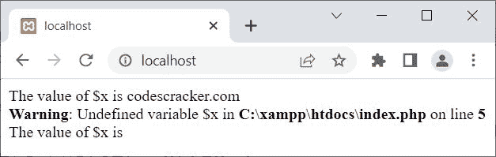
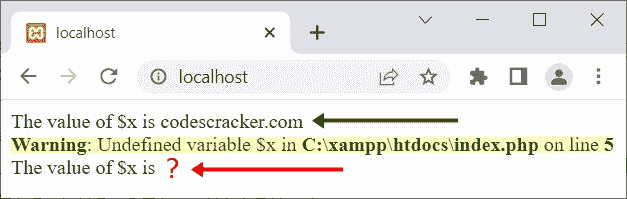

# PHP `unset()` |取消设置变量

> 原文：<https://codescracker.com/php/php-unset-function.htm>

当我们需要取消设置一个[变量](/php/php-variables.htm)时，使用 PHP **unset()** 函数。 例如:

```
<?php
   $x = "codescracker.com";
   echo "The value of \$x is $x";

   unset($x);

   echo "The value of \$x is $x";
?>
```

上面的 PHP 示例在 **unset()** 函数上生成的输出是:



那就是:



## PHP `unset()`语法

PHP 中 **unset()** 函数的语法是:

```
unset(variableOne, variableTwo, variableThree, ..., variableN);
```

至少需要一个变量。所有作为参数的给定变量都将被取消设置。

## PHP 取消设置会话变量

PHP **unset()** 函数大部分时间用于取消会话变量的设置。因此，要取消会话 变量的设置，请遵循以下方式:

```
unset($_SESSION['login']);
```

现在变量 **login** 从会话中取消设置/删除。

[PHP 在线测试](/exam/showtest.php?subid=8)

* * *

* * *