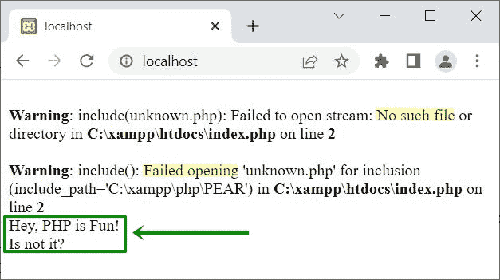

# PHP `include()` |调用另一个 PHP 文件来执行

> 原文：<https://codescracker.com/php/php-include-function.htm>

当我们需要在 PHP 脚本中包含一个外部 PHP 文件时，使用 PHP **include()** 函数，在当前 PHP 文件中执行 该外部文件中可用的脚本。例如:

```
<?php
   include("header.php");
   echo "Hey, PHP is Fun!<BR>";
   echo "Is not it?";
?>
```

文件**在当前目录下的 header.php**中可用，并且包含以下脚本:

```
<?php
   echo "-------Welcome to Company.com---------<HR>";
?>
```

因此，上例中 PHP 中的 **include()** 函数的输出显示在下面给出的 快照中:


现在的问题是，如果包含的文件不存在呢？
让我们用下面给出的例子找出答案:

```
<?php
   include("unknown.php");
   echo "Hey, PHP is Fun!<BR>";
   echo "Is not it?";
?>
```

现在的输出是:



也就是说，由于文件**unknown.php**不存在，所以你看到了错误。但是 **include()** 函数之后的 当前脚本仍然执行。使用**错误报告(0)；**关闭 错误报告。

## PHP `include()`语法

PHP 中 **include()** 函数的语法是:

```
include "file";
```

或者

```
include 'file';
```

或者

```
include("file");
```

或者

```
include('file');
```

**注意-****include()**函数产生警告(E_WARNING)消息，以防指定的 文件不存在，脚本继续执行。

## PHP 中为什么要使用 include()。

我不知道，你使用函数 **include()** 的目的是什么。但是，使用 **include()** 函数，不需要为每个文件编写相同的脚本。也就是说，如果像 header 和 footer 内容这样的 PHP 脚本在您的 web 应用程序的多个文件中可用。然后最好用**的 include()** 函数一次性写出页眉和页脚内容，放在两个 PHP 文件中。并且包含这两个文件，在每一个中， 避免多次写入。

另一个好处是，如果你想改变页脚和/或页眉的内容，那么只需改变这两个文件的内容，它反映了整个应用程序或所有文件的变化，这些文件都包括在内。例如:

```
<?php error_reporting(0); ?>
<!DOCTYPE html>
<html>
<head>
   <style>
      * {box-sizing: border-box;}
      body {margin: 0;}
      .head {padding: 22px 0; font-size: 1.4em; text-align: center; background: maroon; color: white;}
      .navigation {display: flex; background-color: peru;}
      .navigation a {color: white; padding: 12px 16px; text-decoration: none; text-align: center;}
      .cont {display: flex; flex-wrap: wrap; min-height: 540px;}
      .menu {flex: 20%; background-color: #ccc; padding: 16px;}
      .content {flex: 60%; padding: 16px;}
      .right {flex: 20%; background-color: grey; color: white; padding: 16px;}
      .foot {padding: 22px 0; text-align: center; background: maroon; color: white;}
      @media screen and (max-width: 600px) {.cont, .navigation {flex-direction: column;}}
   </style>
</head>
<body>

   <?php include 'header.php'; ?>

   <div class="cont">

      <div class="menu">
         <p>----Some Menu----</p>
      </div>

      <div class="content">
         <p>Content of the Page...</p>
      </div>

      <div class="right">
         <p>----Right Side----</p>
      </div>

   </div>

   <?php include 'footer.php'; ?>

</body>
</html>
```

**header.php**文件的内容是:

```
<div class="head">CodesCracker</div>
   <div class="navigation">
      <a href="#">MenuOne</a>
      <a href="#">MenuTwo</a>
      <a href="#">MenuThree</a>
      <a href="#">MenuFour</a>
      <a href="#">MenuFive</a>
   </div>
```

而**footer.php**文件的内容是:

```
<div class="foot">
   <p>Some texts/links...</p>
</div>
```

现在输出应该是:


[PHP 在线测试](/exam/showtest.php?subid=8)

* * *

* * *