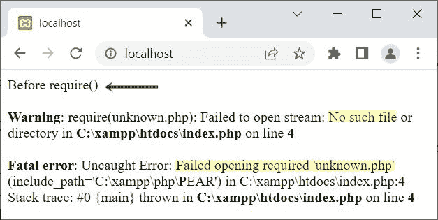

# PHP require()函数

> 原文：<https://codescracker.com/php/php-require-function.htm>

PHP **require()** 函数用在我们需要要求一个文件先执行的时候，在 执行 PHP 脚本之前， **require()** 之后。例如:

```
<?php
   require("myfile.php");

   echo "PHP is Fun!<BR>";
   echo "Is not it?";
?>
```

文件**myfile.php**的脚本是:

```
<?php
   echo "This is text inside \"myfile.txt\" file<HR>";
?>
```

现在，上面的 PHP 示例在 **require()** 函数上的输出显示在下面给出的快照中:


## PHP require()语法

PHP 中 **require()** 函数的语法是:

```
require 'file';

```

或者

```
require('file');
```

与 [include()](/php/php-include-function.htm) 不同的是，一旦失败， **require()** 函数 就会产生一个致命错误(E_COMPILE_ERROR)，从而中止当前 PHP 脚本的进一步执行。例如:

```
<?php
   echo "Before require()<BR>";

   require("unknown.php");

   echo "After require()<BR>";
?>
```

这个 PHP 示例在 **require()** 上产生的输出是:



查看输出， **require()** 函数之前的脚本已经执行，而 函数之后的脚本还没有执行，因为指定的文件不存在。

## PHP 中为什么要使用 require()。

我不知道你使用 **require()** 功能的目的。但是这个函数扮演了一个重要的 角色，当你的应用程序需要在执行当前的 PHP 脚本之前执行一些脚本(来自外部文件)时。例如:

```
<?php
   require 'dbConnection.php';

   $sql = "SELECT * FROM customer";

   $result = $conn -> query($sql);
   if($result)
   {
      while($row = $result -> fetch_row())
      {
         echo "Name: ", $row[1];
         echo "<BR>";
         echo "Age: ", $row[2];
         echo "<HR>";
      }
      $result -> free_result();
   }
   else
   {
      echo "Something went wrong!<BR>";
      echo "Error Description: ", $conn -> error;
   }
   $conn -> close();
?>
```

下面是名为**dbConnection.php**的文件的脚本:

```
<?php
   $server = "localhost";
   $user = "root";
   $pass = "";
   $db = "codescracker";

   $conn = new mysqli($server, $user, $pass, $db);

   if($conn -> connect_errno)
   {
      echo "Connection to the database failed!<BR>";
      echo "Reason: ", $conn -> connect_error;
      exit();
   }
?>
```

上面的例子产生的输出应该是:


也就是说，在成功连接到数据库之前，脚本不会执行。

**注意-**[MySQL()](/php/php-mysqli-connect-to-database.htm)用于以面向对象的方式打开到 MySQL 数据库服务器的 连接。

**注意-**[new](/php/php-new-keyword.htm)关键字用于创建一个新对象。

**注意-**[connect _ errno](/php/php-connect-errno-and-mysqli-connect-errno.htm)用于 以面向对象的方式获取/返回上次 connect 调用的错误代码(如果有)。

**注意-**[connect _ error](/php/php-connect-error-and-mysqli-connect-error.htm)用于 以面向对象的方式从最后一次连接中获取错误描述(如果有的话)。

**注意-**[exit()](/php/php-exit-function.htm)用于终止 当前 PHP 脚本的执行。

**注-**[query()](/php/php-query-and-mysqli-query.htm)用于对 MySQL 数据库进行查询，采用面向对象的方式。

**注意-**[fetch _ row()](/php/php-fetch-row-and-mysqli-fetch-row.htm)用于获取 ，并以面向对象的方式将结果作为枚举数组返回。

**注意-**[free _ result()](/php/php-free-result-and-mysqli-free-result.htm)用于 释放存储的结果，采用面向对象的方式。

**注-**[错误](/php/php-error-and-mysqli-error.htm)用于通过最近一次函数调用，以面向对象的方式返回错误的描述 (如果有的话)。

**注意-**[close()](/php/php-mysqli-close-database-connection.htm)用于关闭一个 打开的连接，采用面向对象的方式。

**注意-****require()**函数大部分时间用于包含关键文件，以避免危及 用 PHP 编写的 web 应用程序的安全性。也就是说，如果密钥文件丢失，那么整个脚本 不会被执行。

[PHP 在线测试](/exam/showtest.php?subid=8)

* * *

* * *