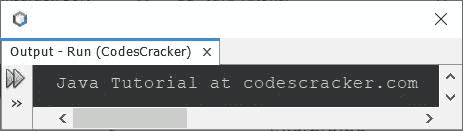
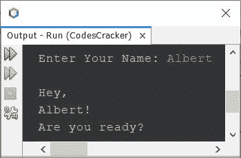

# Java 教程

> 原文：<https://codescracker.com/java/index.htm>

本教程将教你从基础到高级的所有 Java 编程知识。

## Java 是什么？

Java 是世界上最重要、使用最广泛的计算机编程语言之一。

不像其他一些计算机编程语言的影响力随着时间的推移而减弱，Java 变得更加强大。

今天，Java 仍然是开发基于 web 的应用程序的首选和最佳选择。

Java 是一种强大的面向对象编程语言。

Java 与 C++ 非常相似，但它是专门用于网页设计的。Java 编程语言是一种通用语言，像 C 和 C++，任何问题都可以用这种语言解决。

字节码解释程序用于运行 Java 程序。这个程序也被称为 Java 虚拟机(JVM)。字节码解释器不依赖于任何特定的计算机。它可以在任何计算机上使用。

## 为什么是 Java？

Java 成功的一个关键原因是它的灵活性。自从最初的 1.0 版本以来，Java 一直在适应编程环境的变化和程序员编程方式的变化。最重要的是，它不仅追随潮流，还帮助创造了潮流。Java 适应计算世界快速变化的能力是它一直并将继续如此成功的一个重要原因。

## Java 的历史

Java 是由太阳微系统公司于 1991 年开发的。

要完全理解 Java，必须理解它产生的原因、塑造它的力量以及它所继承的遗产。像之前成功的计算机语言一样，Java 融合了其深厚传统和创新概念的最佳元素，这是其独特使命所要求的。

尽管 Java 已经与互联网的在线环境密不可分。

计算机语言和发展的出现有两个基本原因:

*   以适应环境和用途的变化
*   在编程艺术中实现改进和细化

## Java 是如何改变互联网的？

互联网将 Java 推向了编程的前沿，而 Java 反过来又对互联网产生了深远的影响。除了简化 web 编程，Java 还创新了一种叫做 applet 的新型网络程序，它改变了网络世界对内容的思考方式。Java 还解决了一些与互联网相关的最棘手的问题:可移植性和安全性。

### java 小程序

一个[小程序](/java/java-applet-basics.htm)是一种特殊形式的 Java 程序，它被设计成通过互联网传输，并由一个 兼容 Java 的网络浏览器自动执行。

### 安全性

你可能知道，每次你下载一个“正常”的程序，你都在冒险，因为你要下载的代码可能含有病毒。特洛伊木马或其他有害代码。问题的核心是恶意代码会造成损害，因为它获得了对系统资源的未授权访问。

Java 通过将 applet 约束(限制)在 Java 执行环境中，不允许它访问计算机的其他部分来实现这种保护。

### 轻便

可移植性是互联网的一个主要方面，因为有许多不同类型的计算机和操作系统连接到它。如果任何 Java 程序要在几乎任何连接到因特网的计算机上运行，就需要有某种方法使该程序能够在不同的系统上执行。

## Java 的魔力:字节码

主要的关键是，允许 Java 解决安全性和可移植性这两个问题，刚才描述的是，Java 编译器的输出不是可执行代码，而是字节码，它是高度优化的指令集，设计为在 Java 运行时系统上执行，称为 Java 虚拟机(JVM)。

## Servlets:服务器端的 Java

尽管小程序很有用，但它们只是客户机/服务器等式的一半。在 Java 最初发布后不久，很明显 Java 在服务器端也很有用。结果就是 servlet。servlet 是一个在服务器上执行的小程序。只是一个小应用程序动态扩展了网络浏览器的功能；Servlets 动态扩展了 Web 服务器的功能。因此，随着 servlet 的出现，Java 跨越了客户机/服务器连接的两端。

## Java 流行语

如果不看看 Java 的流行词汇，任何关于 Java 历史的讨论都是不完整的。安全性和可移植性是 Java 发明的基本动力，其他因素也对语言的最终形式起着重要作用。Java 团队在下面的术语列表中总结了关键的考虑因素:

*   简单的
*   安全的
*   轻便的
*   面向对象
*   粗野的
*   [多线程](/java/java-multithreading.htm)
*   建筑中立
*   解释
*   高性能
*   分布的
*   动态的

下面是一个简单的 Java 程序:

```
import java.util.Scanner;

public class CodesCracker
{
   public static void main(String[] input)
   {
      System.out.println("Java Tutorial at codescracker.com");
   }
}
```

上述程序产生的输出示例显示在下面给出的快照中:



下面是另一个 Java 编程示例:

```
import java.util.Scanner;

public class CodesCracker
{
   public static void main(String[] input)
   {
      String name;
      Scanner scan = new Scanner(System.in);

      System.out.print("Enter Your Name: ");
      name = scan.nextLine();

      System.out.println("\nHey,\n" +name+ "!\nAre you ready?");
   }
}
```

下面给出的快照显示了上述 Java 代码的示例运行，带有用户输入 **Albert** :



**注意**——不要被上面的 Java 程序迷惑了，这只是一个例子，你会在后面单独的章节里学到 Java 编程 的所有概念。

在本系列教程中，您将学习到关于 Java 的所有知识。

## 观众

本教程的设计和开发是为了帮助那些有兴趣用 Java 和它的描述一起练习很多程序的 Java 程序员。

在这个系列教程中，我们在每一章中都包含了尽可能多的程序。

## 先决条件

在开始学习 Java 之前，你必须具备一些基本的计算机知识。

而如果你有一些如何用 [C](/c/index.htm) 或者 T2】C++ 编程的基础知识，那么在这里学习 Java 就变得非常容易了。

[Java 在线测试](/exam/showtest.php?subid=1)

* * *

* * *