# Java 环境设置

> 原文：<https://codescracker.com/java/java-environment-setup.htm>

## 编译并运行 Java 程序

为了编译和运行你的 Java 程序，你必须首先设置 Java 编程环境。你可以在没有任何软件的情况下设置 Java 环境，只需使用计算机的命令提示符。但这是一个耗时的环境。这意味着如果你使用命令提示符编译并运行你的 Java 程序，这将消耗你的每一个 Java 程序的额外时间。

所以你可以很容易地使用 Java 编译器/IDE，比如 Netbean 或 T2 BlueJ 来编译和运行你的 Java 程序。 这两个 Java 编译器/IDE 都是最流行的 Java 编译器/IDE。

让我们看看如何使用 **Netbean** 和 **BlueJ** 以及命令提示符(cmd)来设置环境。

## Java 环境设置- BlueJ

要使用 **BlueJ** 编译并运行您的 Java 程序，请遵循以下步骤:

**1** 。从网上下载 Java JDK 并安装。

**2** 。现在从网上下载 BlueJ 并安装它。

**3** 。安装 BlueJ 后，打开。

**4** 。打开的 BlueJ 窗口看起来像这样:

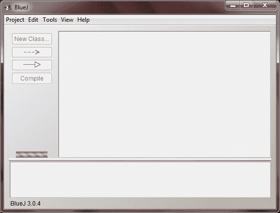

**5** 。现在点击**项目**菜单，然后**新建项目**出现在 BlueJ 窗口的左上方，如下图 所示:

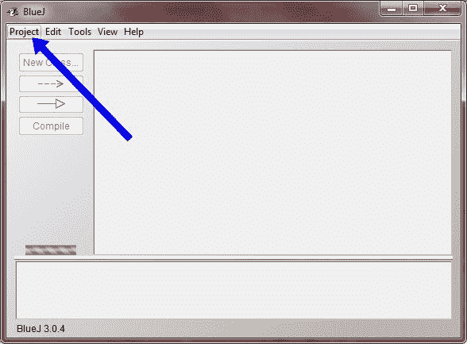

**6** 。现在输入项目名称，如 JavaProgram.java**T3，点击**创建**或直接按**回车**，如下图 所示:**

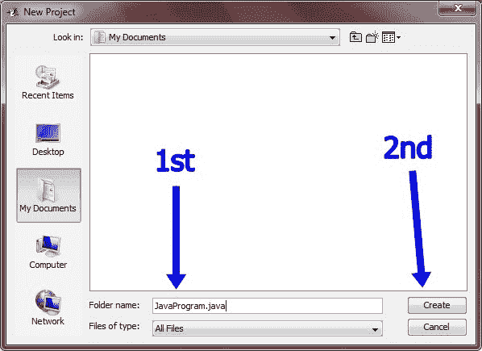

**7** 。执行此操作后，您将在 BlueJ 窗口中看到一些变化，如下图所示:

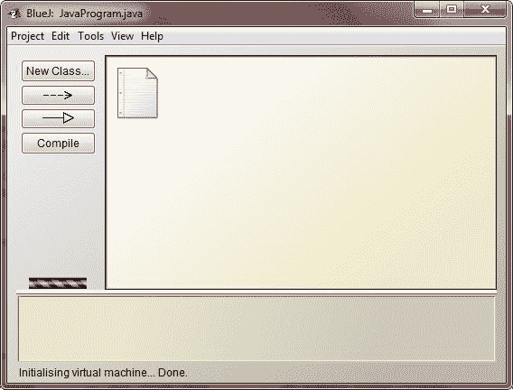

**8** 。现在点击**新建类**菜单，键入类名如 **JavaProgram** ，然后点击 **OK** 按钮，如下图 所示:

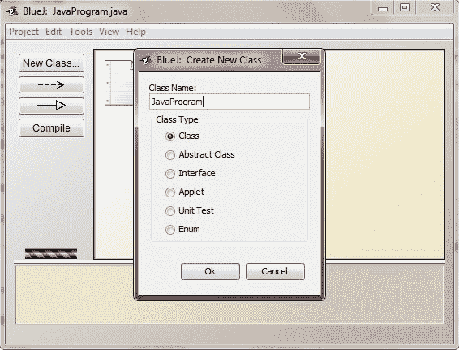

**9** 。执行此操作后，您将再次看到 BlueJ 窗口中的一些变化，如下图所示:

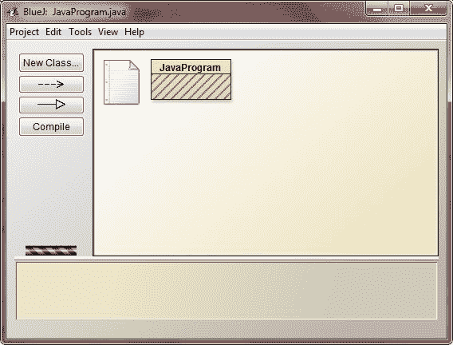

**10** 。现在双击 **JavaProgram** 或者右键单击 **JavaProgram** 然后点击**打开编辑器** 然后会出现一个新的编辑器窗口，看起来像这样:

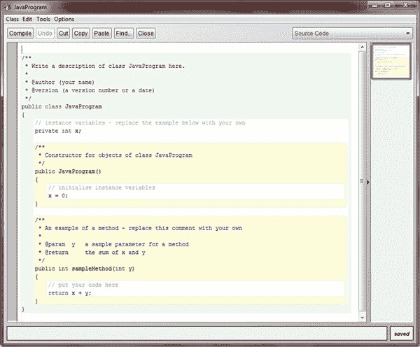

**11** 现在，删除窗口中已有的所有代码/文本，开始键入您自己的 Java 程序，如下所示:

```
public class JavaProgram
{
    public static void main(String args[])
    {

        System.out.println("Hello BlueJ, I am Java");

    }
}
```

如下图所示:

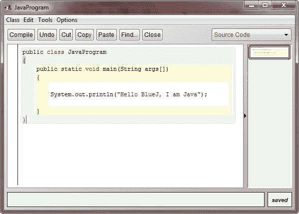

**12** 。现在按下**编译**按钮，现在你会在窗口底部看到一些信息，如下图所示:

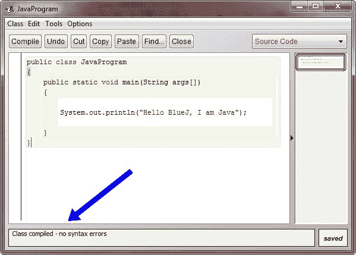

13 。如果你将观看，没有语法错误，然后通过按下**关闭**按钮关闭窗口

**14** 。现在你会来到后面的窗口，如果你想运行并检查你的 Java 程序的输出，那么右击 类，即在 **JavaProgram** 上，然后点击 **void main(String[] args)** ，现在会出现一个小窗口，如下所示:

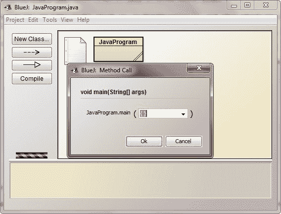

**15** 现在按下 **OK** 按钮，观看你的 Java 程序的输出，如下图所示:

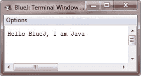

## Java 环境设置- Netbean

要使用 **Netbean** 编译并运行您的 Java 程序，请遵循以下步骤:

**1** 。从网上下载 Java JDK 并安装。

**2** 。现在从网上下载 Netbean 并安装它。

**3** 。安装 Netbean 后，打开它。

**4** 。打开的 Netbean 窗口将如下所示:

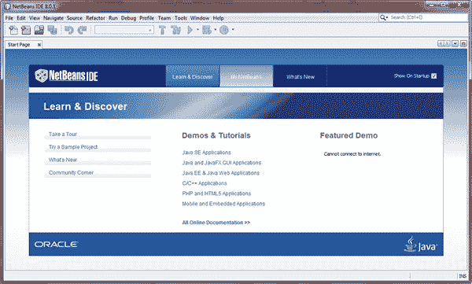

**5** 。现在点击**文件**菜单，然后窗口左上角出现**新项目**，现在会出现一个新窗口 ，如下图所示:

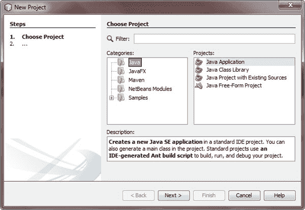

**6** 。现在点击**下一个**按钮，一个新的窗口将再次出现，如下图所示:

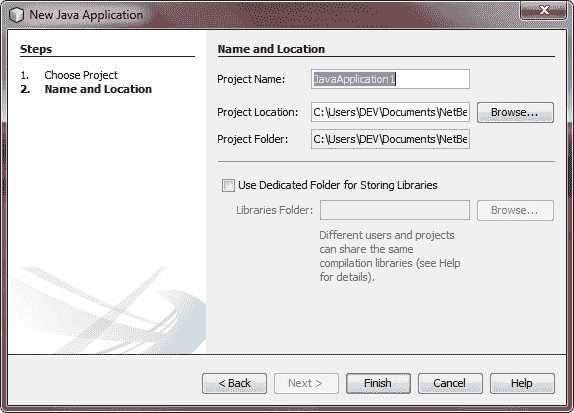

**7** 。现在，您可以键入您的项目名称或简单地保留默认名称，如 JavaApplication1，并按下**完成**按钮，在 按下完成按钮后，您的项目被创建，并且会出现一个新窗口(即编辑器窗口)，如下图所示:

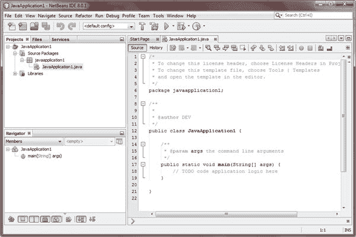

**8** 。现在您可以在 main()函数之后，即 *// TODO 代码应用逻辑下面*， 处键入您的 Java 编程代码，您也可以删除所有预先编写的代码/文本，并在删除不可用的文本后编写新的代码，如下图所示:

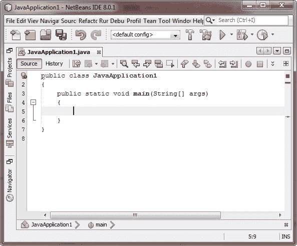

**9** 。现在输入你的 Java 程序，如下所示:

```
public class JavaApplication1
{
    public static void main(String[] args)
    {

        System.out.println("Hello Netbean!, I am Java");

    }  
}
```

如下图所示:

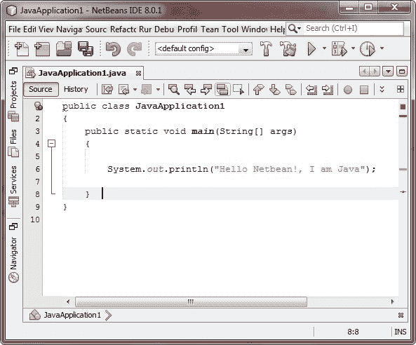

**10** 。键入 Java 程序后，您可以通过按下 **F9** 按钮进行编译，并通过按下 **F6** 按钮或 进行运行。您也可以通过单击 Netbean 窗口顶部的**运行**菜单来编译 Java 程序。编译 并运行上述 Java 编程代码后，您将看到如下图所示的输出:

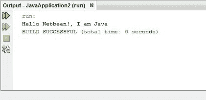

### 使用命令提示符编译并运行 Hello World Java 程序

Java 最简单的程序，它将输出字符串“Hello World”。

```
/* Java Program Example - Java Environment Setup
*  This program prints "Hello World" */

public class JavaProgram 
{
    public static void main(String args[])
    {

       System.out.println("Hello World"); // prints Hello World

    }
}
```

## Java 环境设置-命令提示符

要使用命令提示符编译并运行上面的 Java 程序，让我们看看如何进行。

让我们解释一下如何保存文件，然后使用文本编辑器(记事本)编译并运行程序:

*   将上述代码复制并粘贴到记事本(Windows 文本编辑器)中。
*   以 JavaProgram.java 的名字保存文件。
*   现在打开命令提示符窗口(windows 用户),只需按 windows 键，然后键入 cmd，按 ENTER 按钮，并转到保存该类的目录。现在我们假设它在 C:\目录中。
*   键入“javac JavaProgram.java ”,然后按 ENTER 按钮编译您的代码。如果代码中没有错误，那么命令提示符会将您带到下一行(假设已经设置了 path 变量)。
*   键入“java javaProgram”运行您的 Java 程序。
*   执行此操作后，它会在窗口上打印“Hello World”。

以下是上面的 Java 程序在键入前两行后产生的输出:

```
C : > javac JavaProgram.java
C : > java JavaProgram 
Hello World
```

[Java 在线测试](/exam/showtest.php?subid=1)

* * *

* * *