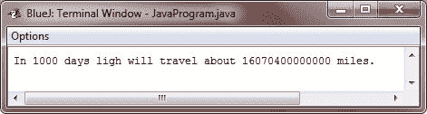

# Java 整数数据类型和范围

> 原文：<https://codescracker.com/java/java-integers.htm>

Java 定义了这四种整数类型:

1.  字节
2.  短的
3.  （同 Internationalorganizations）国际组织
4.  长的

所有这些都是有符号的，正值和负值。

Java 不支持无符号的、只有正数的整数。许多其他计算机语言同时支持有符号和无符号整数。

无论如何，Java 的设计者认为无符号整数是不必要的。具体来说，他们认为无符号的概念主要用于指定高阶位的行为，它定义了整数值的符号。Java 通过添加一个特殊的“无符号[右移](/java/java-right-shift.htm)运算符，以不同的方式处理高位的重要性。因此，消除了对无符号整数类型的需求 。

整数类型的宽度不应该是它消耗的存储量，而是它为该数据类型的变量和表达式定义的行为。然而，Java 运行时环境总是可以自由地使用它想要的任何大小，只要类型的行为符合您对它们的声明。

## 整数宽度和范围

这些整数数据类型的宽度和范围变化很大，如下表所示:

| 名字 | 宽度 | 范围 |
| 长的 | Sixty-four | -9 223 372 036 854 775 808 至 9 223 372 036 854 775 807 | -2 <sup>63</sup> 至 2 <sup>63</sup> -1 |
| （同 Internationalorganizations）国际组织 | Thirty-two | -2147483648 至 2147483647 | -2 <sup>31</sup> 至 2 <sup>31</sup> -1 |
| 短的 | Sixteen | -32768 至 32767 | -2 <sup>15</sup> 至 2 <sup>15</sup> -1 |
| 字节 | eight | -128 到 127 | -2 <sup>7</sup> 至 2 <sup>7</sup> -1 |

现在，让我们来看看每一种类型的整数。

### 字节

byte 是最小的整数类型。这是带符号的 8 位数据类型，范围从-128 到 127。当您处理来自网络或文件的数据流时，byte 类型的变量特别有用。当您处理可能与其他内置类型的 Java 不直接兼容的原始二进制数据时，它们也很有用。

字节变量通过使用 Byte 关键字来声明。例如，下面声明了两个字节变量 b 和 c:

```
byte b, c;
```

### 短的

short 是有符号的 64 位类型。其范围从-32，768 到 32，767。这是最少使用的类型。以下是短变量声明的一些示例:

```
short s;
short t;
```

### （同 Internationalorganizations）国际组织

如你所知，最常用的整数数据类型是 int。它是有符号的 32 位类型，范围从-2，147，483，648 到 2，147，483，647。

除了其他用途，int 类型变量通常用于控制循环和索引数组。即使您可能认为在不需要更大范围的 int 数据类型的情况下，使用 byte 或 short 会比使用 int 更有效，但事实可能并非如此。原因是，当在表达式中使用 byte 和 short 值时，在对表达式求值时，它们会被提升为 int。(您将在另外两章中了解类型升级，即[自动类型升级](/java/java-automatic-type-promotion.htm)和 [类型升级规则](/java/java-type-promotion-rules.htm))。因此，当需要整数时，int 是最佳选择。

### 长的

long 是单精度 64 位类型，适用于 int 数据类型不足以保存所需值的情况。龙的范围相当大。当需要大的整数时，这很有帮助。例如，这是一个计算光在给定天数内传播的英里数的程序:

```
/* Java Program Example - Java Integer Data Types
 * Compute distance light travels using long variables
 */

public class JavaProgram
{   
    public static void main(String args[])
    {

        int lightspeed;
        long days;
        long seconds;
        long distance;

        /* approximate speed of light in miles per second */
        lightspeed = 186000;

        days = 1000;      // specify number of days here

        seconds = days * 24 * 60 * 60;    // convert to seconds

        distance = lightspeed * seconds;  // compute distance

        System.out.print("In " +days);
        System.out.print(" days ligh will travel about " + distance + " miles.");

    }
}

```

当上述 Java 程序被编译和运行时，它将产生以下输出:



显然，结果不可能保存在 int 变量中。

[Java 在线测试](/exam/showtest.php?subid=1)

* * *

* * *