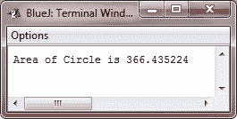

# Java 浮点类型

> 原文：<https://codescracker.com/java/java-floating-point-types.htm>

当计算需要小数精度的表达式时，使用浮点数或实数。例如，平方根之类的计算，或者正弦和余弦之类的超越运算，会产生精度要求浮点类型的值。

Java 实现了浮点类型和运算符的标准(IEEE-754)集。有两种浮点类型，即 float 和 double，分别表示单精度和双精度数。

### 浮点数据类型宽度和范围

下表显示了浮点类型的宽度和范围:

| 名字 | 以位为单位的宽度 | 大致范围 |
| 两倍 | Sixty-four | 4.9e-324 至 1.8e+308 |
| 漂浮物 | Thirty-two | 1.4e-045 至 3.4e+038 |

现在，让我们一个接一个地看看这些(double 和 float)浮点类型。

### 漂浮物

float 类型指定使用 32 位存储的单精度值。单精度在某些处理器上速度更快，占用的空间是双精度的一半，但是当值非常大或非常小时会变得不准确。

当需要小数部分，但不需要很高的精度时，float 类型的变量很有用。例如，无论何时表示美元和美分，float 都很有用。

下面是一些浮点变量声明示例:

```
float hightemp, lowtemp, rad;
```

### 两倍

双精度由关键字 Double 表示，它使用 64 位来存储值。

在一些针对高速数学计算进行优化的现代处理器上，双精度实际上比单精度更快。所有超越数学函数，如 sin()、cos()和 sqrt()，都返回双精度值。当您需要在多次重复计算中保持精度，或者处理大数值时，double 是最佳选择。

下面是一个简短的程序，它使用双变量来计算圆的面积:

```
/* Java Program Example - Java Floating-Point Types
 * Compute the area of a Circle 
 */

public class JavaProgram
{   
    public static void main(String args[])
    {

        double pi, r, a;

        r = 10.8;     // radius of the circle
        pi = 3.1416;   // approximate value of pi
        a = pi * r * r;     // compute area of the circle

        System.out.println("Area of Circle is " +a);

    }
}
```

当上述 Java 程序被编译和运行时，它将产生以下输出:



## 例子

下面是一些使用 float 和 double(浮点)类型变量的示例程序列表:

*   [制作计算器](/java/program/java-program-make-calculator.htm)
*   [计算平均分&百分制](/java/program/java-program-calculate-average-percentage.htm)
*   [计算面积&圆周](/java/program/java-program-calculate-area-circumference.htm)
*   [华氏到摄氏的转换](/java/program/java-program-convert-fahrenheit-to-centigrade.htm)
*   [摄氏到华氏的转换](/java/program/java-program-convert-centigrade-to-fahrenheit.htm)

[Java 在线测试](/exam/showtest.php?subid=1)

* * *

* * *