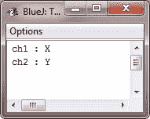
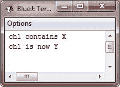
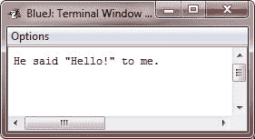

# Java 字符

> 原文：<https://codescracker.com/java/java-characters.htm>

在 Java 中， **char** 是用来存储字符的数据类型。然而，C/C++程序员要小心，Java 中的**字符**与 C/C++中的**字符**不同。在 C/C++中， **char** 是 8 位宽。Java 里不是这样。相反，Java 使用 *Unicode* 来表示字符。

## Java 使用 Unicode

Unicode 定义了一个完全国际化的字符集，可以表示所有人类语言中的所有字符。它是几十种字符集的统一，比如拉丁语、阿拉伯语、希腊语、希伯来语、西里尔语等等。

在 Java 创建的时候，Unicode 需要 16 位。因此，在 Java **中，char** 是 16 位类型。一个 **char** 的范围是从 0 到 65536 的范围。没有负面的**字符**。

## 标准字符集

被称为 ASCII 的标准字符集的范围仍然是从 0 到 127，覆盖的 8 位字符集 ISO-Latin-1 的范围是从 0 到 255。

由于 Java 被设计成允许编写供全球使用的程序，这就意味着它将使用 Unicode 来表示字符。当然，对于英语、西班牙语、德语或法语等语言来说，使用 Unicode 效率稍低，因为这些语言的字符很容易控制在 8 位以内。但这是全球可移植性必须付出的代价。

## Java 字符示例

下面是一个演示 **char** 变量的程序:

```
/* Java Program Example - Java Characters 
 * This program demonstrates char data type */

public class JavaProgram
{   
    public static void main(String args[])
    {

        char ch1, ch2;

        ch1 = 88;      // code for X
        ch2 = 'Y';

        System.out.print("ch1 : " + ch1 + "\nch2 : " + ch2);

    }
}
```

当上述 Java 程序被编译和运行时，它将产生以下输出:



注意这里变量 **ch1** 被赋值为 88，这是对应于字母 x 的 ASCII(和 Unicode)值。 如前所述，ASCII 字符集占据了 Unicode 字符集中的前 127 个值。因此，你可能在其他语言中对字符使用过的所有旧技巧在 Java 中也能工作。

尽管 **char** 被设计用来保存 Unicode 字符，但是它也可以被用作一个整数类型，在这个整数类型上你可以执行 算术运算。例如，您可以将两个字符相加，或者增加一个字符变量的值。考虑下面的 示例程序:

### 例子

```
/* Java Program Example - Java Characters
*  char variables behaves like integers */

public class JavaProgram
{   
    public static void main(String args[])
    {

        char ch1;

        ch1 = 'X';
        System.out.println("ch1 contains " +ch1);

        ch1++;      // increments ch1
        System.out.println("ch1 is now " + ch1);

    }
}
```

当上述 Java 程序被编译和运行时，它将产生以下输出:



在上面的程序中， **ch1** 首先被赋予值 x。接下来， **ch1** 递增。这导致 **ch1** 持有 Y，即 ASCII(和 Unicode)序列中的下一个字符 。

## Java 中的转义序列

反斜杠(\)前面的字符是转义序列，对编译器有特殊的意义。

正如您所看到的，换行符(\n)在 **System.out.println()** 语句中频繁使用，以便在打印字符串后前进到下一行 。

请看这里给出的表格，它显示了 Java 的转义序列:

| 换码顺序 | 描述 |
| \n | 插入换行符 |
| \b | 插入退格键 |
| \f | 插入换页 |
| \r | 插入一个回车 |
| \' | 插入单引号字符 |
| \" | 插入双引号字符 |
| \\ | 插入反斜杠字符 |
| \t | 插入制表符 |

当在 print 语句中遇到转义序列时，编译器会相应地解释它。让我们看看下面的例子:

如果您想在引号内加上引号，那么您必须在内引号上使用转义序列\ " \ ":

```
/* Java Program Example - Java Characters */

class JavaProgram
{
    public static void main(String args[])
    {

        System.out.println("He said \"Hello!\" to me.");

    }
}
```

它将产生以下结果:



## 更多示例

这里有一些关于角色的例子，你可以去看看。

*   [在 Java 中检查字符是否为字母](/java/program/java-program-check-alphabet.htm)
*   [在 Java 中检查字符是否为元音](/java/program/java-program-check-vowel.htm)
*   [计算 Java 中字符串的字符数](/java/program/java-program-find-frequency-of-character.htm)
*   [Java 中大写字符到小写字符的转换](/java/program/java-program-convert-uppercase-to-lowercase.htm)
*   [Java 中小写字符到大写字符的转换](/java/program/java-program-convert-lowercase-to-uppercase.htm)

[Java 在线测试](/exam/showtest.php?subid=1)

* * *

* * *