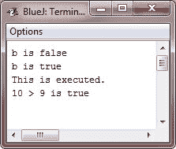

# Java Boolean

> 原文：<https://codescracker.com/java/java-booleans.htm>

Java 有一个用于逻辑值的基本类型，称为**布尔**。它只能有两个可能的值之一，**真**或 T4】假。这是所有关系操作符返回的类型，如 **a < b** 的情况。

**布尔型**也是条件表达式所需要的*类型，这些条件表达式管理控制语句，如 **if** 和 **for** 。*

 *## 布尔示例

下面是一个说明**布尔**类型的程序:

```
/* Java Program Example - Demonstrate boolean values - Java Booleans */

public class JavaProgram
{   
    public static void main(String args[])
    {

        boolean b;

        b = false;
        System.out.println("b is " +b);
        b = true;
        System.out.println("b is " +b);

        /* a boolean value can control the if statement */
        if(b)
            System.out.println("This is executed.");

        b = false;
        if(b)
            System.out.println("This is not executed.");

        /* outcome of a relational operator is a boolean value */
        System.out.println("10 > 9 is " +(10>9));

    }
}
```

当编译并执行上述 Java 程序时，它将产生以下输出:



关于上面的程序，有三件有趣的事情需要注意。首先，如您所见，当通过方法 **println()** 输出一个**布尔值**时，显示“真”或“假”。其次，**布尔**变量的值本身足以控制 **if** 语句。 没有要求像这样写一个 **if** 语句:
if(b == true)...

第三，关系运算符的结果，如布尔值。这就是表达式**10>9**T7 显示值“真”的原因。并且，在 **10 > 9** 周围的额外一组括号是必要的，因为+运算符的 优先级高于>。

[Java 在线测试](/exam/showtest.php?subid=1)

* * *

* * **