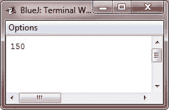

# Java 编号

> 原文：<https://codescracker.com/java/java-numbers.htm>

在 Java 中，你可以自由地处理数字，使用基本的数据类型，如 byte、int、double、long 等。下面是一些在 Java 中定义和初始化变量的例子:

```
int numi = 432;
float numf = 43.23;
```

## Java 数字示例

下面是一个例子，在 Java 中使用数字:

```
/* Java Program Example - Java Numbers */

class JavaProgram
{
    public static void main(String args[])
    {

        Integer num = 50;
        num =  num + 100;
        System.out.println(num); 

    }
}
```

下面是上面的 Java 程序产生的输出:



## 例子

这里有一些例子程序列表，你可以去。实际上，这里我们列出了数字转换程序。

*   [十进制到二进制的转换](/java/program/java-program-convert-decimal-to-binary.htm)
*   [十进制到八进制的转换](/java/program/java-program-convert-decimal-to-octal.htm)
*   [十进制到十六进制的转换](/java/program/java-program-convert-decimal-to-hexadecimal.htm)
*   [二进制到十进制的转换](/java/program/java-program-convert-binary-to-decimal.htm)
*   [二进制到八进制的转换](/java/program/java-program-convert-binary-to-octal.htm)
*   [二进制到十六进制的转换](/java/program/java-program-convert-binary-to-hexadecimal.htm)
*   [八进制到十进制的转换](/java/program/java-program-convert-octal-to-decimal.htm)
*   [八进制到二进制的转换](/java/program/java-program-convert-octal-to-binary.htm)
*   [八进制到十六进制的转换](/java/program/java-program-convert-octal-to-hexadecimal.htm)
*   [十六进制到十进制的转换](/java/program/java-program-convert-hexadecimal-to-decimal.htm)
*   [十六进制到二进制的转换](/java/program/java-program-convert-hexadecimal-to-binary.htm)
*   [十六进制到八进制的转换](/java/program/java-program-convert-hexadecimal-to-octal.htm)

[Java 在线测试](/exam/showtest.php?subid=1)

* * *

* * *