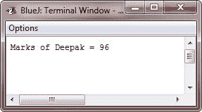

# Java 变量类型

> 原文：<https://codescracker.com/java/java-variable-types.htm>

变量基本上是内存位置的名称。根据变量的数据类型，内存布局和大小可能会有所不同。

下表列出了 Java 中所有三种类型的变量及其含义:

| 可变类型 | 意义 |
| 局部变量 | 局部变量 Java 是在本地创建的，例如在方法、构造函数或任何块中，这些局部变量在从创建它们的方法、构造函数或任何块中退出时会自动销毁 |
| 实例变量 | 在 Java 中，每当通过使用 [new 运算符](/java/java-new-operator.htm)创建一个对象时，就会创建实例变量。 你可以在 Java 中，在一个类中，但在任何块、方法或任何构造函数之外创建实例变量。 |
| 静态变量 | 静态变量也称为类变量，是通过在类中使用 **static** 关键字创建的，但不在 任何块、方法或任何构造函数之内 |

## Java 中的局部变量

下面是一个示例程序，演示了 Java 中局部变量的概念和用法。这里 marks 是局部变量。

```
/* Java Variable Types - Java Local Variables - Example Program */

public class JavaProgram
{
    void printMarks()
    {
        int marks = 0;
        marks = marks + 96;
        System.out.println("Marks of Deepak = " + marks);
    }
    public static void main(String[] args)
    {
           JavaProgram jp = new JavaProgram();
           jp.printMarks();
    }
}
```

下面是上面的 Java 程序产生的示例输出:



## Java 中的实例变量

下面是一个示例程序，说明了 Java 中实例变量的概念和用法:

```
/* Java Variable Types - Java Instance Variables - Example Program */

import java.io.*;

public class JavaProgram
{
    public String studname; // this instance variable is visible for any child class
    private String studbranch;  // this instance variable is only visible to the JavaProgram class

    public JavaProgram(String name)
    {
        studname = name;
    }
    public void initializeBranch(String branch)
    {
        studbranch = branch;
    }
    public void printStudent()
    {
        System.out.println("Name = " + studname);
        System.out.println("Branch = " + studbranch + "\n");
    }

    public static void main(String args[])
    {
        JavaProgram jp1 = new JavaProgram("Deepak");
        jp1.initializeBranch("CSE");
        jp1.printStudent();
        JavaProgram jp2 = new JavaProgram("Rajat");
        jp2.initializeBranch("Electrical");
        jp2.printStudent();
    }
}
```

下面是这个 Java 程序产生的示例输出:


## Java 中的静态变量

下面是一个示例程序，帮助你理解 Java 中的静态变量:

```
/* Java Variable Types - Java Static Variables - Example Program */

import java.io.*;

public class JavaProgram
{
    private static String studname; // this is a private, static variable
    public static final String studbranch = "IT";   // constant variable

    public static void main(String args[])
    {
        studname = "Deepak";
        System.out.println(studname + " is in " + studbranch + " branch");
    }
}
```

上述 Java 程序将产生以下输出:


[Java 在线测试](/exam/showtest.php?subid=1)

* * *

* * *