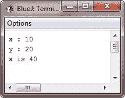

# Java 变量作用域

> 原文：<https://codescracker.com/java/java-variables-scope.htm>

到目前为止，所有使用的变量都已经在 **main()** 方法的开头声明了。然而，Java 允许在任何块中声明变量 。

一个块以左花括号开始，以右花括号结束。一个块定义了一个*范围*。因此，每次你开始一个新的程序块，你都在创建一个新的作用域。作用域决定了哪些对象对程序的其他部分是可见的。 它还决定了这些对象的寿命。

许多其他计算机语言定义了两种通用的作用域类别:全局和局部。然而，这些传统的作用域并不完全符合 Java 严格的面向对象模型。虽然创建相当于全局范围的内容是可能的，但这是个例外，而不是常规。

在 Java 中，两个主要的作用域是由类定义的作用域和由方法定义的作用域。甚至这种区分也有些人为。但是，由于类作用域有几个独特的属性和特性，它们不适用于方法定义的作用域，所以这种区分有一定的意义。稍后你将在单独的章节中了解[类](/java/java-classes.htm)。现在，我们 将只检查方法定义的范围。

方法定义的范围从它的左花括号开始。但是，如果该方法有参数，它们也包含在该方法的范围内。

## Java 范围规则

一般来说，作用域内声明的变量对于作用域外定义的代码是不可见/不可访问的。因此，当您在一个作用域内声明一个变量时，您就本地化了该变量并保护它免受未经授权的访问和/或修改。事实上，范围规则为[封装](/java/java-encapsulation.htm)提供了基础。

范围可以嵌套。例如，每次创建一个代码块时，都是在创建一个新的嵌套范围。当这种情况发生时，外部作用域包围内部作用域。这意味着在外部范围内声明的对象对于内部范围内的代码将是可见的。然而，反之则不然。在内部范围内声明的对象在外部是不可见的。

### Java 变量范围示例

要理解嵌套作用域的效果，请考虑下面的程序:

```
/* Java Program Example - Java Variables Scope */

public class JavaProgram
{   
    public static void main(String args[])
    {

        int x;     //known to all code within main

        x = 10;
        if(x == 10)
        {
            int y = 20;    //known only to this block

            /* x and y both known here */
            System.out.println("x : " + x + "\ny : " + y);
            x = y * 2;
        }
        // y = 100;   //error! y not known here

        /* x is still known here */
        System.out.println("x is " +x);

    }
}
```

当上述 Java 程序被编译和运行时，它将产生以下输出:



如注释所示，变量 **x** 是在 **main()** 的作用域开始时声明的，并且可以被 **main()** 内的所有后续代码 访问。在**内，如果**块，则 **y** 被声明。由于一个块定义了一个作用域， **y** 只对其块内的其他代码 可见。这就是为什么在它的块外，线**y = 100**；被注释掉了。如果您删除前导注释符号，即 **//** ， ，将会出现编译时错误，因为 **y** 在其块外部是不可见的。在 **if** 块中，可以使用**x** ,因为块(即嵌套作用域)中的代码可以访问封闭作用域声明的变量。

在一个块中，变量可以在任何点声明，但只有在声明后才有效。因此，如果您在方法的开始定义了一个变量，那么该方法中的所有代码都可以使用它。相反，如果在块的末尾声明一个变量，它实际上是没有用的，因为没有代码可以访问它。例如，下面的代码片段是无效的，因为**计数**不能在声明之前使用:

```
// This fragment is wrong!
count = 100;     // oops! cannot use count before it is declared!
int count;
```

这里有另一个需要记住的要点，即变量是在进入它们的作用域时被创建的，而在离开它们的作用域时被销毁。这意味着一旦变量超出了作用域，它将不再保持其值。因此，在一个方法中声明的变量在调用该方法之间不会保存它们的值。此外，在块中声明的变量在离开该块时会丢失其值。因此，变量的生存期被限制在它的作用域内。

如果一个变量声明包含一个初始化器，那么每次进入声明它的块时，这个变量都会被重新初始化。例如，考虑以下程序:

```
/* Java Program Example - Demonstrate lifetime of a variable - Java Scope Rules */

public class JavaProgram
{   
    public static void main(String args[])
    {

        int x;

        for(x=0; x<5; x++)
        {
            int y = -1;    //y is initialized each time block is entered
            System.out.println("y is : " +y);    //this always prints -1

            y = 100;
            System.out.println("y is now : " +y);
        }

    }
}
```

当上述 Java 程序被编译和运行时，它将产生以下输出:


如你所见，每次进入循环的内部**时， **y** 被重新初始化为-1。即使它随后被赋予 值 100，这个值也会丢失。**

[Java 在线测试](/exam/showtest.php?subid=1)

* * *

* * *