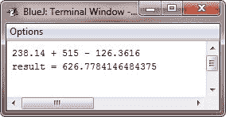

# Java 类型提升规则

> 原文：<https://codescracker.com/java/java-type-promotion-rules.htm>

Java 定义了几个适用于表达式的*类型提升*规则。

它们如下:首先，所有的**字节、short** 和 **char** 值被提升为一个 **int** ，就像刚才描述的那样。然后，如果一个 操作数是一个**长的**，则整个表达式提升为**长的**。如果一个操作数是一个**浮点型**，那么整个表达式将从 提升到**浮点型**。如果任一操作数是 **double** ，则结果是 **double** 。

## Java 类型提升示例

下面的程序演示了如何提升表达式中的每个值，以匹配每个二元运算符的第二个参数:

```
/* Java Program Example - Java Type Promotion Rules */

public class JavaProgram
{   
    public static void main(String args[])
    {

        byte b = 42;
        char c = 'a';
        short s = 1024;
        int i = 50000;
        float f = 5.67f;
        double d = .1234;

        double result = (f * b) + (i / c) - (d * s);

        System.out.println((f * b) + " + " + (i / c) + " - " + (d * s));
        System.out.println("result = " + result);

    }
}
```

当编译并执行上述 Java 程序时，它将产生以下输出:



让我们仔细看看上述计划中这一行中出现的类型提升:

double result =(f * b)+(I/c)-(d * s)；

在第一个子表达式中， **(f * b)，b** 被提升为一个**浮点**，子表达式的结果是**浮点**。接下来，在 子表达式 **(i / c)中，c** 提升为 **int** ，结果为类型 **int** 。然后在 **(d * s)** 中，将 **s** 的值提升为 **double** ，子表达式的类型为 **double** 。最后，考虑这三个中间值， **float，int** ，和 **double** 。 **float** 加上 **int** 的结果是一个 **float** 。然后得到的 **float** 减去最后一个 **double** 提升为 **double** ，这是表达式最终结果的类型。

[Java 在线测试](/exam/showtest.php?subid=1)

* * *

* * *