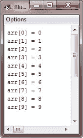
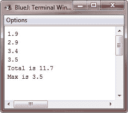

# Java 数组

> 原文：<https://codescracker.com/java/java-arrays.htm>

数组是一组相似类型的变量，它们由一个公共名称引用。可以创建任何类型的数组，并且可以有一维(一维数组)或多维(多维数组)。数组中的特定元素通过其索引来访问。数组提供了一种对相关信息进行分组的便捷方法。

## Java 中数组的类型

Java 中有以下两种类型的数组:

*   [一维数组](/java/java-one-dimensional-arrays.htm)
*   [多维数组](/java/java-multi-dimensional-arrays.htm)

## 用 Java 声明数组

以下是在 Java 中声明数组的一般形式:

```
type array-name[];
```

这里，type 表示名为 array-name 的数组的元素类型(也称为基类型)。下面是一个示例，声明了一个名为 arr 的 int 类型的数组:

```
int arr[];
```

## Java 中的替代数组声明

还有第二种形式来声明数组:

```
*type*[] *var-name*;
```

这里，方括号出现在类型说明符之后，而不是数组变量之后。例如，以下两个声明是等效的:

```
int arr1[] = new int[3];
int[] arr1 = new int[3];
```

并且下面的两个声明也是等价的(你将在下一章了解多维数组):

```
char twodim1[][] = new char[3][4];
char[][] twodim1 = new char[3][4];
```

替代声明形式在同时声明几个数组时提供了方便。例如:

```
int[] arrs, arr2, arr3;    // create three arrays
```

创建三个类型为 **int** 的数组变量。这和写作是一样的:

```
int arrs[], arr2[], arr3[];    // create three arrays
```

当将数组指定为方法的返回类型时，替代声明形式也很有用。

## Java 数组示例

下面是一个例子，说明了 Java 中数组的概念和用法:

```
/* Java Arrays - Example Program */

public class JavaProgram
{
    public static void main(String args[])
    {
        int arr[] = new int[10];
        int i;

        // initializing values to array's elements
        for(i=0; i<10; i++)
        {
            arr[i] = i;
        }

        // printing back, all the values of array
        for(i=0; i<10; i++)
        {
            System.out.println("arr[" + i + "] = " + arr[i]);
        }
    }
}
```

以下是上述 Java 程序的示例输出:



这是另一个 Java 程序，有助于理解 Java 中的数组:

```
/* Java Program Example - Java Arrays */

 public class JavaArray
 {
   public static void main(String[] args)
   {

      double[] arr = {1.9, 2.9, 3.4, 3.5};
      double tot = 0;

      for(int i=0; i < arr.length; i++)
      {
         System.out.println(arr[i] + " ");
      }
      for(int i=0; i < arr.length; i++)
      {
         tot = tot + arr[i];
      }
      System.out.println("Total is " + tot);
      double maxm = arr[0];
      for(int i=1; i < arr.length; i++)
      {
         if (arr[i] > maxm)
         {
            maxm = arr[i];
         }
      }
      System.out.println("Max is " + maxm);
   }
}
```

下面是上面的 Java 程序产生的输出:



### 更多示例

这里有一些关于数组的例子，你可以去找。

*   [一维数组程序](/java/program/java-program-one-dimensional-array.htm)
*   [线性搜索](/java/program/java-program-linear-search.htm)
*   [二分搜索](/java/program/java-program-binary-search.htm)
*   [三维阵列程序](/java/program/java-program-three-dimensional-array.htm)

下一章你会学到一维数组和多维数组的 和[。](/java/java-multi-dimensional-arrays.htm)

[Java 在线测试](/exam/showtest.php?subid=1)

* * *

* * *