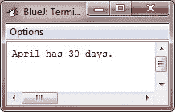

# Java 一维数组

> 原文：<https://codescracker.com/java/java-one-dimensional-arrays.htm>

基本上，一维数组是相似类型变量的列表。

## 创建一维数组

要创建数组，首先必须创建所需数据类型的数组变量。以下是一维(1D)数组声明的一般形式:

```
*type var-name[];*
```

这里，type 声明数组的元素类型(称为基类型)。元素类型决定了组成数组的每个元素的数据类型。因此，数组的元素类型决定了数组将保存什么类型的数据。例如，下面的代码片段声明了一个名为 month_days 的数组，其类型为“array of int”:

```
int month_days[];
```

尽管这个声明确定了 month_days 是一个数组变量，但实际上并不存在数组。要将 month_days 与一个实际的物理整数数组链接起来，那么您必须使用 new 运算符/关键字分配一个整数数组，并将其赋给 month_days。新的是分配内存的特殊运算符。

在后面的章节你会学到更多关于[新操作符](/java/java-new-operator.htm)的知识，但是你现在必须用它来 为数组分配内存。应用于一维(1D)数组的 new 的一般形式如下所示:

```
*array-var* = new *type[size]*;
```

这里，type 指定分配的数据类型，size 指定数组中存在的元素数量，array-var 是链接到数组的数组变量。也就是说，要使用 new 分配数组，必须定义要分配的元素的类型和数量。

由新分配的数组中的元素将自动初始化为零(对于数值类型)、false(对于布尔值)或 null(对于引用类型，将在后面的章节中介绍)。此示例分配一个 12 元素的整数数组，并将它们链接到 month_days:

```
month_days = new int[12];
```

当该语句执行时，month_days 将引用一个由 12 个整数组成的数组。此外，数组中的所有元素都将被初始化为零。

## 获取数组

获取数组是一个两步的过程。首先，必须声明所需数组类型的变量。其次，您必须使用 new 运算符分配将保存数组的内存，并将它赋给数组变量。

分配数组后，可以通过在方括号中指定其索引来访问数组中的特定元素。所有数组的索引都从零开始。例如，以下语句将值 28 分配给 month_days 的第二个元素:

```
month_days[1] = 28;
```

下一行显示存储在索引 2 处的值:

```
System.out.println(month_days[2]);
```

## Java 一维数组示例

将所有的代码放在一起，下面是一个程序，它创建了一个每月天数的数组:

```
/* Java Program Example - Java One-Dimensional (1D) Array */

public class JavaProgram
{   
    public static void main(String args[])
    {

        int month_days[];
        month_days = new int[12];

        month_days[0] = 31;
        month_days[1] = 28;
        month_days[2] = 31;
        month_days[3] = 30;
        month_days[4] = 31;
        month_days[5] = 30;
        month_days[6] = 31;
        month_days[7] = 31;
        month_days[8] = 30;
        month_days[9] = 31;
        month_days[10] = 30;
        month_days[11] = 31;

        System.out.println("April has " + month_days[3] + " days.");

    }
}
```

当编译并执行上述 Java 程序时，它将产生以下输出:



Java 数组索引从零开始，所以四月的天数是 month_days[3]或 30。

可以将数组变量的声明与数组本身的分配结合起来，如下所示

```
int month_days[] = new int[12];
```

在专业编写的 Java 程序中，你通常会看到这种方式。

数组可以在声明时初始化。该过程与用于初始化简单类型的非常相似。数组初始值设定项是用花括号括起来的逗号分隔的表达式列表。逗号分隔数组元素的值。数组将自动创建足够大的空间来容纳你在数组初始化器中定义的元素数量。不需要使用 new 运算符。例如，为了存储每个月的天数，下面的代码创建了一个初始化的整数数组:

```
/* Java Program Example - Java One-Dimensional Array */
/* This is the improved version of the previous program */

public class JavaProgram
{   
    public static void main(String args[])
    {

        int month_days[] = { 31, 28, 31, 30, 31, 30, 31, 31, 30, 31, 30, 31 };
        System.out.println("April has " + month_days[3] + " days.");

    }
}
```

上述 Java 程序的输出与前面的 Java 程序相同，即:


## 例子

这里有一些例子程序，使用一维数组，你可以试试:

*   [一维数组程序](/java/program/java-program-one-dimensional-array.htm)
*   [线性搜索](/java/program/java-program-linear-search.htm)
*   [二分搜索](/java/program/java-program-binary-search.htm)
*   [找到数组中最大的元素](/java/program/java-program-find-largest-element-in-array.htm)
*   [找到数组中最小的元素](/java/program/java-program-find-smallest-element-in-array.htm)
*   [反向排列](/java/program/java-program-reverse-array.htm)
*   [在数组中插入元素](/java/program/java-program-insert-element-in-array.htm)
*   [从数组中删除元素](/java/program/java-program-delete-element-from-array.htm)
*   [合并两个数组](/java/program/java-program-merge-two-arrays.htm)
*   [冒泡排序](/java/program/java-program-bubble-sort.htm)
*   [选择排序](/java/program/java-program-selection-sort.htm)
*   [插入排序](/java/program/java-program-Insertion-sort.htm)

[Java 在线测试](/exam/showtest.php?subid=1)

* * *

* * *